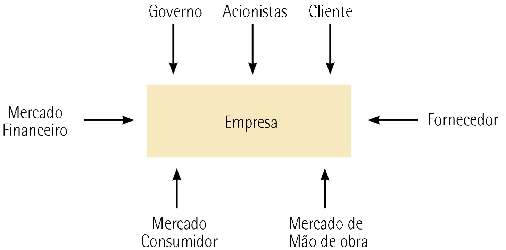
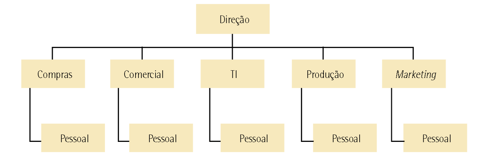
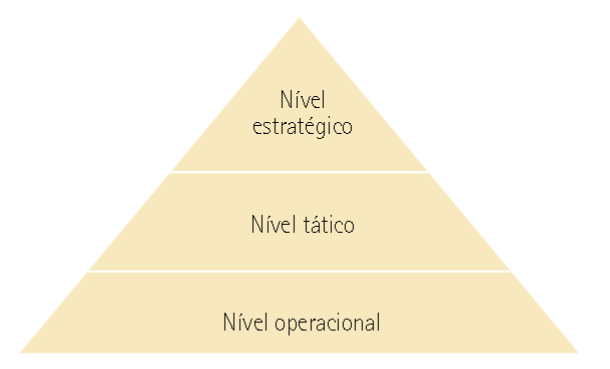
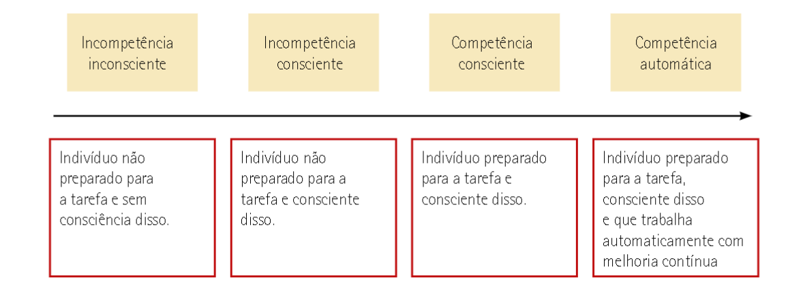
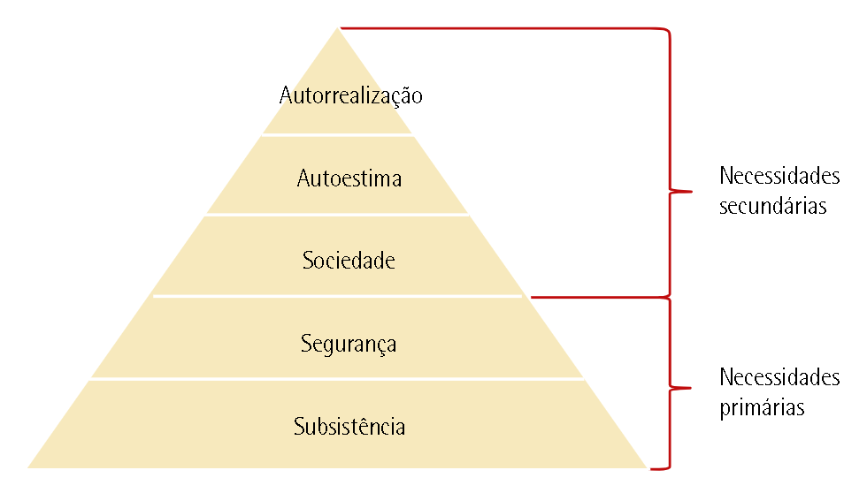
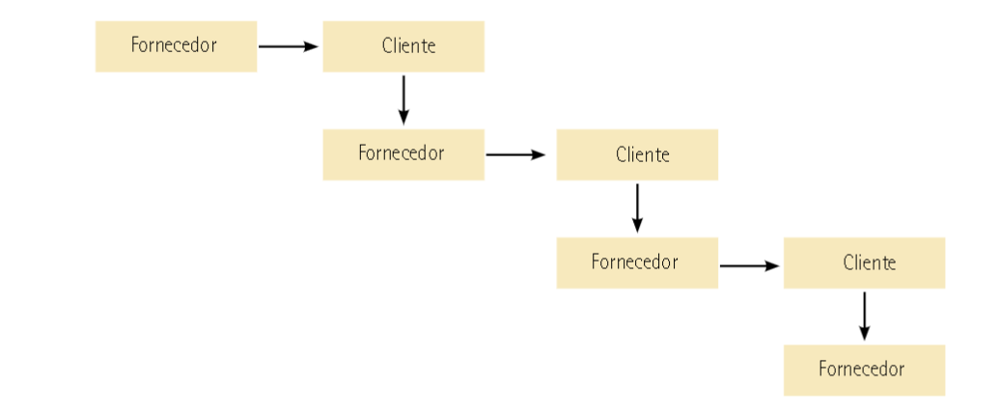

--- 
title: "Empreendedorismo"
author: "Pedro José Laurenti de Matos"
date: "`r Sys.Date()`"
output: rmdformats::material

---

# CONCEITOS GERAIS E HISTÓRICO DA ADMINISTRAÇÃO

## Admnistração

> Processo que visa a ações de tomada de decisão de planejamento, organização, direção  e  controle  de  recursos  humanos,  tecnológicos,  físicos,  financeiros,  de  informação  e  de  conhecimento, o indivíduo que cuida da admnistração é o `admnistrador`.

- **O papel do admnistrador** -  É aquele que se preocupa com a `análise das situações`, com a `resolução de problemas` e com a `eficácia` e a eficiência das funções da empresa.

### Histórico

1. Sócrates  (470  a.C.  –  399  a.C.)  via  a  Administração  como  uma  habilidade  pessoal separada do conhecimento técnico e da experiência;
2. Platão  (429  a.C.  –  347  a.C.)  preocupou-se  com  os  problemas  políticos  e  sociais relacionados ao desenvolvimento social e cultural do povo grego. Em sua obra A República, expõe o seu ponto de vista sobre a forma de governo e a administração dos negócios públicos;
3. Aristóteles (384 a.C. - 322 a.C.) estudou a organização do Estado e distingue três formas de administração pública: a Monarquia (governo de um só), a Aristocracia (governo de uma elite) e a Democracia (governo do povo);
4. Francis Bacon (1561-1626) notabilizou-se por enunciar e defender o *“princípio de prevalência do principal sobre o acessório”*, mostrando uma correta visão de um importante aspecto de como se deve proceder em Administração;
5. Thomas Hobbes (1588-1679) desenvolveu a teoria da origem contratualista do  Estado,  segundo  a  qual  o  homem  primitivo  passou  paulatinamente  à  vida  social.  O  Estado  viria  a  impor  a  ordem  e  organização  dessa  vida  em  sociedade.
6. Jean-Jacques  Rousseau  (1712-1778)  pregou  a  necessidade  do  contrato  social, baseado na convicção de que o homem, embora individualmente e por natureza seja cordial e pacífico, é deturpado pela vida em sociedade.
7. Karl  Heinrich  Marx  (1818-1883),  juntamente  com  seu  companheiro  de  estudos  Friedrich  Engels  (1820-1898),  propôs  uma  teoria  da  origem econômica do Estado segundo a qual o surgimento do poder político e do Estado nada mais é que o fruto da dominação econômica do  homem  pelo  homem.

### Administração **Científica**, **Clássica** e por **Objetivos**

Frederick Winslow Taylor - Pai da ADM Científica, ele formulou uma série de ideias e constatações sustentando que a Administração **não é uma arte ou habilidade inata** de algumas pessoas, e sim **obedece a um conjunto de preceitos** que ditam o sucesso de um sistema administrativo.

Henri Fayol - ADM Clássica, foi feita a partir da Científica. Afirmava que administrar é **conduzir a empresa até a meta proposta**, procurando obter o  maior  rendimento  possível  de  todos  os  recursos  de  que  se  dispõe.  Fayol  determinava  seis  funções  primordiais dentro das organizações:

1. **função técnica**: relacionando-se às capacidades e habilidades da produção;
2. **função comercial**: relacionando-se às relações de compra e venda;
3. **função financeira**: relacionando-se à gestão de capitais;
4. **função de segurança**: relacionando-se à proteção dos bens da organização;
5. **função contábil**: relacionando-se a registros, balanços e custos
6. **função administrativa**: relacionando-se à integração das funções anteriores e subdividindo-se em cinco subfunções (planejar, organizar, comandar, coordenar e controlar).

### Outros nomes

- **Henry  Ford -** Pai do FORDISMO, método de produção e de administração voltada a produção em massa
- **Escola de Relações Humanas da Administração -** Considerou os elementos humanos 

## Organizações

Organização - É a pessoa jurídica, um conjunto de pessoas aliadas no mesmo ideal.

Classificação da estrutura:

- Corporações: formadas pela **reunião de pessoas**, podem ter fim não econômico e econômico;
- Fundações: constituídas em torno de um patrimônio com determinado fim;

Classificação de função;

- direito público: Estatais, governo ou instituições sem fim lucrativo.
- direito privado: Empresas privadas com fins lucrativos.

### Elementos do sistema "Empresa"

> A empresa possui `entradas` e `saídas`.

- `Capital` - é a provisão de investimentos necessários é aquilo que paga o custo.
- `Insumos` - elementos necessários para a produção do produto
- `Produto` - produtos, subprodutos ou serviços são os elementos de valor que a empresa oferece ao cliente.
- `efeito sobre o meio` - Efeito que a empresa provoca no meio em que existe

O = (I,P,T,L,R)

O = Organização
I = Insumos
P = Produtos
T = Tarefa
L = Restrições
R = Recurso

### Relações de uma empresa

Os relacionamentos descritos na figura anterior são:

- **Empresa – Mercado Consumidor:** é a relação entre a empresa e o seu potencial mercado;
- **Empresa – Fornecedores:** é a relação na qual a empresa remunera o fornecedor para fazer a aquisição de seus produtos;
- **Empresa – Mercado de Mão de Obra:** é a relação na qual os trabalhadores são remunerados pelos serviços prestados;
- **Empresa – Mercado Financeiro:** é a relação de troca entre ativos financeiros – a empresa e o mercado financeiro (bancos e agentes financeiros, entre outros);
- **Empresa – Governo:** é a relação na qual o governo provê serviços públicos de qualidade, e a empresa cumpre suas obrigações, como pagamento de impostos;
- **Empresa – Acionistas:** é a relação em que o acionista investe na empresa e recebe dela o retorno sob o seu investimento;
- **Empresa – Cliente:** é a relação em que a empresa entrega seus produtos e é remunerada por eles.

> #### Mas e empresas públicas?
> De acordo com Costa Neto e Canuto (2010), as empresas públicas e órgãos públicos deveriam seguir práticas similares às das empresas privadas, mas observa-se uma disparidade:
> 
> - Gestores com mandatos políticos.
> - Objetivos institucionais influenciados por interesses políticos.
> - Estado, como "dono" do negócio, frequentemente ausente.
> - Dificuldade de desligar funcionários devido à estabilidade, levando ao excesso de pessoal.
> - Risco de confusão entre interesse público e privado, levando a corrupção e outros crimes.
> 
> Segundo Costa Neto e Canuto (2010), ocorrências dessas situações diminuem conforme o desenvolvimento da sociedade em que o sistema público está inserido.

### Estrutura organizacional e funcional

As funções dentro de uma corporação denotam o desdobramento de responsabilidades de cada área. De modo geral, a maioria das corporações `possui as seguintes funções`:

- Função de Marketing: preocupa-se com o relacionamento com o mercado, entendendo expectativas, necessidades, hábitos e tendências dos clientes;
- Função de Operação ou Produção: preocupa-se com a operação de bens e serviços entregues pela corporação ao cliente;
- Função de Administração: preocupa-se com a administração geral dos recursos da corporação.

As atividades estão relacionadas aos processos e métodos detalhados das funções presentes na corporação. Elas podem ser:

- Atividades de Planejamento;
- Atividades de Vendas;
- Atividades de Logística;
- Atividades de Controle da Produção;
- Atividades de Compras e Gestão de Estoques;
- Atividades de Departamento de Pessoal;
- Atividades Contábil-Financeiras;
- Atividades de Controles.

# FUNÇÕES DA ADMINISTRAÇÃO

Diante de todo o histórico, passando por todas as escolas e a partir do legado deixado por Taylor, Fayol,  Ford,  Mayo  e  Druker,  entre  outros,  é  possível  entender  que  a  Administração  possui  quatro  funções:

## Planejamento
>     - O que fazer?
>     - Por que fazer?
>     - Como fazer?

Missão, valores e visão são **`norteadores`** para a organização.

Planos:

- `nível estratégico`: relacionado a decisões de médio e longo prazo associadas a questões com alto grau de incerteza

- `nível  tático`:  como  desdobramento  do  nível  tático,  é  associado  a  decisões  de  médio  prazo,  buscando eficiência dos processos organizacionais

- `Nível operacional`: com decisões de curto prazo, preocupa-se com ações dentro do dia a dia das operações

## Organização
>     - Quem vai fazer?
>     - Onde fazer?
>     - Quando fazer?

- `competência técnica`:  capacidade  intelectual,  como  resultado  do  aprendizado  eficaz,  com  capacidade de pensar estrategicamente e introduzir aperfeiçoamentos no trabalho;
- `competência organizacional`: capacidade de planejar e organizar o trabalho, gerenciando tempo e espaço;
- `competência comunicativa`: capacidade de expressão e comunicação com o grupo;
- `competência social`: capacidade de criação de bons relacionamentos, bem como de transferência de conhecimento;
- `competência  comportamental`:  capacidade  de  iniciativa,  criatividade  e  vontade  de  aprender,  sendo aberto a mudanças.

## Direção
### Eficiência e eficácia

A `eficiência` está relacionada à melhor utilização dos recursos disponíveis para alcançar o melhor resultado, possuindo uma ligação muito forte com as áreas mais táticas e operacionais. A `eficácia` está relacionada ao melhor resultado da corporação, possuindo uma ligação muito forte com as áreas mais estratégicas.

### Liderança e motivação

- `Comando autocrático`: impõe o que deve ser feito por meio de ordens de cima para baixo, com o mínimo de diálogo possível. É a mais antiga, clássica e também obsoleta;

- `Comando democrático`: toma decisões conforme opinião da maioria. Escuta a todos e tenta ser politicamente correto em suas atitudes, mas pode levar a distorções;

- `Comando  participativo`:  toma  decisões  por  meio  de  discussões  com  os  grupos  mais  próximos,  buscando uma série de esclarecimentos antes da posição final.

## Controle
>     - Comparação com padrões
>     - Correção de rumos
>     - Subsídios ao aperfeiçoamento

# ASPECTOS COMPORTAMENTAIS

Não é possível estudar a Administração e o empreendedorismo sem considerar de suma importância o  papel  do  ser  humano  e  seu  comportamento.  Os  recursos  humanos  são  peças‑chave  nos  processos  organizacionais, bem como o modo como eles se relacionam.

## Liderança

Temos 3 pensadores principais com 3 conceitos diferentes:

1. `Costa Neto e Canuto (2010)` - destacam que o conceito de liderança é relacionado a características que determinadas pessoas possuem de tomar decisões aceitas com entusiasmo pelos seus colaboradores.

2. `Sobral  e  Gimba  (2012)` - mencionam  liderança  como  um  processo  de  influência  em  um  grupo  que  desempenha atividades com vistas a um objetivo, envolvendo construção e desconstrução de percepções, situações e expectativas.

Sobral  e  Gimba  (2012)  afirmam  que  as  teorias  mais  modernas  sobre  liderança  tendem  a  uma  ênfase num tipo de líder carismático, visionário e transformacional, com comportamentos apelativos e simbólicos, visando a obter alto grau de comprometimento dos liderados.

Sobral e Gimba (2012) também mencionam o surgimento de um novo tipo de liderança, conhecida como liderança autêntica. Ela está ligada ao conceito de autenticidade, e sua principal característica é a elevada transparência entre líder e liderado, bem como uma conduta consistente com o sistema de valores pessoais e convicções.Essa liderança autêntica pode ser concebida a partir de quatro dimensões, conforme Sobral e Gimba (2012):

- **autoconsciência**:  relaciona‑se  à  consciência  que  há,  por  parte  da  liderança,  sobre  fraquezas  e  potencialidades;
- **transparência**: relaciona‑se ao grau de profundidade de conhecimento dos desejos do líder por parte dos liderados;
- **perspectiva moral e ética**: relaciona‑se à consideração dada, por parte da liderança, a valores morais e éticos;
- **processamento balanceado**: relaciona‑se à consideração dada à opinião dos liderados.

3. `Barreto et al. (2013)` - afirmam que a liderança tem um caráter inspiracional, fortalecida pela dinâmica motivacional entre líderes, liderados e o sistema organizacional onde atua.

Barreto et al. (2013) mencionam que essas três lideranças (carismática, visionária e transformacional) têm muitas semelhanças entre si. Na liderança carismática, a ênfase é no comportamento simbólico do líder, bem como em suas habilidades visionárias, na comunicação não verbal e no apelo a valores ideológicos. A liderança visionária tem o foco no futuro, assumindo riscos e influenciando a direção da organização. A liderança transformacional preza por estabelecer uma relação bidirecional entre líder e liderados.

Os autores mencionam também quatro características principais da liderança transformacional:

- influência idealizada;
- motivação inspiracional;
- estímulo intelectual;
- consideração individualizada.

### Perfis psicológicos segundo Jung e Myers‑Briggs

Costa Neto e Canuto (2010) mencionam que o tipo psicológico de indivíduo influencia na capacidade que ele tem de exercer uma liderança. De acordo com os autores, há uma teoria que classifica as pessoas em quatro grandes tipos psicológicos, que derivam dos perfis estudados pelos psicólogos Carl Gustav Jung (1875‑1961), Katharine Briggs (1875‑1968) e Isabel Myers (1897‑1980). Veja o quadro a seguir:

<table class="tg" style="undefined;table-layout: fixed; width: 1002px">
<colgroup>
<col style="width: 200.88889px">
<col style="width: 400.88889px">
<col style="width: 399.77778px">
</colgroup>
<thead>
  <tr>
    <th class="tg-c3ow">Atividades‑chave</th>
    <th class="tg-c3ow" colspan="2">Escala</th>
  </tr>
</thead>
<tbody>
  <tr>
    <td class="tg-c3ow" rowspan="2">Motivação</td>
    <td class="tg-c3ow">Extroversão (E)</td>
    <td class="tg-c3ow">Introversão (I)</td>
  </tr>
  <tr>
    <td class="tg-baqh">Preferência por tirar energia do mundo exterior das pessoas, atividades ou coisa</td>
    <td class="tg-baqh">Preferência por tirar energia do mundo interior das ideias, emoções ou impressões pessoais</td>
  </tr>
  <tr>
    <td class="tg-baqh" rowspan="2">Observação</td>
    <td class="tg-baqh">Sensação (S)</td>
    <td class="tg-baqh">Intuição (N)</td>
  </tr>
  <tr>
    <td class="tg-baqh">Preferência por obter informações por meio dos cinco sentidos e observar aquilo que é real</td>
    <td class="tg-baqh">Preferência por obter informações por meio do “sexto sentido”, observando o que pode ser</td>
  </tr>
  <tr>
    <td class="tg-baqh" rowspan="2">Decisões</td>
    <td class="tg-baqh">Pensamento (T)</td>
    <td class="tg-baqh">Sentimento (F)</td>
  </tr>
  <tr>
    <td class="tg-baqh">Preferência por organizar e estruturar as informações para tomar decisões de maneira lógica e objetiva</td>
    <td class="tg-baqh">Preferência por organizar e estruturar as informações para tomar decisões de maneira pessoal e orientada para os valores</td>
  </tr>
  <tr>
    <td class="tg-baqh" rowspan="2">Modo de vida</td>
    <td class="tg-baqh">Julgamento (J)</td>
    <td class="tg-baqh">Percepção (P)</td>
  </tr>
  <tr>
    <td class="tg-baqh">Preferência por ter uma vida organizada e planejada</td>
    <td class="tg-baqh">Preferência por ter uma vida espontânea e flexível</td>
  </tr>
</tbody>
</table>

## Motivação

Costa  Neto  e  Canuto  (2010)  mencionam  que  as  seguintes  considerações  de  natureza  humana  possuem necessidades que precisam ser satisfeitas no alcance da motivação, conforme uma determinada hierarquia desenvolvida pelo renomado psicólogo Abraham Maslow, descrita na figura a seguir.

Nessa hierarquia de necessidades que influenciam na motivação, têm‑se:

- `necessidades  primárias`:  compostas  pelas  necessidades  básicas  de  subsistência  (casa,  comida  etc.) e segurança (física, estabilidade no trabalho, seguro saúde etc.);
- `necessidades secundárias`: compostas por questões de cunho um pouco mais íntimo, como a vida na sociedade (amigos, diversões etc.), a autoestima (status, poder etc.) e a autorrealização (sensação de paz, de dever cumprido etc.).

Costa  Neto  e  Canuto  (2010)  mencionam  também  a  abordagem  de  Frederick  Herzberg  sobre  a  influência de fatores que geram ou não motivação. Esses fatores são os seguintes:

- `fatores   extrínsecos  (externos  ao  indivíduo)`:  geram  satisfação  física,  mas  não  a  motivação  propriamente dita. Por exemplo: boas condições físicas de trabalho, ar condicionado, transporte etc.
- `fatores  intrínsecos`:  ligados  a  tarefas  do  indivíduo,  que  geram  desafios  e  um  sentimento  de  satisfação interior pelo sucesso alcançado. Esses levam à motivação.

## Clima, cultura e mudança organizacional

### Clima organizacional

Este conceito diz respeito à forma como os relacionamentos interpessoais se dão no seio da organização.

O  clima  organizacional  é  um  conjunto  de  fatores  e  itens  de  caráter  permanente  que  distingue  uma organização da outra, influenciando o comportamento de indivíduos.

### Cultura organizacional

Cultura organizacional é um sistema sociocultural que revela a identidade da organização por meio de padrões de comportamento.

Schein (1992) afirma que a cultura organizacional é dividida em três níveis:

- artefatos: compreendem as estruturas e os processos organizacionais existentes na corporação;
- valores: compreendem as estratégias, os objetivos e as filosofias adotadas no dia a dia das corporações;
- pressupostos: compreendem as crenças, as percepções e os pensamentos, muitas vezes até inconscientes.

Barreto et al.(2013) mencionam quatro tipos de culturas organizacionais:

- `cultura clã ou grupal`: nesse tipo de cultura, é enfatizada a participação das pessoas na tomada de decisão. Valores morais e trabalho em grupo são incentivados. Há um alto comprometimento dos colaboradores;
- `cultura inovativa ou adhocracia`: nesse tipo de cultura, há uma grande abertura à flexibilidade e à mudança organizacional. O ambiente de trabalho é marcado pelo dinamismo, e há incentivo às iniciativas individuais e à liberdade;
- `cultura de mercado ou racional`: nesse tipo de cultura, há uma orientação a partir de tendências de  mercado  e  bases  seguras  de  clientes.  O  resultado  é  o  objetivo  principal  para  que  o  negócio  melhore a sua posição competitiva;
- `cultura hierárquica`: nesse tipo de cultura, a maior importância é dada à estabilidade, aos valores e às normas associados à burocracia. Regras e políticas mantêm a organização integrada.

### Mudança organizacional

- **Mudança contínua**: constante e evolutiva, produzindo pequenos avanços cotidianos;
- **Mudança episódica**: pouco frequente, descontínua e intencional, é necessária para as organizações que saem de seu ponto de equilíbrio;
- **Mudança descontínua**: ocorre em períodos de desequilíbrio e envolve várias reestruturações;
- **Mudança espontânea**: não gerada e não controlada pela liderança, é gerada pelo dia a dia das corporações;
- **Mudança planejada**: ocorre de modo programado e sistemático;
- **Macromudança**: abrange toda a organização e suas relações com o macroambiente.

Costa Neto e Canuto (2010) afirmam que o sucesso de uma mudança se dá quando há a consideração dos seguintes fatores:

- **Compreensão**: perfeito entendimento do processo e da importância da mudança por parte dos envolvidos;
- **Comprometimento**: determinação de executar a mudança devido a sua importância;
- **Competência**: capacidade técnica e administrativa para efetuar a mudança;
- **Correção**: inexistência de erros nos processos de mudança organizacional;
- **Comunicação**: perfeito funcionamento de um plano de comunicação na mudança;
- **Continuidade**: garantia de que não haverá retrocesso após a mudança.

# A TOMADA DE DECISÃO E A ESTRATÉGIA NO MUNDO DOS NEGÓCIOS

## A tomada de decisão

> “A tomada de decisão não é algo fácil. Mesmo fazendo parte do dia a dia dos administradores e empreendedores, ela tem que ser um processo efetuado de modo racional, em que devem ser utilizadas técnicas por meio das quais se atingem os objetivos organizacionais”

### Qualidade na tomada de decisões

| Decisões Tomadas | Descrição |
|------------------|-----------|
| Racionalmente    | Consequência de um cuidadoso processo de reflexão e do uso de metodologias apropriadas. As fortes emoções são extintas para dar espaço a um processo racional. |
| Baseadas em Fatos e Dados | Tomada de decisão com base em fatos e dados, em vez de palpites ou opiniões subjetivas. Transforma dados em informações e informações em conhecimento. |
| Economicamente Pesadas | Considera a importância de avaliar aspectos econômicos na tomada de decisão. |
| Baseadas na Experiência | Reconhece a importância da experiência adquirida sobre determinados assuntos como fator de sucesso para boas decisões. |
| Visando ao Futuro | Foca em pensar estrategicamente no longo prazo. A visão estratégica é crucial no processo decisório. |
| Consensuais | Em situações complexas com diferentes perspectivas, busca-se o consenso entre os envolvidos. |
| Baseadas em Indicadores | Decisões apoiadas em indicadores que surgem por métodos quantitativos apropriados. |
| Justas e Legais | Decisões fundamentadas em critérios éticos, justos e em conformidade com disposições legais. |
| Criativas e Inovadoras | Capacidade de fugir de soluções convencionais, buscando abordagens criativas e inovadoras. |
| Corajosas x Prudentes | Necessidade de equilibrar coragem e prudência no processo decisório. |
| Inspiradas em Paradigmas | Prática do benchmarking para adotar melhores práticas de mercado. |

## Estratégia

- **Chandler (1962):** Estratégia é a definição dos objetivos de longo prazo de uma empresa e a alocação de recursos para alcançá-los.
- **Ansoff (1965):** Estratégia são diretrizes para tomar decisões em condições de incerteza parcial, focando na interação com o ambiente.
- **Katz (1970):** Estratégia envolve a relação presente (situação estratégica) e futura (plano estratégico) da empresa com o ambiente.
- **Steiner e Miner (1977):** Estratégia envolve a formulação de metas alinhadas às forças internas e externas, com planos para garantir o sucesso.
- **Porter (1989):** Estratégia competitiva são ações para construir uma posição sólida na indústria, superar concorrentes e maximizar retornos.
- **Mintzberg (1988):** Estratégia é uma ponte entre a organização e o ambiente, moldando decisões para se adaptar ao contexto.
- **Hax e Majluf (1988):** Estratégia é um conjunto coeso de decisões que refletem objetivos, ações e alocação de recursos a longo prazo.

### Administração Estratégica

1. **Estratégia como Plano:**
   - Estratégia é um plano conscientemente criado para lidar com uma situação.
   - Exemplo: Plano de guerra militar, estratégia na Teoria dos Jogos, plano amplo de administração.

2. **Estratégia como Pretexto:**
   - Estratégia pode ser usada como uma manobra para superar concorrentes.
   - Exemplo: Ameaçar expansão para desencorajar competidores.

3. **Estratégia como Padrão:**
   - Estratégia pode ser observada como um padrão de comportamento consistente.
   - Exemplo: Ford oferecendo apenas o modelo T na cor preta.

4. **Estratégia como Posição:**
   - Estratégia é uma forma de localizar a organização em relação ao ambiente.
   - Exemplo: Nicho ecológico, local gerador de renda, domínio de produto-mercado.

5. **Estratégia como Perspectiva:**
   - Estratégia é uma maneira ampla de olhar o mundo, tanto interna como externamente.
   - Envolve uma visão coletiva dos estrategistas.

## O mundo dos negócios

> “Negócio é um esforço organizado por determinadas pessoas para produzir bens e serviços, a fim de vendê-los em um determinado mercado e alcançar recompensa financeira pelo seu esforço

Negociar significa basicamente comprar e vender algo a alguém. E, sem dúvida, produzir esse algo e agregar valor no meio dessas duas pontas.

Todo negócio envolve necessariamente algum produto/serviço e, consequentemente, algum fornecedor e algum cliente; uma cadeia de entradas, processos e saídas; alguma produção e algum mercado; uma forma de satisfazer alguma necessidade do cliente ou responder a alguma oportunidade de mercado.

### cadeia de transações e os tipos de negócios

Os bens e serviços são comercializados entre compradores e vendedores que formam uma verdadeira cadeia de transações, conforme a figura a seguir

- **Negócio Industrial:**
  - Responsável pela produção de bens de consumo ou bens de produção.
  - Transforma matérias-primas em mercadorias ou produtos acabados.

- **Negócio Comercial:**
  - Responsável pela venda direta ao consumidor (comércio varejista).
  - Responsável pela venda direta do produtor (comércio atacadista).

- **Negócio de Prestação de Serviços:**
  - Oferece serviços especializados aos clientes.

### Ambiente de negócios

As organizações operam em um contexto, não de forma isolada. O ambiente externo à empresa é chamado de ambiente de negócios, com variáveis que podem influenciar positiva ou negativamente.

De acordo com Chiavenato (2008), as variáveis no ambiente podem ser macroambientais, influenciando a maioria das corporações, ou microambientais, afetando um mercado específico.

**Variáveis Macroambientais:**
- **Econômicas:** Influenciam empresas de todos os tamanhos, relacionadas à economia em geral.
- **Sociais:** Relacionadas à saúde, educação, segurança e bem-estar social.
- **Tecnológicas:** Aspectos tecnológicos que podem trazer mudanças e inovações.
- **Culturais:** Eventos e características culturais.
- **Legais:** Leis e regulamentos que afetam as operações do negócio.
- **Demográficas:** Características da população.
- **Ecológicas:** Relacionadas ao meio ambiente e recursos naturais.

**Variáveis Microeconômicas:**
- **Fornecedores:** Fornecem recursos e insumos para a operação do negócio.
- **Clientes:** Adquirem produtos ou serviços comercializados.
- **Concorrentes:** Disputam as fatias de mercado com o negócio.
- **Agências Reguladoras:** Responsáveis pela fiscalização das operações do negócio.

#### Tamanho de empresas

As empresas são classificadas pelo porte ou tamanho, segundo Chiavenato (2008) e o critério do Sebrae:

- **Microempresa:**
  - Construção e Indústria: Até 19 funcionários.
  - Comércio e Serviços: Até 9 funcionários.

- **Pequena Empresa:**
  - Construção e Indústria: De 20 a 99 funcionários.
  - Comércio e Serviços: De 10 a 49 funcionários.

- **Média Empresa:**
  - Construção e Indústria: De 100 a 499 funcionários.
  - Comércio e Serviços: De 50 a 99 funcionários.

- **Grande Empresa:**
  - Construção e Indústria: A partir de 500 funcionários.
  - Comércio e Serviços: A partir de 100 funcionários.

O BNDES também classifica o porte das empresas de acordo com a receita operacional bruta anual:

- **Microempresa:** ≤ R$ 2,4 milhões.
- **Pequena Empresa:** > R$ 2,4 milhões e ≤ R$ 16 milhões.
- **Média Empresa:** > R$ 16 milhões e ≤ R$ 90 milhões.
- **Média-Grande Empresa:** > R$ 90 milhões e ≤ R$ 300 milhões.
- **Grande Empresa:** > R$ 300 milhões.

# EMPREENDEDORISMO E SEU HISTÓRICO

## Empreendedor e empreendedorismo

Conceitos gerais:

> *`EMPREENDEDOR`* - É quem fareja as oportunidades e precisa ser muito rápido, aproveitando as oportunidades fortuitas, antes que outros aventureiros o façam. O termo empreendedor – do francês entrepreneur – significa aquele que assume riscos e começa algo novo.

> *`EMPREENDEDORISMO`* - É o envolvimento de pessoas e processos que, em conjunto, levam à transformação de ideias em oportunidades. A perfeita implementação dessas oportunidades leva à criação de negócios de sucesso.

### Características de um empreendedor: 

- **Iniciativa:** São pessoas que não ficam esperando que os outros (governo, empregador, parente, padrinho) resolvam seus problemas. Agem diante de adversidades.
- **Persistência:** Motivados e convictos, os empreendedores persistem até que as coisas funcionem adequadamente.
- **Autoconfiança:** Acreditam em si mesmos, permitindo que assumam riscos e iniciativas desafiadoras.
- **Aceitação dos Riscos:** Embora cautelosos, os empreendedores aceitam riscos para alcançar seus objetivos.
- **Ausência de Medo do Fracasso:** Não são paralisados pelo medo do fracasso ou rejeição. Estão dispostos a arriscar.
- **Decisão e Responsabilidade:** Tomam decisões e assumem a responsabilidade por elas, sem depender dos outros.
- **Energia:** Lançam-se em novas empreitadas com energia, resultado de seu entusiasmo e motivação.
- **Automotivação e Entusiasmo:** Automotivados por desafios e crença em suas ideias. Não dependem apenas de recompensas externas.
- **Controle:** Acreditam que podem controlar seu próprio destino e influenciar o ambiente para atingir objetivos.
- **Orientação para Equipe:** Criam equipes, delegam e confiam nos outros para alcançar resultados.
- **Otimismo:** São otimistas, acreditam nas possibilidades, na resolução de problemas e no potencial de desenvolvimento.
- **Capacidade Empreendedora:** Ter capacidade empreendedora aumenta as chances de sucesso nos negócios, mas outras habilidades também são necessárias.

#### Competências de um empreendedor:

- **Negociação Equilibrada:** Aprender a negociar e realizar acordos comerciais equilibrados, visando benefícios mútuos para as partes envolvidas.
- **Comunicação Efetiva:** Desenvolver habilidades de comunicação para se expressar claramente, tanto por escrito quanto verbalmente, e compreender as mensagens dos outros.
- **Conhecimento de Produtos e Mercado:** Dominar detalhes sobre seu produto e o dos concorrentes, além de aprender técnicas de compras, abastecimento e gestão de estoque.
- **Autocontrole:** Cultivar autocontrole emocional para lidar com pressões constantes no ambiente de trabalho.
- **Orientação para o Cliente:** Reconhecer a importância de focar nos clientes, entendendo suas necessidades e transformando-os em parceiros. Clientes satisfeitos retornam e divulgam a empresa.
- **Ferramentas ECR (Efficient Consumer Response):** Adquirir conhecimento sobre as ferramentas de Resposta Eficiente ao Consumidor, visando otimizar a relação entre a empresa e seus clientes.

### Aspectos do empreendedorismo

- No Aspecto Individual:
  - Empreendedorismo é um **comportamento**, não um traço de personalidade isolado.
  - Envolve uma conotação **prática** e abarca atitudes e ideias.
  - Significa criar coisas novas ou desenvolver abordagens inovadoras para tarefas existentes.
  - Um empreendedor é alguém que **imagina, desenvolve e realiza visões**.
  - Capacidade de sonhar e transformar esses sonhos em realidade é fundamental.

- No Aspecto Social:
  - Um empreendedor de sucesso deve possuir capacidade de **julgamento, perseverança** e compreensão tanto do mundo quanto do negócio.
  - Empreendedores têm a habilidade de **identificar e avaliar oportunidades de negócios**, providenciar recursos necessários e tomar ações para assegurar o sucesso.
  - O empreendedor é associado ao **desenvolvimento econômico, inovação** e exploração de oportunidades de negócio.

#### Tipos de empreendedorismo:

|        Empreendedorismo Externo        | Empreendedorismo Interno ou Intraempreendedorismo |
|:--------------------------------------:|:-----------------------------------------------:|
| Quando o empreendedor comanda o próprio negócio ou empreendimento, exercendo a liderança sobre o grupo; | Quando o empreendedor lidera um grupo de pessoas dentro de sua própria organização com o objetivo de impulsionar o crescimento do negócio. |

Intraempreendedorismo:

O  intraempreendedor  é  o  colaborador  da  empresa  que  inova,  identifica  e  cria  oportunidades  de  negócios e monta e coordena novas organizações ou arranjos de recursos para agregar valor. Age para atender necessidades latentes e busca fazer de forma mais eficaz o que já existe.

As competências do intraempreendedor são:

-  conhecimento do produto: habilidade de conhecer e entender o produto, além de explorar seu potencial;
-  conhecimento do negócio: habilidade de realização e operação organizacionais;
-  conhecimento do setor: habilidade de conhecer o segmento de mercado e suas tendências;
-  habilidade de liderança: habilidade de influenciar e direcionar subordinados;
-  habilidade  de  criar  rede  de  contatos:  habilidade  de  relacionar‑se  com  pessoas  influentes,  formadores de opinião e tomadores de decisão;
-  habilidade administrativa: habilidade de planejar estrategicamente, encaminhando táticas e operações;
-  habilidade de empreendedor: habilidade de reconhecer oportunidades e aproveitá‑las.

> Geralmente o intraempreendedor é um péssimo treinador, pois acredita não saber o suficiente para ensinar  e  tem  a  necessidade  de  estar  constantemente  aprendendo  novas  coisas.  Dadas  as  condições,  

## Histórico de empreendedorismo

Segundo  Chiavenato  (2008),  o  empreendedorismo  se  origina  no  século  XVII  e  XIX,  no  período  do  liberalismo econômico. Nesse início, alguns pensadores econômicos afirmavam que as forças livres do mercado  e  da  concorrência  refletiam  a  ação  econômica.  O  empreendedor  era  visto  como  aquele  que  adquiria a matéria‑prima e a revendia, assumindo certo risco. Se conseguisse lucro além do esperado, seria um claro sinal de inovação.

O  termo  “empreendedorismo”  foi  registrado  por  Richard  Cantillon,  em  1755,  para  explicar  a  receptividade ao risco de comprar algo por um determinado preço e vendê‑lo em um regime de incerteza. Jean Baptiste Say, em 1803, ampliou essa definição – para ele, empreendedorismo consiste em transferir recursos  econômicos  de  um  setor  que  produz  menos  para  um  setor  que  tenha  produtividade  mais  elevada e com maior rendimento. Fica convencionado, portanto, que quem abre seu próprio negócio é um empreendedor.

### A visão behaviorista

a década de 1950, quando houve crescimento da URSS, os americanos  adeptos  da  Escola  Behaviorista  decidiram  traçar  um  perfil  da  personalidade  behaviorista.  Colocando em foco a alta gerência das empresas, descobriu‑se que a necessidade de autorrealização (ideia anteriormente defendida) `não estava` claramente interligada à decisão de início de um empreendimento.

### Evolução do empreendedorismo

- Na Idade Média:
  - o termo “empreender” foi utilizado para definir a pessoa que gerenciava grandes projetos de produção usando os recursos disponíveis, geralmente do governo do país.
- No século XVII:
  - o empreendedor estabelecia um acordo contratual com o governo para realizar algum serviço, fornecer produtos e, como geralmente os preços eram prefixados, qualquer lucro ou prejuízo era  só  do  empreendedor.  Richard  Cantillon  (escritor  e  economista)  é  considerado  um  dos  criadores do termo “empreendedorismo”.
- No século XVIII:
  - nesse  século,  o  capitalista  e  o  empreendedor  foram  diferenciados,  devido  ao  início  da  industrialização que ocorria no mundo.
- Nos séculos XIX e XX:
  - os empreendedores foram confundidos com os gerentes ou administradores (o que ainda acontece nos dias de hoje). São analisados, somente do ponto de vista econômico, como pessoas que organizam a empresa, planejam, dirigem e controlam as ações desenvolvidas na organização.

- Nos dias de hoje: 
  - há quem considere que o momento em que se vive atualmente é considerado a Era do empreendedorismo,  devido  a  todas  as  quedas  de  barreiras  comerciais  e  culturais  pela  ação dos empreendedores;
  - impulsionados pela internet e por todo aparato tecnológico, as boas ideias e os negócios têm crescido cada vez mais – contando também com a colaboração da globalização;
  - diversos países do mundo têm criado políticas públicas que incentivam a economia criativa e a atividade empreendedora;

- O  empreendedorismo  no  Brasil:
  - Começou  na  década  de  1990.  Seus  principais  responsáveis  foram  o  Serviço  Brasileiro  de  Apoio  às  Micro  e  Pequenas  Empresas  (Sebrae)  e  a  Sociedade  Brasileira  para  Exportação de Software (Softex).

# APRENDIZAGEM EMPREENDEDORA, VANTAGEM COMPETITIVA E O PROCESSO EMPREENDEDOR

Existem vários mitos sobre empreendedorismo. Dornelas (2008) destaca três em especial:

1. Empreendedores são natos, nascem para o sucesso.
  Isso é um mito porque, enquanto a maioria dos empreendedores nasce com certo nível de inteligência, empreendedores de sucesso acumulam relevantes habilidades, experiências e contatos com o passar dos anos. A capacidade de ter visão e perseguir oportunidades aprimora‑se com o tempo.

2. Empreendedores são “jogadores” que assumem riscos altíssimos.
  Na  realidade,  eles  assumem  riscos  calculados,  evitam  riscos  desnecessários,  compartilham  o  risco  com outros e dividem o risco em “partes menores”.

3. Empreendedores são “lobos solitários” e não conseguem trabalhar em equipe
  O fato é que empreendedores são ótimos líderes, criam times e desenvolvem excelente relacionamento no trabalho com colegas, parceiros, clientes, fornecedores e muitos outros.

### É possível ensinar empreendedorismo?

As  habilidades  requeridas  de  um  empreendedor  podem  ser  classificadas,  de  acordo  com  Dornelas  (2008), em três áreas: **técnica, gerencial e características pessoais**:

As **habilidades técnicas** envolvem saber escrever, saber ouvir as pessoas e saber captar informações, ser  um  bom  orador,  ser  organizado,  saber  liderar  e  trabalhar  em  equipe,  além  de  possuir  know‑howtécnico na sua área de atuação.

As **habilidades gerenciais** incluem as áreas de criação, de desenvolvimento e de gerenciamento de uma nova empresa: de marketing, de administração, de finanças, operacional, de produção, de tomada de decisão e de controle das ações da empresa, além de ser um bom negociador.

Algumas **características pessoais** incluem: assumir riscos e ser disciplinado, inovador, orientado a mudanças, persistente e um líder visionário.

## Empreendedorismo como vantagem competitiva

- Competição presente desde o homem primitivo até executivos modernos.
- Competitividade nas necessidades primárias e nas atividades comerciais/industriais.
- Visão tradicional de vantagem competitiva baseada em modelos estáticos.
- Vantagens competitivas são dinâmicas e dependem de fatores sistêmicos, estruturais e empresariais.

### O ambiente competitivo

- Desafio de criar contexto para uso eficaz de competências e recursos.
- Estratégia competitiva desdobrada em estratégias funcionais (marketing, produção, etc.).
- Vantagem competitiva baseada em valor para o cliente.
- Ênfase na compreensão da indústria, análise de concorrentes e integração de atividades.

### Identificação das arenas de competição

- Forças competitivas regem o mercado; empresas definem estratégias genéricas.
- Modelos estáticos são eficazes em mudanças lentas, mas ambientes hipercompetitivos exigem estratégias dinâmicas.
- Importância da inteligência competitiva na leitura do ambiente.
- Foco atual em vantagem competitiva em vez de concorrência.
- Habilidades empreendedoras essenciais para enfrentar a globalização.

### Considerações Finais

- Vantagem competitiva é a base do pensamento estratégico.
- Combinação de conhecimento, inteligência e experiência é fundamental.
- Visão, inovação e habilidades adaptativas são essenciais.

## Processo empreendedor

Dornelas (2008) afirma que, para que haja sucesso em um negócio, são necessários:

- **Talento:** Resulta da percepção, direção, dedicação e muito trabalho.
- **Tecnologia:** Suporta as necessidades e exequibilidade das ideias.
- **Capital:** Condição essencial para que o modelo de negócio seja implementado.
- **Conhecimento:** A habilidade de fazer convergir em um mesmo ambiente o talento, a tecnologia e o capital.

### Fases do processo empreendedor

- **1ª fase: Identificação e Avaliação de Oportunidade:**
  - Criação e abrangência da oportunidade.
  - Percepção dos valores inclusos nas oportunidades.
  - Identificação de riscos e retorno da oportunidade.
  - Balizamento entre oportunidade e habilidade.

- **2ª fase: Desenvolvimento do Plano de Negócios:**
  - Sumário executivo.
  - Conceito do negócio.
  - Equipe de gestão.
  - Mercado e competidores.
  - Marketing e vendas.
  - Estrutura e operação.
  - Análise estratégica.
  - Plano financeiro.
  - Anexos.

- **3ª fase: Determinação e Captação de Recursos Necessários:**
  - Recursos pessoais.
  - Recursos de terceiros.
  - Recursos de capitalistas de riscos.
  - Bancos.
  - Governo.
  - Incubadoras.

- **4ª fase: Gerenciamento da Empresa Criada:**
  - Estilo de gestão.
  - Fatores críticos de sucesso.
  - Entrar em novos mercados.
  - Melhoria contínua.

# IDENTIFICAR E AVALIAR OPORTUNIDADES

Segundo Chiavenato (2008), a identificação de uma oportunidade é a primeira etapa a ser cumprida pelo empreendedor que deseja desenvolver um produto ou serviço gerador de um negócio. Mas, para que isso aconteça, é necessário visualizar bem os anseios pessoais.

## Categorias de ideias e brainstorming

Chiavenato (2008) menciona também que os novos negócios começam com ideias, cujas fontes se enquadram nas seguintes categorias:
  -   experiência pessoal: pode ser obtida tanto em casa quanto no trabalho;
  -   hobbies: normalmente ascendem da condição de hobbies para a de negócios;
  -   descoberta acidental: são as ideias com as quais os empreendedores se deparam no dia a dia;
  -   busca deliberada: novos negócios que podem surgir de uma exploração proposital.

Existem  diversas  técnicas  que  podem  ser  utilizadas  nessa  busca  por  novas  ideias.  Entre  elas,  o  brainstorming,  conhecida  como  “tempestade  de  ideias”,  que  se  baseia  no  fato  de  as  pessoas  serem  estimuladas a gerar novas ideias quando estão em grupo.O brainstorming é executado conforme as seguintes regras:
  - não podem existir críticas mútuas no grupo sobre as ideias que vêm à tona;
  - quanto mais rodadas de ideias entre os participantes, mais proveitoso será o uso da técnica;
  - em cada rodada, todos os participantes devem apresentar ideias;
  - é possível a sugestão de ideias baseadas em ideias anteriores;
  - todo brainstorming deve ser divertido;
  - não pode haver dominação por parte de um indivíduo.

## Avaliação de uma oportunidade

A avaliação de uma oportunidade é crucial, de acordo com Dornelas (2008), para evitar investir tempo e energia em ideias que possam não agregar valor ao negócio. Nessa avaliação, é necessário considerar os seguintes aspectos:

- Mercado atendido.
- Retorno econômico proporcionado.
- Vantagens competitivas alcançadas.
- Equipe responsável por transformar a oportunidade em negócio.
- Comprometimento do empreendedor.

### O mercado

Os mercados com maior potencial e escalabilidade são os mais atrativos para a criação de novos negócios. Eles possibilitam rápido crescimento na participação do produto/serviço e a construção de uma marca forte devido à demanda dos consumidores. É essencial considerar a concorrência e a possibilidade de retornos significativos sobre o investimento.

Chiavenato (2008) descreve o mercado como um local físico ou virtual que facilita a compra e venda de bens e serviços. Existem duas situações de mercado:

**Mercado em situação de oferta:**
- Oferta maior que procura.
- Mais ofertantes que compradores.
- Produtos/serviços disponíveis.
- Concorrência de ofertantes.
- Preços com tendência à queda.

**Mercado em situação de procura:**
- Procura maior que oferta.
- Mais compradores que ofertantes.
- Falta de produtos/serviços.
- Concorrência de compradores.
- Preços com tendência à elevação.

O mercado atua como uma arena de operações empresariais, onde as batalhas são travadas para aumentar o market share e identificar novas necessidades dos clientes, impulsionando a competitividade.

# PLANOS DE NEGÓCIOS

## O plano de negócios

### Conceitos

Para alcançar o sucesso, o empreendedor deve planejar seu negócio. Improvisar não é uma opção viável. Negligenciar o planejamento pode ser resultado de ansiedade em iniciar um novo negócio, descrença na importância do planejamento ou falta de conhecimento sobre como elaborar um plano eficaz.

Planejar envolve estudar antecipadamente as ações a serem realizadas e os objetivos a serem alcançados. Isso proporciona uma base lógica para a organização e direção da empresa, permitindo uma abordagem racional para lidar com a realidade atual e futura. A preparação adequada é essencial para enfrentar o futuro de forma informada e evitar soluções apressadas.

O resultado imediato do planejamento é o plano em si. O propósito comum de todos os planos é prever, programar e coordenar uma sequência lógica de eventos que, se bem-sucedidos, conduzirão ao alcance dos objetivos. Um plano responde a perguntas como o que, quando, como, onde e por quem. Planejar implica simular o futuro desejado e estabelecer cursos de ação e meios adequados para alcançá-lo.

O plano de negócios, segundo Biagio (2005), é um instrumento essencial para micro e pequenas empresas. Além disso, instituições financeiras o utilizam para avaliar a capacidade de pagamento de empresas em análise para financiamento. O plano de negócios também é fundamental no empreendedorismo, fornecendo ferramentas para planejar e desenvolver uma nova empresa.

### O que é e para que serve

Um plano de negócios é um documento que descreve um empreendimento e seu modelo de negócios. Sua elaboração envolve aprendizado, autoconhecimento e posicionamento no ambiente de negócios. As seções de um plano de negócios geralmente seguem um padrão para facilitar a compreensão.

O plano de negócios é escrito com o objetivo de estruturar as principais ideias e opções para avaliar a viabilidade da empresa a ser criada. Deve ser adaptado aos objetivos da empresa e pode enfocar aspectos como retorno financeiro, processos produtivos, análise de mercado, estratégia de marketing e previsões financeiras.

## Construção de um plano de negócios

### Introdução

Não existe uma estrutura única para um plano de negócios, pois cada empresa deve adaptá-la de acordo com seus objetivos e uso do documento. Uma sequência lógica é fundamental para que leitores compreendam a organização da empresa, seus produtos, mercado, estratégia e situação financeira.

A estrutura de um plano de negócios varia com o foco da empresa. Biagio (2005) sugere que o plano se adapte ao público-alvo, destacando retorno financeiro para investidores, processos produtivos para estruturação operacional ou análise de mercado para introdução de novos produtos.

### Estrutura de um plano de negócios

De acordo com Dornelas (2008), um plano de negócios completo possui a seguinte estrutura básica:

- Capa
- Sumário
- Sumário executivo
- Descrição da empresa
- Análise estratégica
- Produtos e serviços
- Plano operacional
- Plano de recursos humanos
- Análise de mercado
- Estratégia de marketing
- Plano financeiro
- Anexos

### Exemplos de estrutura de planos de negócio

A seguir, apresento exemplos de estrutura de planos de negócio para diferentes tipos de empresas:

##### Exemplo 1: Empresas de Tecnologia e Inovação

1. Capa
2. Sumário
3. Sumário executivo
4. Conceito do negócio
   - O negócio
   - O produto
5. Equipe de gestão
6. Mercado e competidores
   - Análise setorial
   - Mercado-alvo
   - Necessidades do cliente
   - Benefícios do produto
   - Competidores
   - Vantagem competitiva
7. Marketing e vendas
   - Produto
   - Preço
   - Praça
   - Promoção
   - Estratégia de vendas
   - Projeção de vendas
   - Parcerias estratégicas
8. Estrutura e operação
   - Organograma funcional
   - Processos de negócios
   - Política de recursos humanos
   - Fornecedores de serviços
   - Infraestrutura e localização
   - Tecnologia
9. Análise estratégica
   - Análise SWOT
   - Cronograma de implantação
10. Previsões dos resultados econômicos e financeiros
11. Anexos

##### Exemplo 2: Empresas Prestadoras de Serviços de TI

1. Capa
2. Sumário
3. Sumário executivo
4. O negócio
   - Descrição do negócio
   - Descrição dos serviços
   - Mercado
   - Localização
   - Competidores
   - Equipe gerencial
5. Dados financeiros
   - Fontes de recursos financeiros
   - Investimentos necessários
   - Balanço patrimonial (projetado para três anos)
   - Análise do ponto de equilíbrio
   - Demonstrativo de resultados (projetado para três anos)
   - Projeção de fluxo de caixa (horizonte de três anos)
   - Análises de rentabilidade
6. Anexos

##### Exemplo 3: Pequenas Empresas em Geral

1. Capa
2. Sumário
3. Sumário executivo estendido
   - Declaração de visão
   - Declaração de missão
   - Propósitos gerais e específicos do negócio, objetivos e metas
   - Estratégia de marketing
   - Processos de produção
   - Equipe gerencial
   - Investimentos e retornos financeiros
4. Produtos e serviços
   - Descrição dos produtos e serviços (características e benefícios)
   - Previsão de lançamento de novos produtos e serviços
5. Análise da indústria
   - Análise do setor
   - Definição do nicho de mercado
   - Análise da concorrência
   - Diferenciais competitivos
6. Planos de marketing
   - Estratégia de marketing (preço, produto, praça, promoção)
   - Canais de venda e distribuição
   - Projeção de vendas
7. Plano operacional
   - Análise de instalações
   - Equipamentos e máquinas necessárias
   - Funcionários e insumos necessários
   - Processo de produção
   - Terceirização
8. Estrutura da empresa
   - Estrutura organizacional
   - Assessorias externas (jurídica, contábil etc.)
   - Equipe de gestão
9. Plano financeiro
   - Balanço patrimonial
   - Demonstrativo de resultados
   - Fluxo de caixa
10. Anexos

 

### Passos para Elaborar um Plano de Negócios

Segundo Chiavenato (2008), a criação de um plano de negócios envolve a seguinte sequência de etapas:

#### 1. Análise Abrangente do Setor
   - Perfil do cliente
   - Características do mercado
   - Análise da concorrência
   - Cenário econômico, social e tecnológico

#### 2. Detalhamento da Visão Geral do Negócio
   - Detalhes do produto/serviço
   - Preços e condições de venda
   - Estrutura jurídica
   - Estrutura organizacional

#### 3. Planejamento Estratégico do Negócio
   - Definição de missão, visão e valores
   - Definição do negócio
   - Objetivos estratégicos de longo prazo
   - Estabelecimento da estratégia de negócios

#### 4. Planejamento Operacional
   - Previsões de vendas
   - Planejamento de produção
   - Projeções de despesas e fluxo de caixa
   - Balanço simulado

#### 5. Resumo Executivo
   - Resumo condensado de todas as informações
   - Revisão cuidadosa do plano para coesão
   - Verificação da viabilidade e confiabilidade do plano por meio da avaliação de custos, preços, projeções e despesas.

#### 6. Capa, Sumário e Sumário Executivo
A primeira página serve como página de título e deve conter:
   - Nome da empresa
   - Endereço da empresa
   - Número de telefone da empresa (com DDD)
   - Endereço eletrônico do site e e-mail da empresa
   - Logotipo da empresa (se aplicável)
   - Nomes, cargos, endereços e telefones dos proprietários da empresa (diretor, presidente e principais pessoas-chave)
   - Mês e ano em que o plano foi elaborado
   - Número de cópias
   - Nome do criador do plano

O sumário do plano de negócios lista todas as seções e subseções com suas respectivas páginas.

O sumário executivo, direcionado ao público-alvo do plano, explica o propósito do documento. Deve ser conciso, geralmente ocupando apenas uma página, e conter uma breve visão geral do negócio, razões para a criação do plano, fatores críticos de sucesso, impedimentos e um resumo da análise de mercado e condições financeiras.

Um sumário executivo bem estruturado responde a perguntas essenciais usando o método 6W2H:
- O que é o plano?
- Onde a empresa está localizada?
- Por que o plano foi criado?
- Como os recursos serão usados?
- Como está a saúde financeira da empresa?
- Quanto capital é necessário?
- Quando a empresa foi estabelecida?
- Quem é responsável pelas tarefas?
- Qual é o produto ou serviço?
- Qual é a lucratividade do negócio?

Fonte: Adaptado de Chiavenato (2008) e Dornelas (2008).

 

### 8.2.6 Descrição da Empresa

De acordo com Dornelas (2008) e Biagio (2005), a composição do corpo do plano de negócios começa com uma descrição da empresa, que aborda:

#### Ramo de Atividade
- Qual o setor de atuação da empresa?
- Quem são seus clientes?
- O que a empresa oferece e como?
- Qual a área de atuação (regional, nacional ou internacional)?
- Qual é o estágio atual de desenvolvimento da empresa?

#### Estrutura Legal
- Como a empresa está constituída legalmente?
- Quem são os sócios e qual é a participação de cada um?
- Qual é o envolvimento dos sócios (retiram pró-labore, dedicação parcial, etc.)?
- Como ocorrerá a distribuição de lucros e responsabilidades financeiras?

#### Equipe Gerencial
- Qual a equipe de gestão da empresa?
- Quais são as qualificações dos membros da equipe?
- Por que os investidores deveriam confiar na equipe?

#### Localização e Infraestrutura
- Onde a empresa está localizada?
- Que tipo de infraestrutura a empresa possui?
- Como a localização e infraestrutura beneficiam o negócio?

#### Manutenção de Registros
- Qual sistema contábil a empresa utiliza e por quê?
- Quem é responsável pela contabilidade interna?
- A empresa utiliza contador externo?
- Como a empresa analisa seu desempenho com base nos registros?

#### Seguros
- Quais seguros a empresa possui (imóvel, bens, transporte de carga, etc.)?
- Quais são os custos envolvidos com os seguros?
- Como os seguros são integrados às projeções financeiras?

#### Segurança
- Como a empresa aborda a segurança de informações e propriedade intelectual?
- Que medidas de segurança são implementadas?
- Como a empresa cuida da segurança dos funcionários e previne acidentes?

Lembrando que a descrição da empresa deve ser adaptada às características específicas do negócio e servir como um retrato completo da organização.

 

### 8.2.7 Análise Estratégica

Lembrete: Estratégia é algo que nos faz olhar para o futuro. 

De acordo com Maximiano (2006), o termo "estratégia" é muito utilizado pelos empreendedores para definir como agir em negociações, parcerias, entrada em novos mercados e lançamento de produtos. A análise estratégica da empresa deve incluir uma combinação de racionalidade e subjetividade, seguindo um processo básico que ajuda o empreendedor a entender a situação atual do negócio e os melhores meios para atingir os objetivos estabelecidos.

#### Planejamento Estratégico
- Definição da visão e missão da empresa.
- Análise dos ambientes externo (oportunidades e ameaças) e interno (forças e fraquezas) - análise SWOT.
- Estabelecimento de objetivos e metas.
- Formulação das estratégias a serem adotadas.

#### Declaração de Visão
- Projetar como a empresa será daqui a dez ou vinte anos.
- Refletir as aspirações e crenças da organização.
- Elaborada e promovida pela alta gerência.
- Pode envolver todos os níveis da empresa.

#### Declaração de Missão
- Capturar o propósito da empresa e o que ela faz.
- Destacar atividades, mercados atendidos, áreas geográficas e produtos/serviços oferecidos.
- Manter todos os membros da empresa unidos em torno de um único ideal.
- Utilizada na definição das estratégias de negócio.

#### Análise Ambiental
- Monitorar ameaças e oportunidades no mercado.
- Considerar fatores econômicos, governamentais, tecnológicos, entre outros.
- Avaliar a inter-relação entre os níveis ambientais: geral, intelectual, operacional e interno.

#### Formulação de Metas e Objetivos
- Objetivos e metas devem ser mensuráveis, comparáveis e avaliáveis.
- Objetivos funcionam como motores para impulsionar a empresa.
- Cada objetivo pode ter metas específicas que o suportam.

#### Formulação e Implementação da Estratégia
- Escolha da forma como a empresa atuará no mercado para atingir seus objetivos.
- Estratégias genéricas: liderança total em custos, diferenciação e foco.
- Liderança em custos exige ser líder absoluto, caso contrário, a concorrência é acirrada.
- Diferenciação envolve atender às necessidades do cliente com opções satisfatórias.
- Foco é garantir competitividade e sustentabilidade no negócio.

 

### Produtos e Serviços

A descrição dos produtos ou serviços desempenha um papel fundamental na venda da ideia da empresa a investidores e na exposição das características únicas do negócio. De acordo com Biagio (2005), essa seção deve abordar a finalidade dos produtos/serviços, como são produzidos, os recursos envolvidos e outros aspectos relevantes.

#### Descrição Detalhada dos Produtos/Serviços
- Desenvolvimento do produto, desde a matéria-prima até o produto acabado.
- Utilização de representações processuais para visualização gráfica das etapas de produção.
- Necessidades de matéria-prima, características, custos, fornecedores e previsão de compra.
- Equipamentos utilizados no processo produtivo, custos de manutenção, mão de obra, entre outros.

#### Descrição de Produtos (Fabricantes ou Atacadistas)
- Detalhes dos produtos fabricados ou vendidos em grande quantidade.
- Fornecedores principais, critérios de escolha, localização e prazos de entrega.
- Controle de estoque, reposição, margens de venda e utilização de software.

#### Descrição de Produtos (Varejistas)
- Produtos ou famílias de produtos vendidos.
- Principais fornecedores, critérios de escolha e prazos de entrega.
- Controle de estoque, reposição, margens de venda e uso de software.

#### Ciclo de Vida do Produto
Normalmente, os produtos passam por quatro etapas clássicas de desenvolvimento:
1. **Introdução**: Investimento significativo em promoção, crescimento lento das vendas e lucros baixos.
2. **Crescimento**: Aumento da demanda e aumento dos lucros.
3. **Maturação**: Crescimento das vendas reduz, estabilização dos lucros, necessidade de investir em propaganda.
4. **Declínio**: Vendas e lucros diminuem, levando à retirada do produto do mercado.

É essencial especificar em qual estágio do ciclo de vida se encontram os produtos da empresa, pois isso afetará as estratégias de marketing a serem adotadas.

#### Estratégia de Produto

A estratégia de produto é uma parte fundamental do plano de negócios, pois descreve as características e benefícios dos produtos ou serviços oferecidos pela empresa. É importante diferenciar entre características e benefícios: 
- **Características** estão relacionadas a aspectos físicos e funcionais dos produtos (tamanho, peso, formato, cor, funcionalidade).
- **Benefícios** estão relacionados à satisfação do cliente e ao valor que o produto proporciona (conveniência, segurança, garantia, facilidade de uso, felicidade).

#### Análise da Carteira de Produtos

Uma análise cuidadosa da situação atual da carteira de produtos da empresa e suas perspectivas de mercado é crucial. Uma técnica amplamente utilizada em marketing, apresentada por Maximiano (2006), é a Matriz BCG do Boston Consulting Group, que permite analisar a carteira de produtos com base em dois fatores principais: crescimento de mercado e participação relativa de mercado.

##### Crescimento de Mercado:
- Identifica o crescimento do mercado de uma linha de produtos.
- Ajuda a definir a estratégia para o portfólio de produtos.
- Mercados com alto crescimento são promissores.

##### Participação Relativa de Mercado:
- Compara a participação de mercado dos produtos em relação aos concorrentes.
- Ajuda a avaliar a posição da empresa no mercado.

Dependendo da situação em relação a esses fatores, os produtos podem ser classificados em quatro categorias:

- **Dúvida**: Produtos com baixa participação de mercado em mercados de alto crescimento. Podem se tornar estrelas se a participação de mercado for aumentada ao longo do tempo.
- **Estrela**: Produtos com alta participação de mercado em mercados de crescimento. Demandam grandes investimentos para expandir o mercado.
- **Vaca Leiteira**: Produtos com alta participação em mercados de baixo crescimento. Geram lucro sem grandes investimentos.
- **Abacaxi ou Cachorro Vira-lata**: Produtos com pouca participação de mercado em mercados de baixo crescimento. Geram baixo lucro e consomem recursos.

A Matriz BCG pode ser incluída na seção de anexos do plano de negócios para fornecer informações valiosas sobre a situação dos produtos em relação à concorrência e ajudar a definir estratégias eficazes de desenvolvimento ou aperfeiçoamento de produtos.

#### Tecnologia

Identificar as tecnologias necessárias à produção dos produtos é essencial. Além disso, é importante mencionar a propriedade dessas tecnologias. Destaques incluem se o produto é único, inovador, utiliza tecnologia de ponta e se há patentes ou propriedade intelectual associada a essas tecnologias.

 

### Resumo: Plano Operacional

O Plano Operacional no plano de negócios abrange a maneira como a empresa funcionará, desde a gestão até a execução, distribuição e controle de produtos ou serviços. Além disso, ele descreve o perfil das pessoas-chave na organização e as relações funcionais internas. Esta seção é fundamental para fornecer uma visão abrangente das operações da empresa.

#### Estrutura Funcional

- Apresenta a alocação de pessoal, responsabilidades e níveis de autoridade.
- O organograma é comumente utilizado para mostrar a hierarquia, mas deve ser complementado com detalhes sobre responsabilidades e relacionamentos.

#### Descrição da Unidade Física

- Oferece informações sobre a localização e infraestrutura física da empresa.
- Condições do local, como disponibilidade de água, energia elétrica e higiene, são destacadas.

#### Produção

- Explica como a empresa produz seus produtos ou presta serviços.
- Detalha equipamentos, materiais, preços e critérios de qualidade.

#### Custos

- Explana os custos associados às operações, incluindo o sistema de custeio, custos dos produtos e, se aplicável, terceirização.
- Menciona programas de redução de custos, demonstrando preocupação com a lucratividade.

#### Qualidade

- Enfatiza a gestão da qualidade e a prevenção de problemas.
- Identifica pontos de verificação, métodos, critérios de aceitação/rejeição e certificações de qualidade.

#### Sistema de Gestão

- Descreve o sistema de gestão adotado, módulos implementados e cronograma.
- Destaca a informatização e as áreas abrangidas, como estoque, faturamento e contabilidade.

#### Embalagem e Transporte

- Garante a segurança e proteção dos produtos por meio de embalagens adequadas.
- Reconhece a importância da embalagem na diferenciação de produtos.

#### Serviço Pós-Venda

- Demonstração de como a empresa mantém contato com clientes após a venda.
- Importância como canal de serviço, coleta de informações de mercado e identificação de tendências.

Essa seção fornece uma visão detalhada de como a empresa opera e se relaciona com todas as áreas operacionais do negócio.

 

### Resumo: Plano de Recursos Humanos

O Plano de Recursos Humanos é essencial para garantir que uma empresa conte com pessoas qualificadas, motivadas e produtivas para atingir seus objetivos. Essa função compreende quatro processos fundamentais, de acordo com Maximiano (2006):

#### 1. Aquisição de Pessoas

- Envolve o planejamento de mão de obra, pesquisa de mercado, recrutamento, seleção e contratação.
- Garante o suprimento de novos talentos para manter as operações e o desenvolvimento organizacional.

#### 2. Desenvolvimento de Pessoas

- Promove a aquisição e o aprimoramento de competências dos colaboradores.
- Inclui programas de capacitação, desenvolvimento de carreira e comunicação interna.

#### 3. Gestão do Desempenho das Pessoas

- Define atividades por meio da análise e descrição de cargos.
- Acompanha e orienta o desempenho, visando ao desenvolvimento das carreiras e ao alcance dos objetivos organizacionais.

#### 4. Manutenção de Pessoas

- Foca na motivação e satisfação dos colaboradores.
- Inclui programas de remuneração, benefícios, serviços sociais, disciplina, higiene, segurança e qualidade de vida no trabalho.

Maximiano (2006) destaca elementos importantes para o Plano de Recursos Humanos:

#### Cargos

- Cada cargo é uma coleção de responsabilidades e tarefas.
- Descrições de cargo informam responsabilidades, qualificações, condições de trabalho e competências necessárias.

#### Gestão por Competências

- A gestão moderna de pessoas se baseia em competências, que são os atributos necessários para o desempenho do cargo.
- Utilizada em planejamento, recrutamento, seleção, e remuneração.

#### Planejamento da Mão de Obra

- Analisa e atende às necessidades de recursos humanos da empresa.
- Assegura a aquisição e emprego de pessoas para alcançar objetivos.

#### Recrutamento

- Atrai candidatos com competências desejadas.
- Pode ser interno (dentro da empresa) ou externo (busca no mercado de trabalho).

#### Seleção

- Objetivo de predizer o desempenho do candidato no cargo.
- Pode ser conduzida por diferentes profissionais.

#### Treinamento

- Fornecer conhecimento, habilidades e atitudes necessárias aos colaboradores.
- Contribui para o alcance das metas da empresa.

#### Avaliação de Desempenho

- Baseada em objetivos, avalia resultados práticos relacionados ao cargo.
- Evita avaliações subjetivas e foca em resultados mensuráveis.

#### Remuneração

- Importante para a motivação e retenção de funcionários.
- Inclui remuneração direta (fixa e variável) e remuneração indireta (benefícios, prêmios, bônus).

O Plano de Recursos Humanos é crucial para o sucesso da empresa, assegurando que as pessoas certas estejam nos lugares certos e motivadas para alcançar os objetivos organizacionais.

 

### Análise de Mercado

- O mercado é um grupo de consumidores com necessidades e poder aquisitivo semelhantes.
- Existem dois tipos principais de mercado: consumidor final e industrial.
- A análise de mercado envolve a avaliação sistemática do ambiente em que o produto/serviço se insere, incluindo a indústria/setor, análise SWOT e análise da concorrência.

 

### Estratégia de Marketing

- Marketing vai além da promoção e venda de produtos; abrange todas as atividades relacionadas a desenvolver, precificar, distribuir e convencer as pessoas a comprar.
- A função de marketing é definida pela Associação Americana de Marketing como o planejamento e execução de atividades relacionadas a ideias, produtos e serviços para criar valores que satisfaçam objetivos individuais e organizacionais.
- Um plano de marketing eficaz deve incluir como a empresa tornará seus produtos/serviços conhecidos, despertará a necessidade de compra, manterá a lembrança da marca, se comunicará com os consumidores e definirá a estrutura de vendas e distribuição.

 

### Plano Financeiro

- O planejamento financeiro auxilia na tomada de decisões financeiras internas e é uma ferramenta para partes interessadas externas, como investidores e fornecedores de crédito.
- Produz relatórios contábeis e demonstrações financeiras que permitem avaliar a situação econômico-financeira da empresa.
- No contexto do plano de negócios, o plano financeiro inclui o balanço patrimonial, a demonstração de resultados, o plano de investimentos, o fluxo de caixa, a planilha de custos e o plano de vendas.
- O administrador estabelece metas financeiras para o negócio e acompanha seu progresso por meio desses instrumentos financeiros.
