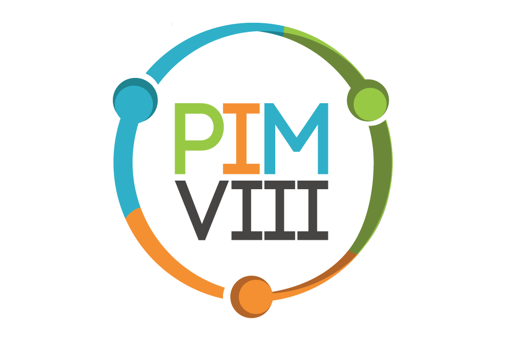
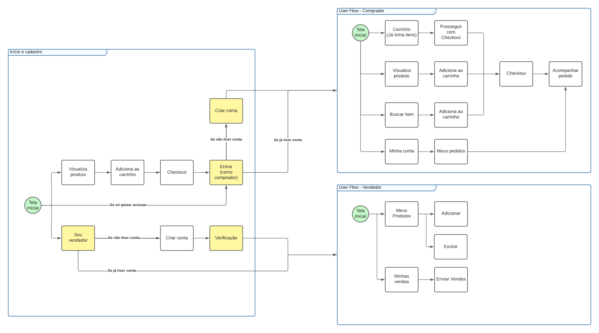
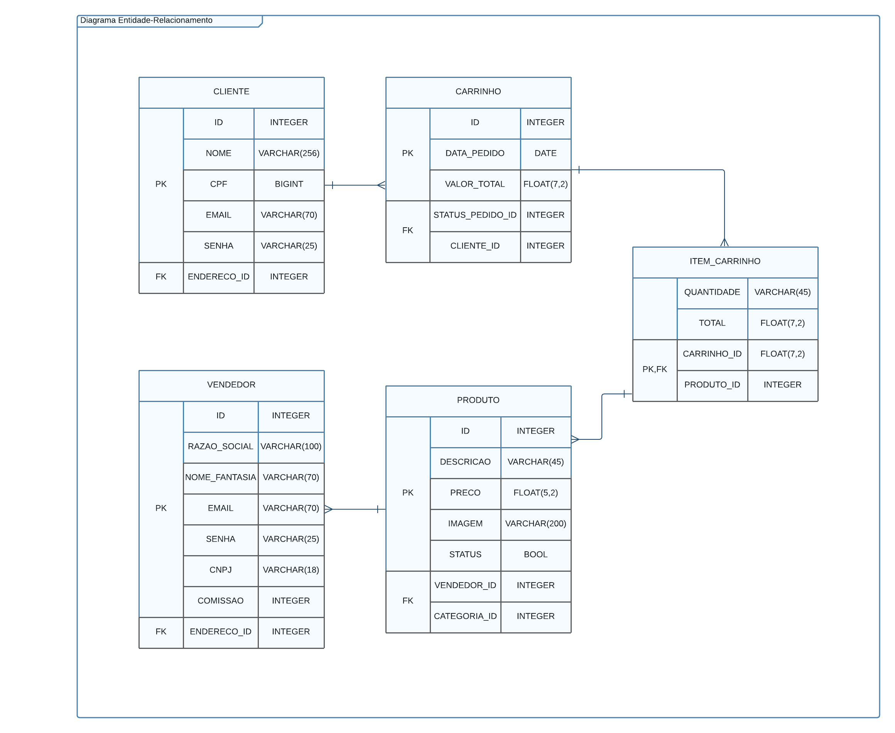

# Projeto Integrado Multidisciplinar - PIM VII

 

- Tema: Sistema de Marketplace para compra e venda de produtos diversos via app/web;

O que precisa entregar (por matéria):

## Desenvolvimento de Software para internet
1. Código ASPX interface gráfica com usuário ASP.net
2. Inclua no trabalho as capturas de tela
3. Incluir no trabalho o código ASPX

### Diagrama User Flow

[Abrir em larga escala](./img/User-Flow.pdf)

## Tópicos Especiais de Programação Orientada a Objetos
1. Protótipo de interface gráfica com usuário Android usando XML
2. Inclua as capturas de tela
3. Inclua código XML

## Programação Orientada a Objetos II
1. Código C# acesso ao Banco de Dados
2. Codificar as classes de entidades:
    - Cliente
    - Carrinho
    - Produto
    - Vendedor
3. Codificar a classe CarrinhoRepository
4. Implementar os métodos da classe CarrinhoRepository

- O diagrama Entidade-Relacionamento do trecho do banco de dados sob responsabilidade da equipe JÁ FOI DADO, a partir dele desenvolve-se o mecanismo de acesso em C#
- O diagrama de Classes do mecanismo de acesso ao trecho do banco de dados também já foi dado

### Diagrama Entidade-Relacionamento

[Abrir em larga escala](./img/Diagrama-Entidade-Relacionamento.pdf)

# Sumário

1. **Introdução**

2. **Sobre o Projeto**
   - 2.1 Escopo do Projeto e PIM

3. **Desenvolvimento de Software para Internet**
   - 3.1 Fluxo de Usuários no Protótipo
   - 3.2 Estruturação do Código ASPX
   - 3.3 Visualização da Interface em Capturas de Tela

4. **Tópicos Especiais de Programação Orientada a Objetos**
   - 4.1 Fluxo do Usuário no Protótipo
   - 4.2 Estruturação do Código XML
   - 4.3 Exibição da Interface em Capturas de Tela

5. **Programação Orientada a Objetos II**
   - 5.1 Modelagem de Entidades e Relacionamentos no Banco de Dados
   - 5.2 Estruturação do Código C# para Acesso às Classes e Entidades
   - 5.3 Implementação da Classe Repositório 'CarrinhoRepository'

6. **Conclusão**

7. **Referências Bibliográficas**

# Divisão de tarefas

 9 dias de desenvolvimento 

- [ ] Dia 1:

| Quem fará | Tempo de Execução  | Descrição                                                         | 
|-----------|--------------------|-------------------------------------------------------------------|
| Pedro     | | |
| Lucas     | | |
| Allan     | | |

- [ ] Dia 2:

| Quem fará | Tempo de Execução  | Descrição                                                         | 
|-----------|--------------------|-------------------------------------------------------------------|
| Pedro     | | |
| Lucas     | | |
| Allan     | | |

- [ ] Dia 3:

| Quem fará | Tempo de Execução  | Descrição                                                         | 
|-----------|--------------------|-------------------------------------------------------------------|
| Pedro     | | |
| Lucas     | | |
| Allan     | | |

- [ ] Dia 4:

| Quem fará | Tempo de Execução  | Descrição                                                         | 
|-----------|--------------------|-------------------------------------------------------------------|
| Pedro     | | |
| Lucas     | | |
| Allan     | | |

- [ ] Dia 5:

| Quem fará | Tempo de Execução  | Descrição                                                         | 
|-----------|--------------------|-------------------------------------------------------------------|
| Pedro     | | |
| Lucas     | | |
| Allan     | | |

- [ ] Dia 6:

| Quem fará | Tempo de Execução  | Descrição                                                         | 
|-----------|--------------------|-------------------------------------------------------------------|
| Pedro     | | |
| Lucas     | | |
| Allan     | | |

- [ ] Dia 7:

| Quem fará | Tempo de Execução  | Descrição                                                         | 
|-----------|--------------------|-------------------------------------------------------------------|
| Pedro     | | |
| Lucas     | | |
| Allan     | | |

- [ ] Dia 8:

| Quem fará | Tempo de Execução  | Descrição                                                         | 
|-----------|--------------------|-------------------------------------------------------------------|
| Pedro     | | |
| Lucas     | | |
| Allan     | | |

- [ ] Dia 9:

| Quem fará | Tempo de Execução  | Descrição                                                         | 
|-----------|--------------------|-------------------------------------------------------------------|
| Pedro     | | |
| Lucas     | | |
| Allan     | | |

# Considerações finais

Agradeço a disposição de todos neste projeto, espero que façamos história com o mesmo.

- Integrantes:
  - Pedro José Laurenti de Matos (RA: 0621134)
  - Lucas Andrade da Silva (RA: 0621821)
  - Allan Cândido Mendes (RA: 0618169)

## Leia aqui

[Documentação final](https://www.pedrolaurenti.orbytesistemas.com/pimviii/PIM-VII.pdf) 

