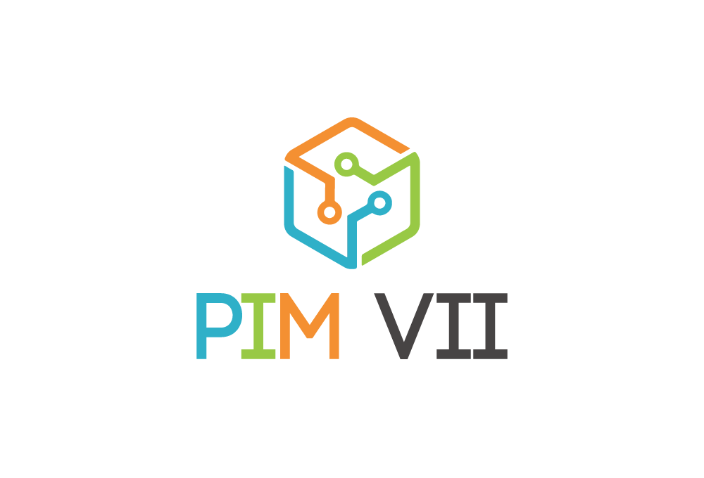

# Projeto Integrado Multidisciplinar - PIM VII

{width=80%}

 

Após leitura e compreensão dos requisitos do projeto, elaboramos um sumário que delineará a estrutura do documento final que será desenvolvido. O sumário a seguir apresenta as seções que iremos abordar:

## Sumário

1. **Introdução**
    - 1.1 Contexto do Projeto
    - 1.2 Objetivos do Trabalho

2. **Plano de Negócios**
    - 2.1 Desenvolvimento do Plano de Negócios
    - 2.2 Estratégias Empresariais

3. **Requisitos e Diagramas**
    - 3.1 Requisitos Funcionais e Não Funcionais
    - 3.2 Diagrama de Caso de Uso
    - 3.3 Diagrama de Atividades

4. **Diagramas e Metodologia**
    - 4.1 Diagrama de Classes
    - 4.2 Diagrama de Sequência
    - 4.3 Diagrama de Componentes e de Implantação
    - 4.4 Metodologia de Desenvolvimento

5. **Gerenciamento de Projeto**
    - 5.1 Termo de Abertura de Projeto
    - 5.2 Matriz de Papéis e Responsabilidades
    - 5.3 Cronograma de Atividades e Custos
    - 5.4 Análise de Riscos
    - 5.5 Lições Aprendidas

6. **Conclusão**
    - 6.1 Resumo dos Principais Pontos
    - 6.2 Contribuições e Resultados Esperados

7. **Referências**
    - 7.1 Fontes de Informação Utilizadas

# Divisão de tarefas

**Dia 1: Planejamento e Escopo (4 horas)**

| Quem fará | Tempo de Execução  | Descrição                                                      | Check |
|-----------|--------------------|----------------------------------------------------------------|-------|
| Lucas     | 2 horas            | Desenvolver um Plano de Negócios para a startup (Empreendedorismo) | [ ]   |
| Pedro     | 2 horas            | Redigir a introdução e o resumo do trabalho                     | [ ]   |

**Dia 2: Requisitos e Diagramas (4 horas)**

| Quem fará | Tempo de Execução  | Descrição                                                      | Check |
|-----------|--------------------|----------------------------------------------------------------|-------|
| Lucas     | 2 horas            | Propor requisitos funcionais, não funcionais e regras de negócios (Projeto de Sistemas Orientado a Objetos) | [ ]   |
| Pedro     | 2 horas            | Criar o diagrama de caso de uso (descritivo e design)           | [ ]   |

**Dia 3: Diagramas e Metodologia (4 horas)**

| Quem fará | Tempo de Execução  | Descrição                                                      | Check |
|-----------|--------------------|----------------------------------------------------------------|-------|
| Lucas     | 2 horas            | Criar o diagrama de atividades                                  | [ ]   |
| Pedro     | 2 horas            | Criar o diagrama de classes                                     | [ ]   |

**Dia 4: Metodologia e Gerenciamento de Projeto (4 horas)**

| Quem fará | Tempo de Execução  | Descrição                                                      | Check |
|-----------|--------------------|----------------------------------------------------------------|-------|
| Lucas     | 1 hora             | Criar o diagrama de sequência                                  | [ ]   |
| Pedro     | 1 hora             | Criar o diagrama de componentes e de implantação               | [ ]   |
| Ambos     | 2 horas            | Escrever sobre a metodologia escolhida frente às Normas Internacionais ISO, CMMI, MPS.br (Gestão da Qualidade) | [ ]   |

**Dia 5: Conclusão e Finalização (4 horas)**

| Quem fará | Tempo de Execução  | Descrição                                                      | Check |
|-----------|--------------------|----------------------------------------------------------------|-------|
| Lucas     | 30 minutos         | Definir a Matriz de Papéis e Responsabilidades                  | [ ]   |
| Pedro     | 1 hora             | Criar o Cronograma de Atividades e Custos                       | [ ]   |
| Lucas     | 30 minutos         | Realizar a Análise de Riscos                                    | [ ]   |
| Lucas     | 30 minutos         | Escrever a conclusão do trabalho                                | [ ]   |
| Pedro     | 30 minutos         | Listar Lições Aprendidas                                       | [ ]   |
| Pedro     | 30 minutos         | Revisar e formatar o trabalho, incluindo capa, sumário e referências (ABNT) | [ ]   |
