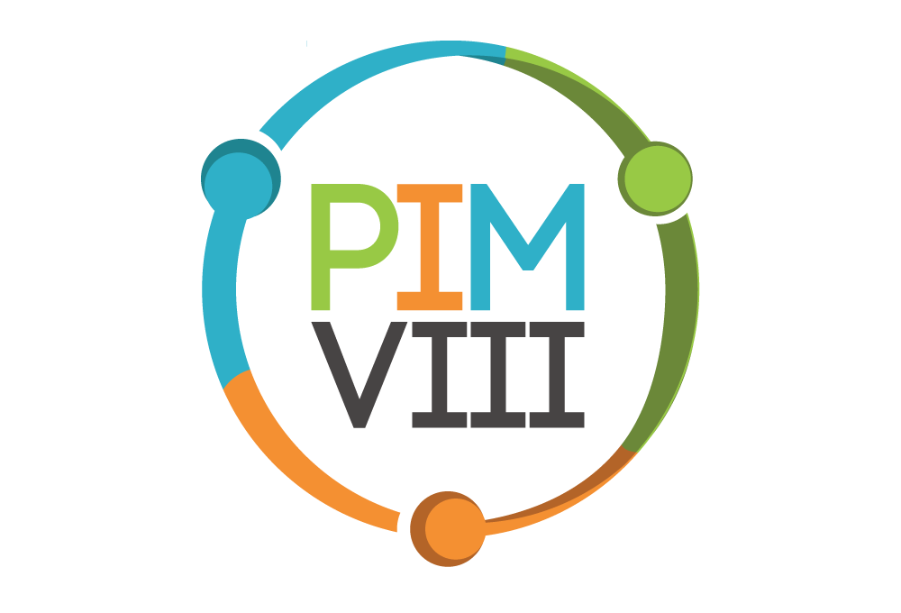

# Projeto Integrado Multidisciplinar - PIM VII

 

- Tema: Sistema de Marketplace para compra e venda de produtos diversos via app/web;

O que precisa entregar (por matéria):

## Desenvolvimento de Software para internet
1. Código ASPX interface gráfica com usuário ASP.net
2. Inclua no trabalho as capturas de tela
3. Incluir no trabalho o código ASPX

### Diagrama User Flow

](./img/User-Flow.png)

## Tópicos Especiais de Programação Orientada a Objetos
1. Protótipo de interface gráfica com usuário Android usando XML
2. Inclua as capturas de tela
3. Inclua código XML

## Programação Orientada a Objetos II
1. Código C# acesso ao Banco de Dados
2. Codificar as classes de entidades:
    - Cliente
    - Carrinho
    - Produto
    - Vendedor
3. Codificar a classe CarrinhoRepository
4. Implementar os métodos da classe CarrinhoRepository

- O diagrama Entidade-Relacionamento do trecho do banco de dados sob responsabilidade da equipe JÁ FOI DADO, a partir dele desenvolve-se o mecanismo de acesso em C#
- O diagrama de Classes do mecanismo de acesso ao trecho do banco de dados também já foi dado

### Diagrama Entidade-Relacionamento

](./img/Diagrama-Entidade-Relacionamento.png)

# Sumário

1. **Introdução**
    - 1.1 Contexto e objetivos do Projeto

2. **Interface Gráfica Android**
    - 2.1 Android usando XML
    - 2.2 Prints

3. **Interface Gráfica Desktop**
    - 3.1 Web/Desktop usando ASP.NET
    - 3.2 Prints 

4. **Banco de Dados**
    - 3.1 Classes de Entidades
        - Cliente
        - Carrinho
        - Produto
        - Vendedor
    - 3.2 Classe CarrinhoRepository
        - Lógica dos métodos

5. **Conclusão**
    - 6.1 Retomada da proposta inicial
    - 6.2 Resumo dos Principais Pontos

6. **Referências**
    - 7.1 Fontes de Informação Utilizadas

# Divisão de tarefas

 9 dias de desenvolvimento 

- [ ] Dia 1:

| Quem fará | Tempo de Execução  | Descrição                                                         | 
|-----------|--------------------|-------------------------------------------------------------------|
| Pedro     | | |
| Lucas     | | |
| Allan     | | |

- [ ] Dia 2:

| Quem fará | Tempo de Execução  | Descrição                                                         | 
|-----------|--------------------|-------------------------------------------------------------------|
| Pedro     | | |
| Lucas     | | |
| Allan     | | |

- [ ] Dia 3:

| Quem fará | Tempo de Execução  | Descrição                                                         | 
|-----------|--------------------|-------------------------------------------------------------------|
| Pedro     | | |
| Lucas     | | |
| Allan     | | |

- [ ] Dia 4:

| Quem fará | Tempo de Execução  | Descrição                                                         | 
|-----------|--------------------|-------------------------------------------------------------------|
| Pedro     | | |
| Lucas     | | |
| Allan     | | |

- [ ] Dia 5:

| Quem fará | Tempo de Execução  | Descrição                                                         | 
|-----------|--------------------|-------------------------------------------------------------------|
| Pedro     | | |
| Lucas     | | |
| Allan     | | |

- [ ] Dia 6:

| Quem fará | Tempo de Execução  | Descrição                                                         | 
|-----------|--------------------|-------------------------------------------------------------------|
| Pedro     | | |
| Lucas     | | |
| Allan     | | |

- [ ] Dia 7:

| Quem fará | Tempo de Execução  | Descrição                                                         | 
|-----------|--------------------|-------------------------------------------------------------------|
| Pedro     | | |
| Lucas     | | |
| Allan     | | |

- [ ] Dia 8:

| Quem fará | Tempo de Execução  | Descrição                                                         | 
|-----------|--------------------|-------------------------------------------------------------------|
| Pedro     | | |
| Lucas     | | |
| Allan     | | |

- [ ] Dia 9:

| Quem fará | Tempo de Execução  | Descrição                                                         | 
|-----------|--------------------|-------------------------------------------------------------------|
| Pedro     | | |
| Lucas     | | |
| Allan     | | |

# Considerações finais

Agradeço a disposição de todos neste projeto, espero que façamos história com o mesmo.

- Integrantes:
  - Pedro José Laurenti de Matos (RA: 0621134)
  - Lucas Andrade da Silva (RA: 0621821)
  - Allan Cândido Mendes (RA: 0618169)

## Leia aqui

[Documentação final](https://www.pedrolaurenti.orbytesistemas.com/pimviii/PIM-VII.pdf) 

