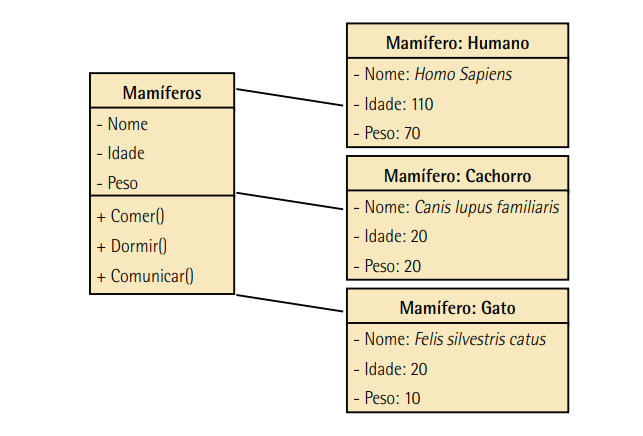

--- 
title: "Projeto de Interface com o Usuário"
author: "Pedro José Laurenti de Matos"
date: "`r Sys.Date()`"
output: rmdformats::material

---


# Introdução

A interação entre seres humanos e computadores evoluiu ao longo do tempo. No passado, apenas algumas pessoas podiam interagir com computadores usando chaves e cartões perfurados. Atualmente, qualquer pessoa pode usar um computador com o toque de um dedo em uma tela sensível ao toque. Isso mudou a maneira como os humanos interagem com os computadores.

Os programadores desempenham um papel importante nessa interação, pois são responsáveis por fazer o computador executar tarefas para ajudar as pessoas a calcular, obter informações e se divertir. Ao longo do tempo, a forma como os programadores pensam sobre a programação também mudou.

Antes, a programação era um processo linear e rígido, em que o usuário seguia um roteiro definido pelo programador. Agora, os usuários podem tomar decisões durante a execução de um programa. Por exemplo, eles podem cancelar uma tarefa no meio do processo ou alternar entre diferentes funções apenas tocando em um ícone.

Essa mudança na forma de pensar exigiu que os programadores adotassem uma abordagem diferente, conhecida como programação orientada a objetos. Essa nova abordagem permite que os programadores construam programas de maneira mais flexível, levando em consideração a experiência do usuário.

Este livro-texto explora em detalhes a programação orientada a objetos e como ela influencia a maneira como pensamos sobre a criação de programas.

## Tab of Contents

1. Unidade I
    - A PROGRAMAÇÃO ORIENTADA A OBJETOS
        - Histórico da programação orientada a objetos
        - Vantagens e objetivos da POO
    - PRINCIPAIS CONCEITOS

2. Unidade II
    - CONHECENDO A LINGUAGEM DE PROGRAMAÇÃO C#
        - Visão geral da plataforma Microsoft .NET
        - Instalação da linguagem C#
            - Iniciando um novo projeto no C#
            - Execução C#
    - OS FUNDAMENTOS DA PROGRAMAÇÃO EM LINGUAGEM C#

3. Unidade III
    - CONCEITOS BÁSICOS
        - Abstração
        - Objetos
        - Classes
            - Classes em C#
        - Atributos
        - Métodos
            - Métodos em C#
            - Métodos construtores
            - Sobrecarga de métodos
            - A palavra-chave this
    - INTEGRAÇÃO ENTRE CLASSES
        - Encapsulamento
            - Modificadores de acesso
            - Modificador static
        - Associações
        - Agregação e composição
        - Reutilização de classes
            - Delegação
            - Herança
            - Referência à superclasse
            - Sobreposição e ocultação
        - Polimorfismo
        - Objetos

4. Unidade IV
    - INTERAÇÃO ENTRE OBJETOS
        - Comunicação e associação
        - Classes abstratas e interfaces
            - Classes abstratas
            - Interfaces
        - Herança simples e múltipla
        - Hierarquias de classes
    - RECURSOS DOS PROGRAMAS ORIENTADOS A OBJETOS
        - Persistência
        - Inicialização e destruição de objetos
        - Tratamento de exceções

# Unidade I

## A PROGRAMAÇÃO ORIENTADA A OBJETOS

### Histórico da programação orientada a objetos

A programação orientada a objetos (POO) não é recente. O editor gráfico Sketchpad, desenvolvido por Ivan Sutherland em 1963, foi o primeiro editor orientado a objetos. Ele permitia criar objetos manipuláveis e instâncias semelhantes a um desenho mestre. As ideias do Sketchpad foram fundamentais para os conceitos de herança. Na década de 1960, Kristen Nygaard e Ole-Johan Dahl desenvolveram os conceitos de classe e herança na linguagem Simula 67. Alan Kay, na Xerox, estudava formas de interpretar problemas do mundo real e percebeu que substantivos e verbos estão interligados. Ele definiu os princípios da POO, onde tudo no mundo real é um objeto, objetos realizam ações, objetos são agrupados em classes e classes são organizadas hierarquicamente. A POO segue a maneira natural como os seres humanos abstraem o mundo real, facilitando a modelagem e desenvolvimento de sistemas por meio da interação entre objetos.

###  Vantagens e objetivos da POO

Desde sua criação até os dias de hoje, muitas linguagens foram criadas e gradativamente incorporando os conceitos da POO por completo.

A programação orientada a objetos (POO) é uma evolução da programação estrutural/modular, impulsionada pela popularização dos computadores e pela crescente demanda na indústria de software. Ao contrário da programação estrutural, onde o código é copiado para reutilização, a POO permite uma modelagem mais natural e a reutilização eficiente de código. Isso reduz os custos de manutenção e aumenta a produtividade dos programadores. A POO oferece uma abordagem de modelagem baseada na abstração do ambiente real, facilitando a compreensão e reduzindo a necessidade de documentação extensa. Em resumo, a POO é uma técnica poderosa de programação com vantagens significativas em relação à programação estrutural/modular.

| Vantagens                                                            | Desvantagens                                                            |
|----------------------------------------------------------------------|-------------------------------------------------------------------------|
| - Os sistemas POO geralmente possuem uma distribuição de código mais lógica, funcional e melhor encapsulada. | - O aprendizado do paradigma de programação orientada a objetos pode ser mais complicado no início em comparação a sistemas estruturados. |
| - Torna a manutenção e a extensão do código mais fácil e com menos riscos de inserção de erros. | - Requer uma base conceitual bem formada para começar a programar, ao contrário da programação procedural tradicional. |
| - Facilita o reaproveitamento de código. | - Em termos de velocidade de processamento, linguagens orientadas a objetos geralmente não são tão eficientes quanto linguagens não orientadas a objetos. |


Segundo a Microsoft, a programação orientada a objeto (POO) é apoiada em três pilares: **encapsulamento, herança e polimorfismo** (MICROSOFT, 2014; SINTES, 2002).

##  PRINCIPAIS CONCEITOS

A Programação Orientada a Objetos (POO) envolve conceitos importantes que devem ser estudados e compreendidos para o desenvolvimento correto de software. A **Unified Modeling Language (UML)** é uma forma de visualizar projetos de software em POO, seguindo um padrão de representação.

Programar orientado a objetos requer aprender a pensar de maneira orientada a objetos, o que pode ser natural para crianças, mas é perdido ao longo do tempo em favor de um pensamento procedural e estruturado.

Vejamos o seguinte exemplo: para se dirigir um carro, nós simplesmente nos sentamos, ajustamos os controles (tais como banco, altura do volante, espelhos e farol), damos partida e dirigimos! Então, podemos dizer que nós somos usuários de um sistema chamado Carro. Vamos analisá-lo:
- Este Carro é composto por uma série de peças que chamamos de classe.
- Tanto o Carro como essas classes possuem uma série de características próprias. Para essas características, damos o nome de atributos.
- Cada classe, assim como o Carro, também possui funções (comportamentos) específicas. Essas funções são chamadas de métodos.

A análise de entidades do mundo real e a abstração são fundamentais na POO. Por exemplo, um carro é uma entidade composta por classes (o que é), atributos (características) e métodos (comportamentos).



<br>

Pensando nos animais mamíferos, temos uma classe principal que possui atributos (características) e métodos (comportamentos) próprios da classe mamíferos. Porém, esses métodos e atributos se materializam pelos animais mais específicos, como cães, gatos e seres humanos. Podemos dizer, portanto, que as classes Humano, Cachorro e Gato são instâncias. Um objeto é uma instância de uma classe (SINTES, 2002, p. 7).

Quando um objeto faz alguma coisa, executa uma ação quando recebe uma mensagem ou responde a uma mudança de estado, ele é chamado de comportamento.

Seguindo essa linha de pensamento, sabemos que esses animais possuem órgãos em seus copos, tal como o coração (veja a figura a seguir).


<br>

Um órgão como o coração possui características e funções próprias; logo, podemos abstraí-lo e modelá-lo como uma classe específica.

Essa classe Coração irá compor uma característica da classe Mamíferos que, embora faça uso do Coração (assim como as demais classes que herdam suas características), não precisa conhecer seu funcionamento para utilizá-lo. Basta saber que o Coração precisa ter um tamanho específico (para que caiba no animal apropriado) e que ele deve bater, por exemplo.

Dessa forma, damos o nome de encapsulamento à técnica de utilizar classes prontas como característica de outra classe de forma a não ter a necessidade, nem a dependência, dos detalhes de seu funcionamento para que tal classe possa ser utilizada.

Encapsulamento é a característica da POO de ocultar partes independentes da implementação. O encapsulamento permite que você construa partes ocultas da implementação do software, que atingem uma funcionalidade e ocultam os detalhes de implementação do mundo exterior (SINTES, 2002, p. 22). 

A herança permite que você baseie a definição de uma nova classe em uma previamente existente. Assim, podemos definir uma superclasse chamada Vertebrados na qual estão reunidos os atributos gerais que todas as suas subclasses possuem.


<br>

A interação entre objetos ocorre por meio de mensagens, e objetos podem estar relacionados de forma independente ou em uma relação mais profunda, onde o comportamento de um objeto depende do outro.

Outro conceito relevante é o polimorfismo. Tal conceito nos diz que coisas diferentes se comportam de maneiras diferentes com a mesma ação

Se pensarmos nos carros, todos eles funcionam de forma similar, mas existem pequenas alterações de funcionamento (que o motorista não precisa saber para poder usá-los) em determinas ações. A alimentação dos motores com diferentes tipos de combustível exemplifica bem o polimorfismo. O motor é praticamente o mesmo em sua composição, independentemente da categoria, mas responde de maneira semelhante.

onde exatamente entram os objetos? Classes e objetos são praticamente a mesma coisa, exceto por um detalhe: a implementação. Assim como nos carros, antes de implementá-los, ou seja, construí-los e montá-los, é necessário projetá-los. Fase de projeto é onde se definem as características e ações de cada peça do carro. As classes são definições de como o programa irá funcionar. 

Uma vez concluído o projeto, passa-se para a fase de construção, na qual teremos no final o projeto montado e pronto para uso! Assim é o objeto em POO: uma classe que será instanciada (colocada em memória) para o uso.

## Resumo

### Conceitos

- Classe:
    Uma classe é um componente no programa que representa uma entidade ou conceito. Ela tem **atributos**, que são as características ou propriedades da classe, e **métodos**, que são as ações ou comportamentos que a classe pode executar. Pense na classe como uma espécie de molde ou modelo que define como um objeto deve ser.

- Objeto:
    Diferente de uma classe, é **específico** ( até certo ponto, pois todos os elementos podem ser objetos e classes dependendo do campo de visão).

- Atributo:
    Um atributo é uma característica ou propriedade de uma classe que descreve seu estado. Por exemplo, se tivermos a classe "Pessoa", os atributos podem ser "nome", "idade" e "altura". Esses atributos ajudam a definir como uma pessoa específica é.


### Ações

- Método:
    Um método é um comportamento ou ação que uma classe pode executar. É como uma função associada à classe. Por exemplo, na classe "Carro", um método pode ser "ligar" ou "acelerar". Os métodos definem as ações que um objeto da classe pode realizar.

- Instância:
    Uma instância é um objeto específico criado a partir de uma classe. Quando você cria um objeto usando uma classe, você está criando uma instância dessa classe. Por exemplo, se tivermos a classe "Cachorro", podemos criar uma instância chamada "meuCachorro" que representa um cachorro específico.

- Interação entre objetos:
    A interação entre objetos refere-se à comunicação e relação entre objetos diferentes em um programa. Os objetos podem se enviar mensagens uns aos outros para solicitar a execução de determinadas ações ou obter informações. Essa interação é fundamental para o funcionamento de sistemas orientados a objetos, onde os objetos trabalham juntos para atingir um objetivo comum.

- Comportamento:
    O comportamento refere-se às ações realizadas por um objeto em resposta a uma mensagem ou mudança de estado. É o que um objeto faz ou como ele responde a determinadas situações. Por exemplo, um objeto da classe "Gato" pode ter o comportamento de "miar" quando estiver com fome.

---

- Encapsulamento:
    Técnica de utilizar classes prontas como característica de outra classe de forma a não ter a necessidade, nem a dependência, dos detalhes de seu funcionamento para que tal classe possa ser utilizada.

- Herança:
    Herança é um mecanismo que permite que uma classe herde atributos e métodos de outra classe. Isso significa que uma classe filha pode estender ou especializar uma classe pai, aproveitando suas características. Por exemplo, pode haver uma classe pai chamada "Animal" e classes filhas como "Cachorro" e "Gato". As classes filhas herdam os atributos e métodos da classe pai, mas também podem ter seus próprios atributos e métodos exclusivos.

- Polimorfismo:
    Polimorfismo é a capacidade de objetos de diferentes classes responderem de maneira diferente a uma mesma ação. Isso significa que um método pode ter implementações diferentes em classes diferentes, mas pode ser chamado da mesma maneira. Por exemplo, pode haver um método chamado "fazerSom()" que é usado em diferentes classes de animais. Cada classe de animal pode implementar esse método de forma diferente para produzir o som específico do animal.

# Unidade II
## CONHECENDO A LINGUAGEM DE PROGRAMAÇÃO C#

A plataforma .NET, desenvolvida pela Microsoft, é uma plataforma de desenvolvimento que se concentra principalmente na criação de serviços Web XML, também conhecidos como web services. A ideia central dos web services é permitir que diferentes aplicações, independentemente do sistema operacional ou da linguagem de programação, possam se comunicar e trocar dados de forma transparente. A plataforma .NET visa englobar todas as linguagens de programação, compiladores e modelos de objetos necessários para alcançar essa integração.

Alguns pontos importantes sobre a plataforma .NET são:

- Independência de linguagem: permite a implementação de herança, controle de exceções e depuração entre diferentes linguagens de programação.
- Reutilização de código legado: possibilita o reaproveitamento de código escrito com outras tecnologias, como COM, COM+, ATL, DLLs e outras bibliotecas existentes.
- Tempo de execução compartilhado: o Common Language Runtime (CLR) é compartilhado entre as linguagens que suportam a plataforma .NET, eliminando a necessidade de runtimes diferentes para cada linguagem.
- Sistemas autoexplicativos e controle de versões: cada peça de código .NET contém informações necessárias e suficientes para o runtime, sem depender de registros externos, o que evita conflitos de incompatibilidade.
- Simplicidade na resolução de problemas complexos.

A arquitetura da plataforma .NET é dividida em módulos ou componentes, incluindo o CLR (Common Language Runtime), CTS (Common Type System), CLS (Common Language Specification) e BCL (Base Class Library). O CLR é o ambiente de execução das aplicações .NET, gerenciando a memória e permitindo a interoperabilidade entre as linguagens. O CTS define os tipos suportados por .NET, enquanto o CLS estabelece um conjunto de regras que as linguagens devem seguir para garantir a interoperabilidade. A BCL oferece uma biblioteca de classes base para acelerar o desenvolvimento de sistemas, abrangendo desde janelas e gráficos até entrada/saída, redes e segurança.

Além disso, a plataforma .NET utiliza a linguagem intermediária Microsoft Intermediate Language (MSIL), que é interpretada e executada pelo CLR. Qualquer programa .NET é traduzido para IL, independentemente da linguagem de programação utilizada, garantindo a independência da linguagem e da plataforma.

Em resumo, a plataforma .NET é uma plataforma de desenvolvimento da Microsoft que permite a criação de web services e a integração de diferentes linguagens de programação. Ela possui um tempo de execução compartilhado, oferece reutilização de código legado, tem sistemas autoexplicativos, controle de versões e simplifica a resolução de problemas complexos. Sua arquitetura é dividida em módulos como o CLR, CTS, CLS e BCL, e utiliza a linguagem intermediária MSIL para garantir a independência da linguagem e da plataforma.

### Visão geral da plataforma Microsoft .NET

A plataforma Microsoft .NET é um conjunto de tecnologias de software desenvolvido pela Microsoft. Ela inclui a linguagem de programação C#, bem como outras linguagens como VB.NET e F#. A plataforma .NET permite o desenvolvimento de aplicativos para Windows, web e dispositivos móveis.

### Instalação da linguagem C#

Antes de começar a programar em C#, é necessário instalar as ferramentas necessárias. Siga os passos abaixo para instalar a linguagem C#:

1. Baixe e instale o Visual Studio: O Visual Studio é um ambiente de desenvolvimento integrado (IDE) que inclui suporte completo para a linguagem C#. Você pode baixá-lo gratuitamente no site da Microsoft (https://visualstudio.microsoft.com/).

2. Selecione os componentes necessários: Durante a instalação do Visual Studio, você terá a opção de selecionar os componentes que deseja instalar. Certifique-se de selecionar o suporte para o desenvolvimento em C#.

3. Conclua a instalação: Siga as instruções na tela para concluir a instalação do Visual Studio.

### Iniciando um novo projeto no C#

Agora que você tem o Visual Studio instalado, vamos iniciar um novo projeto em C#:

1. Abra o Visual Studio: Após a instalação, abra o Visual Studio em seu computador.

2. Crie um novo projeto: No menu principal, clique em "Arquivo" > "Novo" > "Projeto" para abrir o assistente de criação de projetos.

3. Selecione o tipo de projeto: No assistente, escolha o tipo de projeto que deseja criar. Por exemplo, você pode escolher "Aplicativo de Console" para criar um programa de console simples.

4. Escolha o nome e a localização do projeto: Digite um nome para o projeto e escolha a localização onde ele será armazenado em seu computador.

5. Clique em "Criar" ou "OK": Após configurar as opções do projeto, clique em "Criar" ou "OK" para criar o projeto.

### Execução C#

Agora que você tem um projeto em C#, vamos executá-lo:

1. Escolha o projeto de inicialização: No Visual Studio, no Solution Explorer (Explorador de Soluções), clique com o botão direito do mouse no projeto que deseja executar e selecione "Definir como Projeto de Inicialização".

2. Inicie a depuração: No menu principal, clique em "Depurar" > "Iniciar Depuração" ou pressione a tecla F5 para iniciar a depuração do projeto.

3. Observe a saída: A saída do programa será exibida no Console do Visual Studio ou em uma janela de console separada, dependendo do tipo de aplicativo que você criou.

Parabéns! Você executou com sucesso um programa em C#. Agora você pode começar a explorar os fundamentos da programação em C#.

## OS FUNDAMENTOS DA PROGRAMAÇÃO EM LINGUAGEM C#

Agora que você está familiarizado com a linguagem C# e a plataforma .NET, vamos explorar os fundamentos da programação em C#. Os tópicos a seguir fornecerão uma base sólida para o desenvolvimento de aplicativos em C#:

1. Variáveis e tipos de dados: Aprenda a declarar variáveis e entender os diferentes tipos de dados disponíveis em C#.

2. Estruturas de controle: Explore as estruturas de controle, como condicionais (if-else, switch) e loops (for, while), para controlar o fluxo de execução do programa.

3. Funções e métodos: Saiba como definir e usar funções e métodos para organizar o código e reutilizar a lógica em seu programa.

4. Arrays e coleções: Aprenda a trabalhar com arrays e coleções para armazenar e manipular conjuntos de dados.

5. Orientação a objetos: Entenda os conceitos fundamentais da programação orientada a objetos, como classes, objetos, herança e polimorfismo.

6. Manipulação de exceções: Saiba como lidar com exceções e erros em tempo de execução para tornar seu programa mais robusto.

7. Entrada e saída de dados: Explore as diferentes maneiras de interagir com o usuário e ler/escrever dados de/arquivos.

8. Programação assíncrona: Familiarize-se com a programação assíncrona em C# para lidar com operações de longa duração de forma eficiente.

9. Depuração e teste: Aprenda técnicas de depuração e teste para identificar e corrigir problemas em seu código.

Ao dominar esses fundamentos da programação em C#, você estará pronto para desenvolver aplicativos mais complexos e explorar recursos avançados da linguagem.

Espero que este tutorial seja útil para você começar a programar em C#. Boa sorte em sua jornada de aprendizado!

# Unidade III

## Abstração

A abstração em C# é alcançada por meio da criação de classes, que são modelos que representam objetos do mundo real. Uma classe define os atributos e métodos que um objeto terá. Por exemplo, podemos ter uma classe chamada "Carro" com atributos como "modelo", "cor" e "ano" e métodos como "ligar" e "acelerar". Essa classe abstrai as características e comportamentos de um carro em geral.

## Objetos

Objetos em C# são instâncias específicas de uma classe. Eles são criados a partir da definição da classe e possuem seus próprios valores para os atributos da classe. Por exemplo, a partir da classe "Carro", podemos criar objetos como "carro1" e "carro2", cada um com seus próprios valores para "modelo", "cor" e "ano".

## Classes

Em C#, as classes são definidas usando a palavra-chave `class`. Dentro de uma classe, podemos definir os atributos como variáveis e os métodos como funções.

### Classes em C#

```csharp
public class Carro
{
    public string modelo;
    public string cor;
    public int ano;

    public void ligar()
    {
        Console.WriteLine("O carro está ligado.");
    }

    public void acelerar()
    {
        Console.WriteLine("O carro está acelerando.");
    }
}

```

Nesse exemplo, a classe "Carro" possui os atributos modelo, cor e ano, e os métodos ligar() e acelerar().

## Atributos

Em C#, os atributos são as características ou propriedades dos objetos. Eles são declarados dentro de uma classe como variáveis. Cada objeto instanciado a partir da classe terá seus próprios valores para os atributos.

## Métodos
Os métodos em C# são as ações ou comportamentos que os objetos podem executar. Eles são definidos dentro de uma classe como funções. Os métodos podem receber parâmetros, realizar operações e interagir com os atributos e outros objetos.

### Métodos em C#

```csharp
public void ligar()
{
    Console.WriteLine("O carro está ligado.");
}

public void acelerar()
{
    Console.WriteLine("O carro está acelerando.");
}
```

Nesse exemplo, os métodos ligar() e acelerar() são definidos na classe "Carro" e podem ser chamados em objetos dessa classe.

### Métodos construtores
Os métodos construtores em C# são usados para inicializar um objeto quando ele é criado. Eles são chamados automaticamente durante a criação do objeto e podem receber parâmetros para definir o estado inicial do objeto.

```csharp

public class Carro
{
    public string modelo;
    public string cor;
    public int ano;

    // Construtor sem parâmetros
    public Carro()
    {
        modelo = "Desconhecido";
        cor = "Branco";
        ano = 2020;
    }

    // Construtor com parâmetros
    public Carro(string modelo, string cor, int ano)
    {
        this.modelo = modelo;
        this.cor = cor;
        this.ano = ano;
    }
}
```

No exemplo acima, a classe "Carro" possui dois construtores, um sem parâmetros que define valores padrão e outro com parâmetros para definir os valores do objeto.

### Sobrecarga de métodos
A sobrecarga de métodos em C# permite ter vários métodos com o mesmo nome, mas com parâmetros diferentes. Isso significa que é possível ter diferentes versões de um método que realizam ações semelhantes, mas com diferentes tipos ou quantidades de parâmetros.

### A palavra-chave this
A palavra-chave this em C# é usada para referenciar o objeto atual dentro de uma classe. Ela é usada para distinguir os atributos e métodos do objeto atual dos parâmetros ou variáveis locais com o mesmo nome.

## Integração entre classes

### Encapsulamento

O encapsulamento em C# envolve ocultar os detalhes internos de uma classe e fornecer uma interface controlada para interagir com os objetos. Isso é feito através do uso de modificadores de acesso.

### Modificadores de acesso

Em C#, os modificadores de acesso determinam a visibilidade dos atributos e métodos de uma classe. Os principais modificadores de acesso são:

- `public`: torna o atributo ou método acessível por qualquer classe.
- `private`: torna o atributo ou método acessível apenas dentro da própria classe.
- `protected`: torna o atributo ou método acessível dentro da própria classe e de suas classes derivadas.
- `internal`: torna o atributo ou método acessível dentro do mesmo assembly.

### Modificador static
O modificador `static` em C# é usado para criar membros de classe que pertencem à própria classe, em vez de pertencerem a instâncias individuais da classe. Isso significa que os membros estáticos são compartilhados por todos os objetos da classe.

### Associações

As associações em C# descrevem as relações entre classes e como elas se conectam e interagem entre si. Podemos estabelecer associações de um para um, um para muitos e muitos para muitos.

### Agregação e composição
A agregação e a composição em C# são formas de relacionar classes. Na agregação, uma classe é composta por uma ou mais instâncias de outra classe, mas as instâncias podem existir independentemente da classe principal. Na composição, uma classe é composta por uma ou mais instâncias de outra classe, e as instâncias dependem da classe principal.

### Reutilização de classes
A reutilização de classes em C# permite utilizar classes existentes em novas classes ou projetos. Podemos reutilizar classes por meio de delegação, herança, referência à superclasse e sobreposição e ocultação.

- Delegação

A delegação ocorre quando uma classe transfere a responsabilidade de executar determinadas ações para outra classe. Isso permite que a classe delegante se concentre em suas próprias responsabilidades, enquanto utiliza os serviços de outra classe para realizar tarefas específicas.

- Herança

A herança em C# permite criar novas classes (classes derivadas) a partir de classes existentes (classes base). Uma classe derivada herda os atributos e métodos da classe base, podendo adicionar novos atributos e métodos ou modificar os existentes. A herança permite estabelecer relações de especialização entre classes.

- Referência à superclasse

A referência à superclasse em C# é a capacidade de tratar uma instância de uma classe derivada como uma instância de sua classe base. Isso permite tratar objetos de classes derivadas como objetos de uma classe mais genérica, facilitando a criação de código mais flexível e reutilizável.

- Sobreposição e ocultação

A sobreposição ocorre quando uma classe derivada redefine um método da classe base, fornecendo uma implementação específica para a classe derivada. A ocultação ocorre quando uma classe derivada declara um método com o mesmo nome de um método da classe base, mas sem alterar sua implementação.

## Polimorfismo
O polimorfismo em C# permite que objetos de diferentes classes sejam tratados de forma uniforme, desde que sejam derivados de uma mesma classe base ou implementem uma mesma interface. Isso permite escrever código genérico que pode ser aplicado a diferentes tipos de objetos.


# Unidade IV

## Interação entre Objetos em C#

A interação entre objetos é um conceito fundamental na programação orientada a objetos. Nessa unidade, vamos explorar diversos aspectos dessa interação no contexto da linguagem C#.

## Comunicação e Associação

A comunicação entre objetos ocorre quando um objeto interage com outro, trocando informações ou realizando ações. Essa interação é possível por meio de métodos e propriedades dos objetos. Em C#, é comum usar parâmetros e retorno de métodos para facilitar a comunicação entre objetos.

A associação entre objetos ocorre quando um objeto está relacionado a outro objeto de alguma forma. Essa associação pode ser representada por meio de propriedades ou referências entre os objetos. Em C#, é possível criar associações de um para um, de um para muitos e de muitos para muitos.

- Exemplo de comunicação entre objetos em C#:

```csharp

public class Pessoa
{
    public string Nome { get; set; }

    public void Apresentar()
    {
        Console.WriteLine("Olá, meu nome é " + Nome);
    }
}

public class Program
{
    public static void Main(string[] args)
    {
        Pessoa pessoa = new Pessoa();
        pessoa.Nome = "João";
        pessoa.Apresentar();
    }
}

```

O exemplo de comunicação entre objetos mostra a classe `Pessoa` com o método `Apresentar()`, que imprime uma mensagem de saudação com base no nome da pessoa.

- Exemplo de associação entre objetos em C#:

```csharp

public class Pedido
{
    public decimal ValorTotal { get; set; }
}

public class Cliente
{
    public string Nome { get; set; }
    public Pedido PedidoAtual { get; set; }
}

public class Program
{
    public static void Main(string[] args)
    {
        Pedido pedido = new Pedido();
        pedido.ValorTotal = 100;

        Cliente cliente = new Cliente();
        cliente.Nome = "Maria";
        cliente.PedidoAtual = pedido;

        Console.WriteLine(cliente.Nome + " fez um pedido no valor de " + cliente.PedidoAtual.ValorTotal);
    }
}


```

O exemplo de associação entre objetos apresenta a classe `Pedido` e a classe `Cliente`. O objeto `Cliente` possui uma referência ao objeto `PedidoAtual`, permitindo que o cliente acesse informações sobre seu pedido.


## Classes Abstratas e Interfaces
As classes abstratas e interfaces são mecanismos poderosos para modelar a interação entre objetos em C#.

### Classes Abstratas
Uma classe abstrata é uma classe que não pode ser instanciada diretamente, mas pode ser usada como base para outras classes. Ela define um conjunto de métodos e propriedades que as classes derivadas devem implementar. As classes abstratas permitem a criação de uma hierarquia de classes com comportamentos e características comuns.

- Exemplo de classe abstrata em C#:

```csharp

public abstract class Animal
{
    public abstract void EmitirSom();
}

public class Cachorro : Animal
{
    public override void EmitirSom()
    {
        Console.WriteLine("Au au!");
    }
}

public class Gato : Animal
{
    public override void EmitirSom()
    {
        Console.WriteLine("Miau!");
    }
}

public class Program
{
    public static void Main(string[] args)
    {
        Animal cachorro = new Cachorro();
        cachorro.EmitirSom(); // Output: Au au!

        Animal gato = new Gato();
        gato.EmitirSom(); // Output: Miau!
    }
}

```

O exemplo de classe abstrata demonstra a classe `Animal` como uma classe abstrata que possui um método abstrato `EmitirSom()`. As classes `Cachorro` e `Gato` herdam da classe `Animal` e implementam o método `EmitirSom()` de acordo com suas características.

### Interfaces
Uma interface é um contrato que define um conjunto de métodos e propriedades que uma classe deve implementar. Diferente das classes abstratas, as interfaces não podem conter implementações de métodos, apenas suas assinaturas. Uma classe em C# pode implementar várias interfaces, permitindo uma maior flexibilidade na definição do comportamento dos objetos.

- Exemplo de interface em C#:

```csharp

public interface IVeiculo
{
    void Acelerar();
    void Frear();
}

public class Carro : IVeiculo
{
    public void Acelerar()
    {
        Console.WriteLine("Carro acelerando...");
    }

    public void Frear()
    {
        Console.WriteLine("Carro freando...");
    }
}

public class Moto : IVeiculo
{
    public void Acelerar()
    {
        Console.WriteLine("Moto acelerando...");
    }

    public void Frear()
    {
        Console.WriteLine("Moto freando...");
    }
}

public class Program
{
    public static void Main(string[] args)
    {
        IVeiculo carro = new Carro();
        carro.Acelerar(); // Output: Carro acelerando...
        carro.Frear(); // Output: Carro freando...

        IVeiculo moto = new Moto();
        moto.Acelerar(); // Output: Moto acelerando...
        moto.Frear(); // Output: Moto freando...
    }
}


```

O exemplo de interface apresenta a interface `IVeiculo`, que define os métodos `Acelerar()` e `Frear()`. As classes `Carro` e `Moto` implementam a interface `IVeiculo` e fornecem suas próprias implementações para os métodos.


## Herança Simples e Múltipla
A herança é um mecanismo importante na programação orientada a objetos. Em C#, é possível fazer herança simples, onde uma classe herda de apenas uma classe base, e herança múltipla, onde uma classe herda de várias classes base.

Na herança simples, uma classe pode herdar todos os membros (métodos, propriedades, etc.) da classe base, além de poder adicionar novos membros ou sobrepor os existentes.

- Exemplo de herança simples em C#:

```csharp

public class Animal
{
    public void Comer()
    {
        Console.WriteLine("Animal comendo...");
    }
}

public class Mamifero : Animal
{
    public void Amamentar()
    {
        Console.WriteLine("Mamífero amamentando...");
    }
}

public class Cachorro : Mamifero
{
    public void Latir()
    {
        Console.WriteLine("Cachorro latindo...");
    }
}

public class Program
{
    public static void Main(string[] args)
    {
        Cachorro cachorro = new Cachorro();
        cachorro.Comer(); // Output: Animal comendo...
        cachorro.Amamentar(); // Output: Mamífero amamentando...
        cachorro.Latir(); // Output: Cachorro latindo...
    }
}


```

O exemplo de herança simples mostra as classes `Animal`, `Mamifero` e `Cachorro`. A classe `Cachorro` herda de `Mamifero`, que, por sua vez, herda de `Animal`. Isso permite que a classe `Cachorro` tenha acesso aos métodos `Comer()` e `Amamentar()` definidos nas classes pai.

Na herança múltipla, uma classe pode herdar membros de várias classes base. No entanto, o C# não permite herança múltipla de classes, mas é possível implementar várias interfaces, que funcionam como contratos com comportamentos.

- Exemplo de herança múltipla (por meio de interfaces) em C#:

```csharp

public interface IAve
{
    void Voar();
}

public interface IAquatico
{
    void Nadar();
}

public class Pato : IAve, IAquatico
{
    public void Voar()
    {
        Console.WriteLine("Pato voando...");
    }

    public void Nadar()
    {
        Console.WriteLine("Pato nadando...");
    }
}

public class Program
{
    public static void Main(string[] args)
    {
        Pato pato = new Pato();
        pato.Voar(); // Output: Pato voando...
        pato.Nadar(); // Output: Pato nadando...
    }
}


```

O exemplo de herança múltipla (por meio de interfaces) apresenta as interfaces `IAve` e `IAquatico`. A classe `Pato` implementa ambas as interfaces, fornecendo suas próprias implementações para os métodos `Voar()` e `Nadar()`.


## Hierarquias de Classes
As hierarquias de classes são estruturas em árvore que representam a relação entre classes por meio da herança. Uma classe derivada herda os membros da classe base e, por sua vez, pode ser a classe base para outras classes. Essa estrutura permite organizar e reutilizar código de maneira eficiente.

- Exemplo de hierarquia de classes em C#:

```csharp

public class Veiculo
{
    public string Marca { get; set; }
    public string Modelo { get; set; }
}

public class Carro : Veiculo
{
    public int Portas { get; set; }
}

public class Moto : Veiculo
{
    public int Cilindradas { get; set; }
}

public class Program
{
    public static void Main(string[] args)
    {
        Carro carro = new Carro();
        carro.Marca = "Ford";
        carro.Modelo = "Focus";
        carro.Portas = 4;

        Moto moto = new Moto();
        moto.Marca = "Honda";
        moto.Modelo = "CBR 500";
        moto.Cilindradas = 500;

        Console.WriteLine("Carro: " + carro.Marca + " " + carro.Modelo + " - " + carro.Portas + " portas");
        Console.WriteLine("Moto: " + moto.Marca + " " + moto.Modelo + " - " + moto.Cilindradas + " cc");
    }
}


```

O exemplo de hierarquia de classes mostra a classe base `Veiculo` e as classes derivadas `Carro` e `Moto`. As classes derivadas herdam as propriedades da classe base e adicionam suas próprias propriedades específicas.

## Recursos dos Programas Orientados a Objetos em C#
Além dos conceitos básicos da interação entre objetos, há outros recursos importantes na programação orientada a objetos em C#.

### Persistência
A persistência refere-se à capacidade de armazenar dados de forma permanente. Em C#, é comum utilizar bancos de dados ou arquivos para persistir os objetos. O acesso a bancos de dados é realizado por meio de tecnologias como ADO.NET ou Entity Framework, que permitem a conexão e manipulação dos dados de maneira eficiente.

- Exemplo de persistência em C# usando o Entity Framework:

```csharp

public class Produto
{
    public int Id { get; set; }
    public string Nome { get; set; }
    public decimal Preco { get; set; }
}

public class ApplicationDbContext : DbContext
{
    public DbSet<Produto> Produtos { get; set; }

    protected override void OnConfiguring(DbContextOptionsBuilder optionsBuilder)
    {
        optionsBuilder.UseSqlServer("NomeDaConnectionString");
    }
}

public class Program
{
    public static void Main(string[] args)
    {
        using (var context = new ApplicationDbContext())
        {
            var produto = new Produto
            {
                Nome = "Celular",
                Preco = 1500
            };

            context.Produtos.Add(produto);
            context.SaveChanges();
        }
    }
}


```

O exemplo de persistência utiliza o Entity Framework para mostrar como salvar um objeto `Produto` em um banco de dados. A classe `Produto` possui propriedades que representam os dados do produto, e a classe `ApplicationDbContext` configura a conexão com o banco de dados e define um `DbSet` para acessar a tabela de produtos.

### Inicialização e Destruição de Objetos
A inicialização de objetos em C# ocorre no momento em que são criados. Nesse processo, é possível atribuir valores iniciais às propriedades do objeto e realizar outras tarefas necessárias antes que o objeto esteja pronto para uso.

A destruição de objetos ocorre quando eles não são mais necessários e devem ser liberados da memória. Em C#, o coletor de lixo (garbage collector) é responsável por gerenciar a destruição automática dos objetos que não estão mais em uso, liberando a memória ocupada por eles.

- Exemplo de inicialização e destruição de objetos em C#:

```csharp

public class Exemplo
{
    public Exemplo()
    {
        Console.WriteLine("Objeto inicializado");
    }

    ~Exemplo()
    {
        Console.WriteLine("Objeto destruído");
    }
}

public class Program
{
    public static void Main(string[] args)
    {
        Exemplo exemplo = new Exemplo();
        // Output: Objeto inicializado

        // O restante do código...

        // Quando o objeto exemplo não for mais utilizado,
        // ele será destruído automaticamente pelo garbage collector.
        // Antes de ser destruído, o destrutor (~Exemplo()) será chamado.
        // Output: Objeto destruído
    }
}

```

Nesse exemplo, a classe `Exemplo` possui um construtor que exibe uma mensagem **"Objeto inicializado"** quando um objeto dessa classe é criado. Além disso, a classe possui um destrutor (método `~Exemplo()`) que exibe a mensagem "Objeto destruído" antes que o objeto seja liberado da memória pelo garbage collector.

No método `Main`, é criada uma instância da classe `Exemplo` e, em seguida, o restante do código pode ser executado. Quando o objeto `exemplo` não for mais utilizado, ele será destruído automaticamente pelo garbage collector, e o destrutor será chamado, exibindo a mensagem "Objeto destruído" antes da liberação da memória ocupada pelo objeto.

### Tratamento de Exceções
O tratamento de exceções é uma prática importante na programação orientada a objetos. Em C#, é possível usar blocos try-catch para capturar e tratar exceções que podem ocorrer durante a execução do programa. O tratamento adequado de exceções ajuda a lidar com erros e falhas de maneira controlada, evitando que o programa seja interrompido de forma inesperada.

Esses são alguns dos principais conceitos e recursos relacionados à interação entre objetos em C#. Compreender e aplicar esses conceitos é essencial para desenvolver programas eficientes e bem estruturados em C# com orientação a objetos.

- Exemplo de tratamento de exceções em C#:

```csharp

public class Program
{
    public static void Main(string[] args)
    {
        try
        {
            int dividendo = 10;
            int divisor = 0;
            int resultado = dividendo / divisor; // Tentativa de divisão por zero
            Console.WriteLine("Resultado: " + resultado);
        }
        catch (DivideByZeroException ex)
        {
            Console.WriteLine("Erro: Divisão por zero");
        }
        catch (Exception ex)
        {
            Console.WriteLine("Erro: " + ex.Message);
        }
    }
}


```

Nesse exemplo, o código tenta realizar uma divisão por zero dentro do bloco `try`, o que resultaria em uma exceção `DivideByZeroException`. Utilizamos o bloco `catch (DivideByZeroException ex)` para capturar essa exceção e executar ações específicas, como exibir uma mensagem de erro adequada.

Caso ocorra uma exceção diferente de `DivideByZeroException`, podemos capturá-la no bloco `catch (Exception ex)`, que representa qualquer exceção do tipo `Exception`. Isso nos permite tratar exceções desconhecidas ou lidar com erros de forma mais genérica.

Ao executar o exemplo, se a exceção `DivideByZeroException` for lançada, o programa exibirá a mensagem "Erro: Divisão por zero" dentro do bloco `catch (DivideByZeroException ex)`. Se ocorrer uma exceção diferente, ela será capturada no bloco `catch (Exception ex)` e exibirá uma mensagem de erro mais genérica.

O tratamento adequado de exceções é essencial para lidar com erros de forma controlada, evitar falhas inesperadas e permitir uma melhor depuração e manipulação de erros em tempo de execução.
