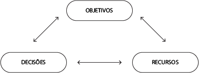

--- 
title: "Empreendedorismo"
author: "Pedro José Laurenti de Matos"
date: "`r Sys.Date()`"
output: rmdformats::material

---

# CONCEITOS GERAIS E HISTÓRICO DA ADMINISTRAÇÃO

## Admnistração

> Processo que visa a ações de tomada de decisão de planejamento, organização, direção  e  controle  de  recursos  humanos,  tecnológicos,  físicos,  financeiros,  de  informação  e  de  conhecimento, o indivíduo que cuida da admnistração é o `admnistrador`.

- **O papel do admnistrador** -  É aquele que se preocupa com a `análise das situações`, com a `resolução de problemas` e com a `eficácia` e a eficiência das funções da empresa.

### Histórico

1. Sócrates  (470  a.C.  –  399  a.C.)  via  a  Administração  como  uma  habilidade  pessoal separada do conhecimento técnico e da experiência;
2. Platão  (429  a.C.  –  347  a.C.)  preocupou-se  com  os  problemas  políticos  e  sociais relacionados ao desenvolvimento social e cultural do povo grego. Em sua obra A República, expõe o seu ponto de vista sobre a forma de governo e a administração dos negócios públicos;
3. Aristóteles (384 a.C. - 322 a.C.) estudou a organização do Estado e distingue três formas de administração pública: a Monarquia (governo de um só), a Aristocracia (governo de uma elite) e a Democracia (governo do povo);
4. Francis Bacon (1561-1626) notabilizou-se por enunciar e defender o *“princípio de prevalência do principal sobre o acessório”*, mostrando uma correta visão de um importante aspecto de como se deve proceder em Administração;
5. Thomas Hobbes (1588-1679) desenvolveu a teoria da origem contratualista do  Estado,  segundo  a  qual  o  homem  primitivo  passou  paulatinamente  à  vida  social.  O  Estado  viria  a  impor  a  ordem  e  organização  dessa  vida  em  sociedade.
6. Jean-Jacques  Rousseau  (1712-1778)  pregou  a  necessidade  do  contrato  social, baseado na convicção de que o homem, embora individualmente e por natureza seja cordial e pacífico, é deturpado pela vida em sociedade.
7. Karl  Heinrich  Marx  (1818-1883),  juntamente  com  seu  companheiro  de  estudos  Friedrich  Engels  (1820-1898),  propôs  uma  teoria  da  origem econômica do Estado segundo a qual o surgimento do poder político e do Estado nada mais é que o fruto da dominação econômica do  homem  pelo  homem.

### Administração **Científica**, **Clássica** e por **Objetivos**

Frederick Winslow Taylor - Pai da ADM Científica, ele formulou uma série de ideias e constatações sustentando que a Administração **não é uma arte ou habilidade inata** de algumas pessoas, e sim **obedece a um conjunto de preceitos** que ditam o sucesso de um sistema administrativo.

Henri Fayol - ADM Clássica, foi feita a partir da Científica. Afirmava que administrar é **conduzir a empresa até a meta proposta**, procurando obter o  maior  rendimento  possível  de  todos  os  recursos  de  que  se  dispõe.  Fayol  determinava  seis  funções  primordiais dentro das organizações:

1. **função técnica**: relacionando-se às capacidades e habilidades da produção;
2. **função comercial**: relacionando-se às relações de compra e venda;
3. **função financeira**: relacionando-se à gestão de capitais;
4. **função de segurança**: relacionando-se à proteção dos bens da organização;
5. **função contábil**: relacionando-se a registros, balanços e custos
6. **função administrativa**: relacionando-se à integração das funções anteriores e subdividindo-se em cinco subfunções (planejar, organizar, comandar, coordenar e controlar).

### Outros nomes

- **Henry  Ford -** Pai do FORDISMO, método de produção e de administração voltada a produção em massa
- **Escola de Relações Humanas da Administração -** Considerou os elementos humanos 

## Organizações

Organização - É a pessoa jurídica, um conjunto de pessoas aliadas no mesmo ideal.

Classificação da estrutura:

- Corporações: formadas pela **reunião de pessoas**, podem ter fim não econômico e econômico;
- Fundações: constituídas em torno de um patrimônio com determinado fim;

Classificação de função;

- direito público: Estatais, governo ou instituições sem fim lucrativo.
- direito privado: Empresas privadas com fins lucrativos.

### Elementos do sistema "Empresa"

> A empresa possui `entradas` e `saídas`.

- `Capital` - é a provisão de investimentos necessários é aquilo que paga o custo.
- `Insumos` - elementos necessários para a produção do produto
- `Produto` - produtos, subprodutos ou serviços são os elementos de valor que a empresa oferece ao cliente.
- `efeito sobre o meio` - Efeito que a empresa provoca no meio em que existe

O = (I,P,T,L,R)

O = Organização
I = Insumos
P = Produtos
T = Tarefa
L = Restrições
R = Recurso

### Relações de uma empresa

Os relacionamentos descritos na figura anterior são:

- **Empresa – Mercado Consumidor:** é a relação entre a empresa e o seu potencial mercado;
- **Empresa – Fornecedores:** é a relação na qual a empresa remunera o fornecedor para fazer a aquisição de seus produtos;
- **Empresa – Mercado de Mão de Obra:** é a relação na qual os trabalhadores são remunerados pelos serviços prestados;
- **Empresa – Mercado Financeiro:** é a relação de troca entre ativos financeiros – a empresa e o mercado financeiro (bancos e agentes financeiros, entre outros);
- **Empresa – Governo:** é a relação na qual o governo provê serviços públicos de qualidade, e a empresa cumpre suas obrigações, como pagamento de impostos;
- **Empresa – Acionistas:** é a relação em que o acionista investe na empresa e recebe dela o retorno sob o seu investimento;
- **Empresa – Cliente:** é a relação em que a empresa entrega seus produtos e é remunerada por eles.

> #### Mas e empresas públicas?
> De acordo com Costa Neto e Canuto (2010), as empresas públicas e órgãos públicos deveriam seguir práticas similares às das empresas privadas, mas observa-se uma disparidade:
> 
> - Gestores com mandatos políticos.
> - Objetivos institucionais influenciados por interesses políticos.
> - Estado, como "dono" do negócio, frequentemente ausente.
> - Dificuldade de desligar funcionários devido à estabilidade, levando ao excesso de pessoal.
> - Risco de confusão entre interesse público e privado, levando a corrupção e outros crimes.
> 
> Segundo Costa Neto e Canuto (2010), ocorrências dessas situações diminuem conforme o desenvolvimento da sociedade em que o sistema público está inserido.

### Estrutura organizacional e funcional

As funções dentro de uma corporação denotam o desdobramento de responsabilidades de cada área. De modo geral, a maioria das corporações `possui as seguintes funções`:

- Função de Marketing: preocupa-se com o relacionamento com o mercado, entendendo expectativas, necessidades, hábitos e tendências dos clientes;
- Função de Operação ou Produção: preocupa-se com a operação de bens e serviços entregues pela corporação ao cliente;
- Função de Administração: preocupa-se com a administração geral dos recursos da corporação.

As atividades estão relacionadas aos processos e métodos detalhados das funções presentes na corporação. Elas podem ser:

- Atividades de Planejamento;
- Atividades de Vendas;
- Atividades de Logística;
- Atividades de Controle da Produção;
- Atividades de Compras e Gestão de Estoques;
- Atividades de Departamento de Pessoal;
- Atividades Contábil-Financeiras;
- Atividades de Controles.

# FUNÇÕES DA ADMINISTRAÇÃO

Diante de todo o histórico, passando por todas as escolas e a partir do legado deixado por Taylor, Fayol,  Ford,  Mayo  e  Druker,  entre  outros,  é  possível  entender  que  a  Administração  possui  quatro  funções:

## Planejamento
>     - O que fazer?
>     - Por que fazer?
>     - Como fazer?

Missão, valores e visão são **`norteadores`** para a organização.

Planos:

- `nível estratégico`: relacionado a decisões de médio e longo prazo associadas a questões com alto grau de incerteza

- `nível  tático`:  como  desdobramento  do  nível  tático,  é  associado  a  decisões  de  médio  prazo,  buscando eficiência dos processos organizacionais

- `Nível operacional`: com decisões de curto prazo, preocupa-se com ações dentro do dia a dia das operações

## Organização
>     - Quem vai fazer?
>     - Onde fazer?
>     - Quando fazer?

- `competência técnica`:  capacidade  intelectual,  como  resultado  do  aprendizado  eficaz,  com  capacidade de pensar estrategicamente e introduzir aperfeiçoamentos no trabalho;
- `competência organizacional`: capacidade de planejar e organizar o trabalho, gerenciando tempo e espaço;
- `competência comunicativa`: capacidade de expressão e comunicação com o grupo;
- `competência social`: capacidade de criação de bons relacionamentos, bem como de transferência de conhecimento;
- `competência  comportamental`:  capacidade  de  iniciativa,  criatividade  e  vontade  de  aprender,  sendo aberto a mudanças.

## Direção
### Eficiência e eficácia

A `eficiência` está relacionada à melhor utilização dos recursos disponíveis para alcançar o melhor resultado, possuindo uma ligação muito forte com as áreas mais táticas e operacionais. A `eficácia` está relacionada ao melhor resultado da corporação, possuindo uma ligação muito forte com as áreas mais estratégicas.

### Liderança e motivação

- `Comando autocrático`: impõe o que deve ser feito por meio de ordens de cima para baixo, com o mínimo de diálogo possível. É a mais antiga, clássica e também obsoleta;

- `Comando democrático`: toma decisões conforme opinião da maioria. Escuta a todos e tenta ser politicamente correto em suas atitudes, mas pode levar a distorções;

- `Comando  participativo`:  toma  decisões  por  meio  de  discussões  com  os  grupos  mais  próximos,  buscando uma série de esclarecimentos antes da posição final.

## Controle
>     - Comparação com padrões
>     - Correção de rumos
>     - Subsídios ao aperfeiçoamento

# ASPECTOS COMPORTAMENTAIS

Não é possível estudar a Administração e o empreendedorismo sem considerar de suma importância o  papel  do  ser  humano  e  seu  comportamento.  Os  recursos  humanos  são  peças‑chave  nos  processos  organizacionais, bem como o modo como eles se relacionam.

## Liderança

Temos 3 pensadores principais com 3 conceitos diferentes:

1. `Costa Neto e Canuto (2010)` - destacam que o conceito de liderança é relacionado a características que determinadas pessoas possuem de tomar decisões aceitas com entusiasmo pelos seus colaboradores.

2. `Sobral  e  Gimba  (2012)` - mencionam  liderança  como  um  processo  de  influência  em  um  grupo  que  desempenha atividades com vistas a um objetivo, envolvendo construção e desconstrução de percepções, situações e expectativas.

Sobral  e  Gimba  (2012)  afirmam  que  as  teorias  mais  modernas  sobre  liderança  tendem  a  uma  ênfase num tipo de líder carismático, visionário e transformacional, com comportamentos apelativos e simbólicos, visando a obter alto grau de comprometimento dos liderados.

Sobral e Gimba (2012) também mencionam o surgimento de um novo tipo de liderança, conhecida como liderança autêntica. Ela está ligada ao conceito de autenticidade, e sua principal característica é a elevada transparência entre líder e liderado, bem como uma conduta consistente com o sistema de valores pessoais e convicções.Essa liderança autêntica pode ser concebida a partir de quatro dimensões, conforme Sobral e Gimba (2012):

- **autoconsciência**:  relaciona‑se  à  consciência  que  há,  por  parte  da  liderança,  sobre  fraquezas  e  potencialidades;
- **transparência**: relaciona‑se ao grau de profundidade de conhecimento dos desejos do líder por parte dos liderados;
- **perspectiva moral e ética**: relaciona‑se à consideração dada, por parte da liderança, a valores morais e éticos;
- **processamento balanceado**: relaciona‑se à consideração dada à opinião dos liderados.

3. `Barreto et al. (2013)` - afirmam que a liderança tem um caráter inspiracional, fortalecida pela dinâmica motivacional entre líderes, liderados e o sistema organizacional onde atua.

Barreto et al. (2013) mencionam que essas três lideranças (carismática, visionária e transformacional) têm muitas semelhanças entre si. Na liderança carismática, a ênfase é no comportamento simbólico do líder, bem como em suas habilidades visionárias, na comunicação não verbal e no apelo a valores ideológicos. A liderança visionária tem o foco no futuro, assumindo riscos e influenciando a direção da organização. A liderança transformacional preza por estabelecer uma relação bidirecional entre líder e liderados.

Os autores mencionam também quatro características principais da liderança transformacional:

- influência idealizada;
- motivação inspiracional;
- estímulo intelectual;
- consideração individualizada.

### Perfis psicológicos segundo Jung e Myers‑Briggs

Costa Neto e Canuto (2010) mencionam que o tipo psicológico de indivíduo influencia na capacidade que ele tem de exercer uma liderança. De acordo com os autores, há uma teoria que classifica as pessoas em quatro grandes tipos psicológicos, que derivam dos perfis estudados pelos psicólogos Carl Gustav Jung (1875‑1961), Katharine Briggs (1875‑1968) e Isabel Myers (1897‑1980). Veja o quadro a seguir:

<table class="tg" style="undefined;table-layout: fixed; width: 1002px">
<colgroup>
<col style="width: 200.88889px">
<col style="width: 400.88889px">
<col style="width: 399.77778px">
</colgroup>
<thead>
  <tr>
    <th class="tg-c3ow">Atividades‑chave</th>
    <th class="tg-c3ow" colspan="2">Escala</th>
  </tr>
</thead>
<tbody>
  <tr>
    <td class="tg-c3ow" rowspan="2">Motivação</td>
    <td class="tg-c3ow">Extroversão (E)</td>
    <td class="tg-c3ow">Introversão (I)</td>
  </tr>
  <tr>
    <td class="tg-baqh">Preferência por tirar energia do mundo exterior das pessoas, atividades ou coisa</td>
    <td class="tg-baqh">Preferência por tirar energia do mundo interior das ideias, emoções ou impressões pessoais</td>
  </tr>
  <tr>
    <td class="tg-baqh" rowspan="2">Observação</td>
    <td class="tg-baqh">Sensação (S)</td>
    <td class="tg-baqh">Intuição (N)</td>
  </tr>
  <tr>
    <td class="tg-baqh">Preferência por obter informações por meio dos cinco sentidos e observar aquilo que é real</td>
    <td class="tg-baqh">Preferência por obter informações por meio do “sexto sentido”, observando o que pode ser</td>
  </tr>
  <tr>
    <td class="tg-baqh" rowspan="2">Decisões</td>
    <td class="tg-baqh">Pensamento (T)</td>
    <td class="tg-baqh">Sentimento (F)</td>
  </tr>
  <tr>
    <td class="tg-baqh">Preferência por organizar e estruturar as informações para tomar decisões de maneira lógica e objetiva</td>
    <td class="tg-baqh">Preferência por organizar e estruturar as informações para tomar decisões de maneira pessoal e orientada para os valores</td>
  </tr>
  <tr>
    <td class="tg-baqh" rowspan="2">Modo de vida</td>
    <td class="tg-baqh">Julgamento (J)</td>
    <td class="tg-baqh">Percepção (P)</td>
  </tr>
  <tr>
    <td class="tg-baqh">Preferência por ter uma vida organizada e planejada</td>
    <td class="tg-baqh">Preferência por ter uma vida espontânea e flexível</td>
  </tr>
</tbody>
</table>

## Motivação

Costa  Neto  e  Canuto  (2010)  mencionam  que  as  seguintes  considerações  de  natureza  humana  possuem necessidades que precisam ser satisfeitas no alcance da motivação, conforme uma determinada hierarquia desenvolvida pelo renomado psicólogo Abraham Maslow, descrita na figura a seguir.

Nessa hierarquia de necessidades que influenciam na motivação, têm‑se:

- `necessidades  primárias`:  compostas  pelas  necessidades  básicas  de  subsistência  (casa,  comida  etc.) e segurança (física, estabilidade no trabalho, seguro saúde etc.);
- `necessidades secundárias`: compostas por questões de cunho um pouco mais íntimo, como a vida na sociedade (amigos, diversões etc.), a autoestima (status, poder etc.) e a autorrealização (sensação de paz, de dever cumprido etc.).

Costa  Neto  e  Canuto  (2010)  mencionam  também  a  abordagem  de  Frederick  Herzberg  sobre  a  influência de fatores que geram ou não motivação. Esses fatores são os seguintes:

- `fatores   extrínsecos  (externos  ao  indivíduo)`:  geram  satisfação  física,  mas  não  a  motivação  propriamente dita. Por exemplo: boas condições físicas de trabalho, ar condicionado, transporte etc.
- `fatores  intrínsecos`:  ligados  a  tarefas  do  indivíduo,  que  geram  desafios  e  um  sentimento  de  satisfação interior pelo sucesso alcançado. Esses levam à motivação.

## Clima, cultura e mudança organizacional

### Clima organizacional

Este conceito diz respeito à forma como os relacionamentos interpessoais se dão no seio da organização.

O  clima  organizacional  é  um  conjunto  de  fatores  e  itens  de  caráter  permanente  que  distingue  uma organização da outra, influenciando o comportamento de indivíduos.

### Cultura organizacional

Cultura organizacional é um sistema sociocultural que revela a identidade da organização por meio de padrões de comportamento.

Schein (1992) afirma que a cultura organizacional é dividida em três níveis:

- artefatos: compreendem as estruturas e os processos organizacionais existentes na corporação;
- valores: compreendem as estratégias, os objetivos e as filosofias adotadas no dia a dia das corporações;
- pressupostos: compreendem as crenças, as percepções e os pensamentos, muitas vezes até inconscientes.

Barreto et al.(2013) mencionam quatro tipos de culturas organizacionais:

- `cultura clã ou grupal`: nesse tipo de cultura, é enfatizada a participação das pessoas na tomada de decisão. Valores morais e trabalho em grupo são incentivados. Há um alto comprometimento dos colaboradores;
- `cultura inovativa ou adhocracia`: nesse tipo de cultura, há uma grande abertura à flexibilidade e à mudança organizacional. O ambiente de trabalho é marcado pelo dinamismo, e há incentivo às iniciativas individuais e à liberdade;
- `cultura de mercado ou racional`: nesse tipo de cultura, há uma orientação a partir de tendências de  mercado  e  bases  seguras  de  clientes.  O  resultado  é  o  objetivo  principal  para  que  o  negócio  melhore a sua posição competitiva;
- `cultura hierárquica`: nesse tipo de cultura, a maior importância é dada à estabilidade, aos valores e às normas associados à burocracia. Regras e políticas mantêm a organização integrada.

### Mudança organizacional

- **Mudança contínua**: constante e evolutiva, produzindo pequenos avanços cotidianos;
- **Mudança episódica**: pouco frequente, descontínua e intencional, é necessária para as organizações que saem de seu ponto de equilíbrio;
- **Mudança descontínua**: ocorre em períodos de desequilíbrio e envolve várias reestruturações;
- **Mudança espontânea**: não gerada e não controlada pela liderança, é gerada pelo dia a dia das corporações;
- **Mudança planejada**: ocorre de modo programado e sistemático;
- **Macromudança**: abrange toda a organização e suas relações com o macroambiente.

Costa Neto e Canuto (2010) afirmam que o sucesso de uma mudança se dá quando há a consideração dos seguintes fatores:

- **Compreensão**: perfeito entendimento do processo e da importância da mudança por parte dos envolvidos;
- **Comprometimento**: determinação de executar a mudança devido a sua importância;
- **Competência**: capacidade técnica e administrativa para efetuar a mudança;
- **Correção**: inexistência de erros nos processos de mudança organizacional;
- **Comunicação**: perfeito funcionamento de um plano de comunicação na mudança;
- **Continuidade**: garantia de que não haverá retrocesso após a mudança.

# A TOMADA DE DECISÃO E A ESTRATÉGIA NO MUNDO DOS NEGÓCIOS

## A tomada de decisão

> “A tomada de decisão não é algo fácil. Mesmo fazendo parte do dia a dia dos administradores e empreendedores, ela tem que ser um processo efetuado de modo racional, em que devem ser utilizadas técnicas por meio das quais se atingem os objetivos organizacionais”

### Qualidade na tomada de decisões

| Decisões Tomadas | Descrição |
|------------------|-----------|
| Racionalmente    | Consequência de um cuidadoso processo de reflexão e do uso de metodologias apropriadas. As fortes emoções são extintas para dar espaço a um processo racional. |
| Baseadas em Fatos e Dados | Tomada de decisão com base em fatos e dados, em vez de palpites ou opiniões subjetivas. Transforma dados em informações e informações em conhecimento. |
| Economicamente Pesadas | Considera a importância de avaliar aspectos econômicos na tomada de decisão. |
| Baseadas na Experiência | Reconhece a importância da experiência adquirida sobre determinados assuntos como fator de sucesso para boas decisões. |
| Visando ao Futuro | Foca em pensar estrategicamente no longo prazo. A visão estratégica é crucial no processo decisório. |
| Consensuais | Em situações complexas com diferentes perspectivas, busca-se o consenso entre os envolvidos. |
| Baseadas em Indicadores | Decisões apoiadas em indicadores que surgem por métodos quantitativos apropriados. |
| Justas e Legais | Decisões fundamentadas em critérios éticos, justos e em conformidade com disposições legais. |
| Criativas e Inovadoras | Capacidade de fugir de soluções convencionais, buscando abordagens criativas e inovadoras. |
| Corajosas x Prudentes | Necessidade de equilibrar coragem e prudência no processo decisório. |
| Inspiradas em Paradigmas | Prática do benchmarking para adotar melhores práticas de mercado. |

## Estratégia

- **Chandler (1962):** Estratégia é a definição dos objetivos de longo prazo de uma empresa e a alocação de recursos para alcançá-los.
- **Ansoff (1965):** Estratégia são diretrizes para tomar decisões em condições de incerteza parcial, focando na interação com o ambiente.
- **Katz (1970):** Estratégia envolve a relação presente (situação estratégica) e futura (plano estratégico) da empresa com o ambiente.
- **Steiner e Miner (1977):** Estratégia envolve a formulação de metas alinhadas às forças internas e externas, com planos para garantir o sucesso.
- **Porter (1989):** Estratégia competitiva são ações para construir uma posição sólida na indústria, superar concorrentes e maximizar retornos.
- **Mintzberg (1988):** Estratégia é uma ponte entre a organização e o ambiente, moldando decisões para se adaptar ao contexto.
- **Hax e Majluf (1988):** Estratégia é um conjunto coeso de decisões que refletem objetivos, ações e alocação de recursos a longo prazo.

### Administração Estratégica

1. **Estratégia como Plano:**
   - Estratégia é um plano conscientemente criado para lidar com uma situação.
   - Exemplo: Plano de guerra militar, estratégia na Teoria dos Jogos, plano amplo de administração.

2. **Estratégia como Pretexto:**
   - Estratégia pode ser usada como uma manobra para superar concorrentes.
   - Exemplo: Ameaçar expansão para desencorajar competidores.

3. **Estratégia como Padrão:**
   - Estratégia pode ser observada como um padrão de comportamento consistente.
   - Exemplo: Ford oferecendo apenas o modelo T na cor preta.

4. **Estratégia como Posição:**
   - Estratégia é uma forma de localizar a organização em relação ao ambiente.
   - Exemplo: Nicho ecológico, local gerador de renda, domínio de produto-mercado.

5. **Estratégia como Perspectiva:**
   - Estratégia é uma maneira ampla de olhar o mundo, tanto interna como externamente.
   - Envolve uma visão coletiva dos estrategistas.

## O mundo dos negócios

> “Negócio é um esforço organizado por determinadas pessoas para produzir bens e serviços, a fim de vendê-los em um determinado mercado e alcançar recompensa financeira pelo seu esforço

Negociar significa basicamente comprar e vender algo a alguém. E, sem dúvida, produzir esse algo e agregar valor no meio dessas duas pontas.

Todo negócio envolve necessariamente algum produto/serviço e, consequentemente, algum fornecedor e algum cliente; uma cadeia de entradas, processos e saídas; alguma produção e algum mercado; uma forma de satisfazer alguma necessidade do cliente ou responder a alguma oportunidade de mercado.

### cadeia de transações e os tipos de negócios

Os bens e serviços são comercializados entre compradores e vendedores que formam uma verdadeira cadeia de transações, conforme a figura a seguir

- **Negócio Industrial:**
  - Responsável pela produção de bens de consumo ou bens de produção.
  - Transforma matérias-primas em mercadorias ou produtos acabados.

- **Negócio Comercial:**
  - Responsável pela venda direta ao consumidor (comércio varejista).
  - Responsável pela venda direta do produtor (comércio atacadista).

- **Negócio de Prestação de Serviços:**
  - Oferece serviços especializados aos clientes.

### Ambiente de negócios

As organizações operam em um contexto, não de forma isolada. O ambiente externo à empresa é chamado de ambiente de negócios, com variáveis que podem influenciar positiva ou negativamente.

De acordo com Chiavenato (2008), as variáveis no ambiente podem ser macroambientais, influenciando a maioria das corporações, ou microambientais, afetando um mercado específico.

**Variáveis Macroambientais:**
- **Econômicas:** Influenciam empresas de todos os tamanhos, relacionadas à economia em geral.
- **Sociais:** Relacionadas à saúde, educação, segurança e bem-estar social.
- **Tecnológicas:** Aspectos tecnológicos que podem trazer mudanças e inovações.
- **Culturais:** Eventos e características culturais.
- **Legais:** Leis e regulamentos que afetam as operações do negócio.
- **Demográficas:** Características da população.
- **Ecológicas:** Relacionadas ao meio ambiente e recursos naturais.

**Variáveis Microeconômicas:**
- **Fornecedores:** Fornecem recursos e insumos para a operação do negócio.
- **Clientes:** Adquirem produtos ou serviços comercializados.
- **Concorrentes:** Disputam as fatias de mercado com o negócio.
- **Agências Reguladoras:** Responsáveis pela fiscalização das operações do negócio.

#### Tamanho de empresas

As empresas são classificadas pelo porte ou tamanho, segundo Chiavenato (2008) e o critério do Sebrae:

- **Microempresa:**
  - Construção e Indústria: Até 19 funcionários.
  - Comércio e Serviços: Até 9 funcionários.

- **Pequena Empresa:**
  - Construção e Indústria: De 20 a 99 funcionários.
  - Comércio e Serviços: De 10 a 49 funcionários.

- **Média Empresa:**
  - Construção e Indústria: De 100 a 499 funcionários.
  - Comércio e Serviços: De 50 a 99 funcionários.

- **Grande Empresa:**
  - Construção e Indústria: A partir de 500 funcionários.
  - Comércio e Serviços: A partir de 100 funcionários.

O BNDES também classifica o porte das empresas de acordo com a receita operacional bruta anual:

- **Microempresa:** ≤ R$ 2,4 milhões.
- **Pequena Empresa:** > R$ 2,4 milhões e ≤ R$ 16 milhões.
- **Média Empresa:** > R$ 16 milhões e ≤ R$ 90 milhões.
- **Média-Grande Empresa:** > R$ 90 milhões e ≤ R$ 300 milhões.
- **Grande Empresa:** > R$ 300 milhões.

# EMPREENDEDORISMO E SEU HISTÓRICO

## Empreendedor e empreendedorismo

Conceitos gerais:

> *`EMPREENDEDOR`* - É quem fareja as oportunidades e precisa ser muito rápido, aproveitando as oportunidades fortuitas, antes que outros aventureiros o façam. O termo empreendedor – do francês entrepreneur – significa aquele que assume riscos e começa algo novo.

> *`EMPREENDEDORISMO`* - É o envolvimento de pessoas e processos que, em conjunto, levam à transformação de ideias em oportunidades. A perfeita implementação dessas oportunidades leva à criação de negócios de sucesso.

Características de um empreendedor: 

- **Iniciativa:** São pessoas que não ficam esperando que os outros (governo, empregador, parente, padrinho) resolvam seus problemas. Agem diante de adversidades.
- **Persistência:** Motivados e convictos, os empreendedores persistem até que as coisas funcionem adequadamente.
- **Autoconfiança:** Acreditam em si mesmos, permitindo que assumam riscos e iniciativas desafiadoras.
- **Aceitação dos Riscos:** Embora cautelosos, os empreendedores aceitam riscos para alcançar seus objetivos.
- **Ausência de Medo do Fracasso:** Não são paralisados pelo medo do fracasso ou rejeição. Estão dispostos a arriscar.
- **Decisão e Responsabilidade:** Tomam decisões e assumem a responsabilidade por elas, sem depender dos outros.
- **Energia:** Lançam-se em novas empreitadas com energia, resultado de seu entusiasmo e motivação.
- **Automotivação e Entusiasmo:** Automotivados por desafios e crença em suas ideias. Não dependem apenas de recompensas externas.
- **Controle:** Acreditam que podem controlar seu próprio destino e influenciar o ambiente para atingir objetivos.
- **Orientação para Equipe:** Criam equipes, delegam e confiam nos outros para alcançar resultados.
- **Otimismo:** São otimistas, acreditam nas possibilidades, na resolução de problemas e no potencial de desenvolvimento.
- **Capacidade Empreendedora:** Ter capacidade empreendedora aumenta as chances de sucesso nos negócios, mas outras habilidades também são necessárias.
