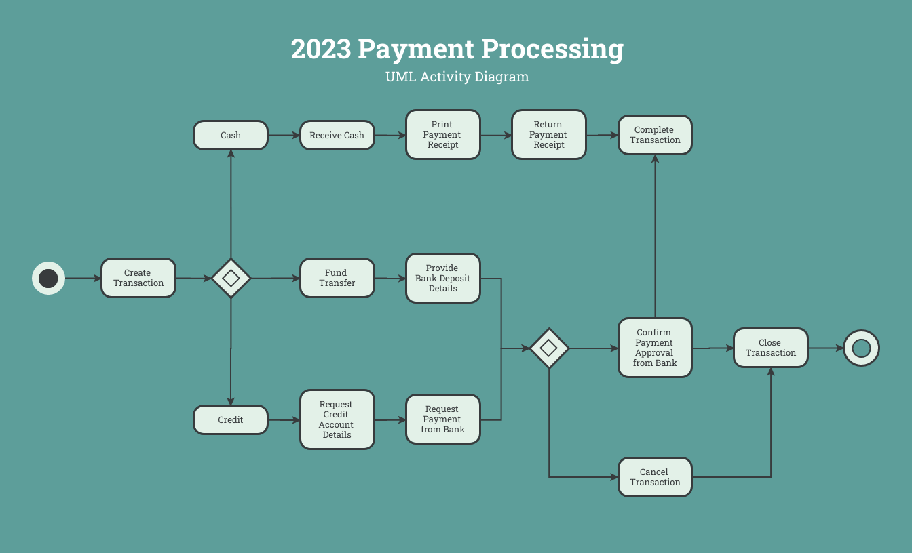
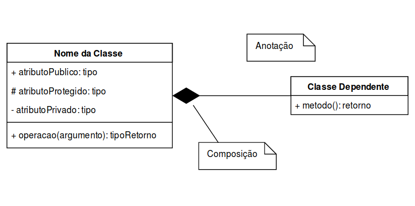

--- 
title: "Estudos Disciplinares VII"
author: "Pedro José Laurenti de Matos"
date: "`r Sys.Date()`"
output: rmdformats::material

---

# UNIDADE I

## Diagrama de Atividades

As `coleções de ações` podem ser divididas conforme a seguir:

- Estado inicial: é representado por um círculo preenchido. Todo diagrama de atividades deve ter um estado inicial.
- Estado de ação: é realizado instantaneamente e indica que o sistema está realizando algo.
- Estado de atividade: necessita de um tempo para ser executado e indica que o sistema está realizando algo.
- Ponto de ramificação: é representado por um losango e apresenta uma transição de entrada e várias transições de saída.
- Ponto de união: é representado por um losango e reúne várias transições de entrada e uma transição de saída.
- Ponto de transição: ocorre no término de um estado de ação e, consequentemente, no início de outro.
- Bifurcação: pode ser representada por uma barra horizontal. Recebe uma transição de entrada e cria dois ou mais fluxos de controle que serão executados independentemente e em paralelo.
- União: é representada por uma barra horizontal. Recebe duas ou mais transições de entrada e une os fluxos em um único fluxo de controle.
- Estado final: um diagrama de atividade pode não apresentar estado final (quando o processo ou procedimento que está sendo modelado é cíclico) e também pode ter um ou vários estados finais.

O diagrama de atividades é um dos diagramas disponíveis na UML (Linguagem de Modelagem Unificada) para a modelagem de aspectos dinâmicos de sistemas.

## Design Pattern e Abstract Factory

Os **Padrões de Projeto (Design Patterns)** são soluções comprovadas para problemas comuns que surgem ao desenvolver software. Eles fornecem diretrizes e modelos para resolver esses problemas de forma eficaz.

Um exemplo de Padrão de Projeto é o **Abstract Factory**, que se concentra na criação de objetos de maneira flexível. Isso é especialmente útil quando precisamos criar objetos que se encaixem em diferentes contextos, como suportar diferentes tipos de interfaces gráficas, como Windows ou Mac.

A ideia é que você diga à fábrica que deseja um sistema que se comporte como o Windows. A fábrica, então, cria objetos relacionados à interface gráfica do Windows, como botões, caixas de seleção e janelas. Quando você usa esses objetos, eles são criados pela fábrica de GUI do Windows, tornando seu código mais flexível e independente das classes específicas que estão sendo instanciadas.

## Diagrama de Sequência

O **Diagrama de Sequência da UML** é uma representação gráfica que descreve a ordem temporal das mensagens trocadas entre os objetos em um sistema.

Geralmente, é construído com informações provenientes dos **Diagramas de Caso de Uso** e dos **Diagramas de Classes**. O Diagrama de Caso de Uso fornece os atores (como usuários) e o Diagrama de Classes fornece os objetos envolvidos no sistema. Isso ajuda a determinar a sequência em que os eventos ocorrem e as mensagens que são enviadas (ou seja, os métodos chamados), estabelecendo a interação entre os objetos.

O Diagrama de Sequência é derivado das funcionalidades identificadas nos Diagramas de Caso de Uso, onde um Caso de Uso descreve um comportamento do sistema executado por um ator. Ele também se baseia no Diagrama de Classes para identificar os objetos relevantes. Além disso, o Diagrama de Sequência ajuda a validar e refinar os dois diagramas, podendo levar a complementações ou modificações.

Ao ler um Diagrama de Sequência, é importante seguir a sequência temporal de cima para baixo e da esquerda para a direita. Números sequenciais são frequentemente usados para ordenar as mensagens.

Os atores em um Diagrama de Sequência são os mesmos descritos nos Casos de Uso e são representados como bonecos magros. Os objetos são representados como quadrados ou estereótipos da UML (que não são utilizados no diagrama em questão). Cada ator ou objeto possui uma "linha de vida" tracejada, que geralmente representa uma instância e o tempo em que existem no processo. Essa linha de vida é interrompida com um "X" quando o objeto é destruído.

Quando um objeto está ativamente envolvido no processo, ele possui o "foco de controle", que é uma linha retangular fina posicionada acima da linha de vida. Os objetos posicionados no topo do diagrama existem desde o início do processo, enquanto os objetos posicionados abaixo são criados e, muitas vezes, destruídos durante o processo. Um objeto também pode enviar uma mensagem a si mesmo, o que é chamado de autochamada.

## Diagrama da UML

A **UML (Unified Modeling Language)** é uma linguagem de modelagem desenvolvida para ser extensível e fácil de usar. Seus elementos são compartilhados entre diferentes tipos de diagramas. Portanto, a identificação adequada de alguns diagramas depende da interpretação das informações contidas neles.

Vamos considerar, por exemplo, os diagramas de máquina de estados e de atividades. Em termos de desenho, eles podem parecer perfeitamente idênticos. A diferença entre eles está nos verbos usados para descrever suas atividades ou estados.

No contexto da UML, verbos no infinitivo (ou em outros tempos do indicativo) são usados para definir atividades, enquanto verbos no gerúndio e particípio passado são usados para definir estados. Portanto, "Registrar Voto" representa uma atividade, enquanto "Registrando Voto" ou "Voto Registrado" representam estados.

É importante não confundir diagramas que têm simbologias radicalmente diferentes. Por exemplo, o diagrama de comunicação tem elementos que o tornam visualmente diferente e se concentra na interação entre atores e objetos, não na interação entre atividades e estados.

Embora um erro na escolha do tempo verbal possa tornar difícil distinguir entre atividades e estados, a semântica do diagrama de comunicação é completamente diferente. Visualmente, esses diagramas são distintos, e não devem ser confundidos.

As mesmas considerações se aplicam ao diagrama de casos de uso, que descreve as interações entre atores e as funcionalidades do sistema. Ele também possui características visuais distintas e não deve ser confundido com os diagramas de atividades, estados ou comunicação.

Resumindo, temos quatro tipos de diagramas considerados aqui:

1. **Atividades e Estados:** Diagramas que podem ser confundidos se não houver um padrão rigoroso de nomenclatura.

2. **Comunicação:** Mostra a interação entre atores e objetos, com características visuais distintas.

3. **Caso de Uso:** Mostra a interação entre atores e funcionalidades, também com características visuais distintas.

4. **Outros:** Diagramas com simbologias diferentes que não devem ser confundidos com os mencionados acima.

## PMBOK

O **PMBOK** é o acrônimo para **Project Management Body of Knowledge**, que em português significa "Corpo de Conhecimento em Gerência de Projetos" do **PMI (Project Management Institute)**, ou seja, Instituto de Gerência de Projetos.

No PMBOK, os processos necessários para entregar um projeto no prazo acordado estão agrupados na área de **Gerência de Tempo**. Esses processos incluem:

- Definição das atividades.
- Sequenciamento das atividades.
- Estimativa dos recursos das atividades.
- Estimativa da duração das atividades.
- Desenvolvimento do cronograma.

Os demais processos pertencem a outras áreas, conforme descrito a seguir:

- Planejamento, garantia e controle da qualidade pertencem à **Gerência de Qualidade**.
- Planejamento, definição, verificação e controle do escopo pertencem à **Gerência de Escopo**.
- Estimativa de custos, realização do orçamento e controle de custos pertencem à **Gerência de Custos**.
- Planejamento de compra e contratações, seleção de fornecedores e encerramento do contrato pertencem à **Gerência de Aquisições (Procurement)**.

Em um cenário em que um funcionário que atuou como programador por cerca de 10 anos é promovido a gerente de projetos, com a responsabilidade de entregar projetos dentro do prazo estabelecido, o gerente de projetos usará o PMBOK para coordenar os processos relacionados à **Gerência de Tempo** e garantir que as entregas ocorram conforme o cronograma estabelecido no contrato.

## Estrutura Analítica de Projetos

No início de um projeto, seja de software ou de qualquer outra natureza, é fundamental ter uma visão clara do seu escopo, compreender o que deve ser entregue ao cliente e definir as ações necessárias para o sucesso do plano.

Uma das ferramentas essenciais para o gerenciamento do escopo de um projeto é a **Estrutura Analítica do Projeto (EAP)**, conhecida em inglês como **Work Breakdown Structure (WBS)**.

A EAP é tipicamente representada como uma árvore hierárquica, na qual cada nível dessa árvore detalha o projeto em diferentes graus de profundidade.

A construção da EAP tem como objetivo principal detalhar as entregas do projeto e estabelecer os limites do escopo das tarefas envolvidas.

Conforme definido pelo **Project Management Institute (PMI)** no livro "Practice Standard for Work Breakdown Structures," a EAP deve seguir a chamada "regra dos 100%." Isso significa que a EAP deve incluir todo o trabalho que está definido no escopo do projeto, sem deixar de fora nenhum elemento importante e também sem incluir tarefas não relacionadas ao escopo.

## Banco de Dados Relacionais

**Armazenamento de Dados e Bancos de Dados Relacionais**

Na área de computação, lidamos frequentemente com grandes quantidades de dados, originados de várias fontes, incluindo programas, interações com usuários e instrumentos externos. À medida que a quantidade de dados cresce, surgem desafios, como encontrar informações específicas, relacionar dados e gerenciar atualizações e exclusões.

**Bancos de Dados Relacionais** se destacam como uma abordagem importante para lidar com esses desafios. Eles são essencialmente coleções de tabelas interconectadas. Cada tabela é chamada de relação e suas linhas representam registros, chamados de tuplas.

- **Exemplo de Tabela:**

| Compositor          | Gênero       |
|---------------------|--------------|
| Ludwig van Beethoven| Clássico     |
| Johann Sebastian Bach| Barroco     |
| John Coltrane       |  Jazz        |
| Miles Davis         |  Jazz        |
| Antônio Carlos Jobim| MPB          |

Os **Diagramas de Entidade e Relacionamento** são usados no projeto de bancos de dados relacionais. Eles incluem três elementos principais: tipos de entidade (representados como quadrados), atributos (propriedades dos tipos de entidade) e relacionamentos (associações entre tipos de entidade).

Cada linha de uma tabela deve ter uma combinação única de elementos, conhecida como **super-chave**, e uma super-chave mínima é chamada de **chave candidata**. Uma chave candidata designada para uma tabela é chamada de **chave primária**, e pode ser referenciada em outras tabelas através de **chaves estrangeiras**.

Em alguns casos, uma **entidade fraca** depende de outra para sua chave primária. Restrições são aplicadas para garantir a integridade dos dados, como a **integridade referencial**, que exige que chaves estrangeiras correspondam a chaves primárias ou sejam nulas.

Bancos de dados relacionais oferecem uma estrutura sólida para armazenar e gerenciar dados, garantindo que informações sejam organizadas, relacionadas e mantidas com integridade.