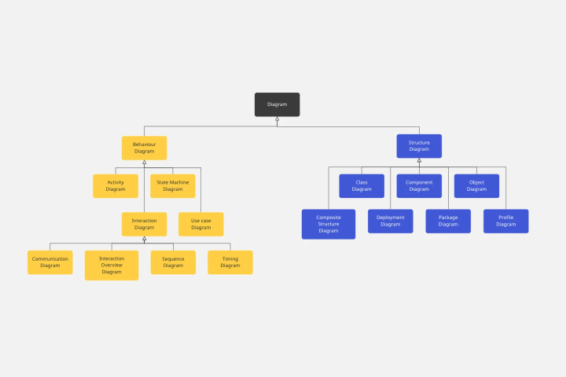

--- 
title: "Estudos Disciplinares VII"
author: "Pedro José Laurenti de Matos"
date: "`r Sys.Date()`"
output: rmdformats::material

---

# UNIDADE I

## Diagrama de Atividades

<div style="width:80%">

<center>


</center>

</div>

As `coleções de ações` podem ser divididas conforme a seguir:

- Estado inicial: é representado por um círculo preenchido. Todo diagrama de atividades deve ter um estado inicial.
- Estado de ação: é realizado instantaneamente e indica que o sistema está realizando algo.
- Estado de atividade: necessita de um tempo para ser executado e indica que o sistema está realizando algo.
- Ponto de ramificação: é representado por um losango e apresenta uma transição de entrada e várias transições de saída.
- Ponto de união: é representado por um losango e reúne várias transições de entrada e uma transição de saída.
- Ponto de transição: ocorre no término de um estado de ação e, consequentemente, no início de outro.
- Bifurcação: pode ser representada por uma barra horizontal. Recebe uma transição de entrada e cria dois ou mais fluxos de controle que serão executados independentemente e em paralelo.
- União: é representada por uma barra horizontal. Recebe duas ou mais transições de entrada e une os fluxos em um único fluxo de controle.
- Estado final: um diagrama de atividade pode não apresentar estado final (quando o processo ou procedimento que está sendo modelado é cíclico) e também pode ter um ou vários estados finais.


O diagrama de atividades é um dos diagramas disponíveis na UML (Linguagem de Modelagem Unificada) para a modelagem de aspectos dinâmicos de sistemas.

## Design Pattern e Abstract Factory

Os **Padrões de Projeto (Design Patterns)** são soluções comprovadas para problemas comuns que surgem ao desenvolver software. Eles fornecem diretrizes e modelos para resolver esses problemas de forma eficaz.

Um exemplo de Padrão de Projeto é o **Abstract Factory**, que se concentra na criação de objetos de maneira flexível. Isso é especialmente útil quando precisamos criar objetos que se encaixem em diferentes contextos, como suportar diferentes tipos de interfaces gráficas, como Windows ou Mac.

A ideia é que você diga à fábrica que deseja um sistema que se comporte como o Windows. A fábrica, então, cria objetos relacionados à interface gráfica do Windows, como botões, caixas de seleção e janelas. Quando você usa esses objetos, eles são criados pela fábrica de GUI do Windows, tornando seu código mais flexível e independente das classes específicas que estão sendo instanciadas.

## Diagrama de Sequência

O **Diagrama de Sequência da UML** é uma representação gráfica que descreve a ordem temporal das mensagens trocadas entre os objetos em um sistema.

Geralmente, é construído com informações provenientes dos **Diagramas de Caso de Uso** e dos **Diagramas de Classes**. O Diagrama de Caso de Uso fornece os atores (como usuários) e o Diagrama de Classes fornece os objetos envolvidos no sistema. Isso ajuda a determinar a sequência em que os eventos ocorrem e as mensagens que são enviadas (ou seja, os métodos chamados), estabelecendo a interação entre os objetos.

O Diagrama de Sequência é derivado das funcionalidades identificadas nos Diagramas de Caso de Uso, onde um Caso de Uso descreve um comportamento do sistema executado por um ator. Ele também se baseia no Diagrama de Classes para identificar os objetos relevantes. Além disso, o Diagrama de Sequência ajuda a validar e refinar os dois diagramas, podendo levar a complementações ou modificações.

Ao ler um Diagrama de Sequência, é importante seguir a sequência temporal de cima para baixo e da esquerda para a direita. Números sequenciais são frequentemente usados para ordenar as mensagens.

Os atores em um Diagrama de Sequência são os mesmos descritos nos Casos de Uso e são representados como bonecos magros. Os objetos são representados como quadrados ou estereótipos da UML (que não são utilizados no diagrama em questão). Cada ator ou objeto possui uma "linha de vida" tracejada, que geralmente representa uma instância e o tempo em que existem no processo. Essa linha de vida é interrompida com um "X" quando o objeto é destruído.

Quando um objeto está ativamente envolvido no processo, ele possui o "foco de controle", que é uma linha retangular fina posicionada acima da linha de vida. Os objetos posicionados no topo do diagrama existem desde o início do processo, enquanto os objetos posicionados abaixo são criados e, muitas vezes, destruídos durante o processo. Um objeto também pode enviar uma mensagem a si mesmo, o que é chamado de autochamada.

<div style="width:80%">

<center>


</center>

</div>

## Diagrama da UML

A **UML (Unified Modeling Language)** é uma linguagem de modelagem desenvolvida para ser extensível e fácil de usar. Seus elementos são compartilhados entre diferentes tipos de diagramas. Portanto, a identificação adequada de alguns diagramas depende da interpretação das informações contidas neles.

Vamos considerar, por exemplo, os diagramas de máquina de estados e de atividades. Em termos de desenho, eles podem parecer perfeitamente idênticos. A diferença entre eles está nos verbos usados para descrever suas atividades ou estados.

No contexto da UML, verbos no infinitivo (ou em outros tempos do indicativo) são usados para definir atividades, enquanto verbos no gerúndio e particípio passado são usados para definir estados. Portanto, "Registrar Voto" representa uma atividade, enquanto "Registrando Voto" ou "Voto Registrado" representam estados.

É importante não confundir diagramas que têm simbologias radicalmente diferentes. Por exemplo, o diagrama de comunicação tem elementos que o tornam visualmente diferente e se concentra na interação entre atores e objetos, não na interação entre atividades e estados.

Embora um erro na escolha do tempo verbal possa tornar difícil distinguir entre atividades e estados, a semântica do diagrama de comunicação é completamente diferente. Visualmente, esses diagramas são distintos, e não devem ser confundidos.

As mesmas considerações se aplicam ao diagrama de casos de uso, que descreve as interações entre atores e as funcionalidades do sistema. Ele também possui características visuais distintas e não deve ser confundido com os diagramas de atividades, estados ou comunicação.

Resumindo, temos quatro tipos de diagramas considerados aqui:

1. **Atividades e Estados:** Diagramas que podem ser confundidos se não houver um padrão rigoroso de nomenclatura.

2. **Comunicação:** Mostra a interação entre atores e objetos, com características visuais distintas.

3. **Caso de Uso:** Mostra a interação entre atores e funcionalidades, também com características visuais distintas.

4. **Outros:** Diagramas com simbologias diferentes que não devem ser confundidos com os mencionados acima.


<div style="width:80%">

<center>



</center>

</div>


## PMBOK

O **PMBOK** é o acrônimo para **Project Management Body of Knowledge**, que em português significa "Corpo de Conhecimento em Gerência de Projetos" do **PMI (Project Management Institute)**, ou seja, Instituto de Gerência de Projetos.

No PMBOK, os processos necessários para entregar um projeto no prazo acordado estão agrupados na área de **Gerência de Tempo**. Esses processos incluem:

- Definição das atividades.
- Sequenciamento das atividades.
- Estimativa dos recursos das atividades.
- Estimativa da duração das atividades.
- Desenvolvimento do cronograma.

Os demais processos pertencem a outras áreas, conforme descrito a seguir:

- Planejamento, garantia e controle da qualidade pertencem à **Gerência de Qualidade**.
- Planejamento, definição, verificação e controle do escopo pertencem à **Gerência de Escopo**.
- Estimativa de custos, realização do orçamento e controle de custos pertencem à **Gerência de Custos**.
- Planejamento de compra e contratações, seleção de fornecedores e encerramento do contrato pertencem à **Gerência de Aquisições (Procurement)**.

Em um cenário em que um funcionário que atuou como programador por cerca de 10 anos é promovido a gerente de projetos, com a responsabilidade de entregar projetos dentro do prazo estabelecido, o gerente de projetos usará o PMBOK para coordenar os processos relacionados à **Gerência de Tempo** e garantir que as entregas ocorram conforme o cronograma estabelecido no contrato.


## Estrutura Analítica de Projetos

No início de um projeto, seja de software ou de qualquer outra natureza, é fundamental ter uma visão clara do seu escopo, compreender o que deve ser entregue ao cliente e definir as ações necessárias para o sucesso do plano.

Uma das ferramentas essenciais para o gerenciamento do escopo de um projeto é a **Estrutura Analítica do Projeto (EAP)**, conhecida em inglês como **Work Breakdown Structure (WBS)**.

A EAP é tipicamente representada como uma árvore hierárquica, na qual cada nível dessa árvore detalha o projeto em diferentes graus de profundidade.

A construção da EAP tem como objetivo principal detalhar as entregas do projeto e estabelecer os limites do escopo das tarefas envolvidas.

Conforme definido pelo **Project Management Institute (PMI)** no livro "Practice Standard for Work Breakdown Structures," a EAP deve seguir a chamada "regra dos 100%." Isso significa que a EAP deve incluir todo o trabalho que está definido no escopo do projeto, sem deixar de fora nenhum elemento importante e também sem incluir tarefas não relacionadas ao escopo.

## Banco de Dados Relacionais

**Armazenamento de Dados e Bancos de Dados Relacionais**

Na área de computação, lidamos frequentemente com grandes quantidades de dados, originados de várias fontes, incluindo programas, interações com usuários e instrumentos externos. À medida que a quantidade de dados cresce, surgem desafios, como encontrar informações específicas, relacionar dados e gerenciar atualizações e exclusões.

**Bancos de Dados Relacionais** se destacam como uma abordagem importante para lidar com esses desafios. Eles são essencialmente coleções de tabelas interconectadas. Cada tabela é chamada de relação e suas linhas representam registros, chamados de tuplas.

- **Exemplo de Tabela:**

| Compositor          | Gênero       |
|---------------------|--------------|
| Ludwig van Beethoven| Clássico     |
| Johann Sebastian Bach| Barroco     |
| John Coltrane       |  Jazz        |
| Miles Davis         |  Jazz        |
| Antônio Carlos Jobim| MPB          |

Os **Diagramas de Entidade e Relacionamento** são usados no projeto de bancos de dados relacionais. Eles incluem três elementos principais: tipos de entidade (representados como quadrados), atributos (propriedades dos tipos de entidade) e relacionamentos (associações entre tipos de entidade).

Cada linha de uma tabela deve ter uma combinação única de elementos, conhecida como **super-chave**, e uma super-chave mínima é chamada de **chave candidata**. Uma chave candidata designada para uma tabela é chamada de **chave primária**, e pode ser referenciada em outras tabelas através de **chaves estrangeiras**.

Em alguns casos, uma **entidade fraca** depende de outra para sua chave primária. Restrições são aplicadas para garantir a integridade dos dados, como a **integridade referencial**, que exige que chaves estrangeiras correspondam a chaves primárias ou sejam nulas.

Bancos de dados relacionais oferecem uma estrutura sólida para armazenar e gerenciar dados, garantindo que informações sejam organizadas, relacionadas e mantidas com integridade.

---

<hr>

## Missão, visão e valores de uma empresa

Segundo Silva (2017), a identidade organizacional é formada pelo conjunto composto pela missão, visão e valores de uma organização. É crucial que todos compreendam claramente o propósito e a razão de ser da organização, bem como os valores nos quais ela se baseia.

Esse conjunto serve como guia para todas as ações da empresa e deve assegurar a coesão entre o que a organização se propõe a fazer e o que ela efetivamente realiza (Matos, Matos e Almeida, 2007).

## Plano de Negócios

O plano de negócio é um documento essencial que delineia os objetivos de um empreendimento e estabelece os procedimentos a serem seguidos para alcançá-los. O seu propósito fundamental é reduzir os riscos e incertezas associados ao negócio.

Conforme destacado pelo SEBRAE (2013), o plano de negócios desempenha um papel crucial ao identificar potenciais equívocos no planejamento antes que eles se manifestem no mercado real.

Vale ressaltar que este documento abrange a caracterização completa do negócio, seus processos operacionais, estratégias e projeções financeiras, incluindo receitas, despesas e resultados financeiros, conforme apontado por Salim (2005).

## Plano de Projeto

O plano de gerenciamento de projetos tem como objetivos propor a documentação relativa às premissas e às restrições de determinado projeto e delinear seu escopo, seus prazos, seus riscos, suas definições e suas responsabilidades (POSSI, 2006).

### Plano de Gestão de Riscos

O plano de gerenciamento de riscos desempenha um papel fundamental ao descrever a estrutura e a execução dos processos relacionados aos riscos.

Conforme enfatizado pelo **Escritório de Projetos** (2017), este plano abrange a identificação dos riscos, a condução de análises qualitativas e quantitativas, a elaboração de propostas de respostas e a definição das estratégias de controle e monitoramento dos riscos.

### **Plano de Contingência: Preparação para Eventualidades**

O termo contingência, conforme definido por Romero (2016), se refere a eventos imprevistos, acidentais, ou situações que ocorrem devido à incerteza. Independentemente da natureza das operações de uma empresa, é fundamental ter planos alternativos para manter suas atividades funcionando sem problemas. Esse conjunto de alternativas é conhecido como plano de contingência.

Conforme apontado por Rezende (2005), especialmente na área de tecnologia da informação e comunicação (TIC), é crucial estabelecer um plano de contingência que apresente alternativas para o processamento de dados e a execução dos sistemas organizacionais, a fim de abordar possíveis falhas nos sistemas originais.

Um plano de contingência é essencial para a resiliência de uma organização, permitindo a rápida adaptação e resposta a eventos inesperados, minimizando impactos e interrupções nas operações.

## Consultas e linguagem SQL

**Simplificando o Acesso a Bancos de Dados com SQL**

Por muito tempo, obter informações de bancos de dados envolvia a necessidade de entender a estrutura física e organização dos dados dentro do banco. Os programadores precisavam ter um profundo conhecimento do funcionamento interno do banco de dados para extrair as informações necessárias. Isso resultava em um problema de acoplamento, onde qualquer alteração no banco afetaria o código do programa, mesmo que a mudança fosse puramente relacionada ao armazenamento de dados.

Simultaneamente, as alterações no código muitas vezes levavam a modificações na estrutura do banco de dados.

**Consultas e a Linguagem SQL**

Para simplificar o desenvolvimento de programas que utilizam bancos de dados, a linguagem SQL foi criada, seguindo um paradigma declarativo em vez de um paradigma imperativo. Enquanto linguagens como C utilizam um paradigma imperativo, a linguagem SQL se concentra no resultado desejado (os registros que você quer do banco de dados) em vez de como encontrá-los no banco.

Além disso, a linguagem SQL foi desenvolvida especificamente para consultar bancos de dados relacionais.

As principais operações SQL incluem **insert**, **update**, **delete** e **select**. Esses comandos utilizam cláusulas de relacionamento com as chaves das tabelas e condições para recuperar as informações desejadas.

## Arquitetura de Software

**Arquitetura de Software: Flexibilidade e Organização**

Ao criar um novo software, uma das maiores desafios é encontrar uma arquitetura que seja suficientemente flexível para acomodar novas funcionalidades de acordo com as necessidades do cliente, mas também robusta o suficiente para permitir um crescimento ordenado com o mínimo esforço. Muitas vezes, essas duas necessidades (flexibilidade e organização) parecem estar em conflito.

Na realidade, é muito mais simples permitir que um programa cresça de forma caótica do que de forma estruturada. A falta de organização pode ser erroneamente percebida como flexibilidade. O desafio para o arquiteto de software é encontrar uma arquitetura que integre flexibilidade e organização de forma equilibrada.

**A Evolução da Arquitetura de Software**

Houve um tempo em que o desenvolvimento de programas, especialmente os grandes e complexos, carecia de preocupação com aspectos arquitetônicos. A abordagem frequentemente era resolver problemas o mais rápido possível, sem considerar o futuro do programa. Isso resultava na criação de códigos de baixa qualidade e má organização, tornando-os difíceis de manter e modificar.

Com a crescente demanda por sistemas computacionais, surgiu a engenharia de software, que tinha como objetivo sistematizar a produção de software, incorporando boas práticas de projeto e codificação.

**A Importância da Arquitetura de Software**

Um dos aspectos fundamentais da engenharia de software é a elaboração de uma arquitetura de software que seja flexível o suficiente para permitir crescimento futuro, mas também organizada e gerenciável para tornar o desenvolvimento previsível. Uma das arquiteturas mais difundidas para o desenvolvimento de sistemas computacionais é a arquitetura em camadas.

Nesse modelo, cada camada do sistema possui responsabilidades específicas e interfaces bem definidas. Cada camada tem um objetivo claro e métodos (funções ou procedimentos) claramente especificados para acesso a seus recursos, isolando os detalhes técnicos internos.

**A Complexidade Gerenciável**

À medida que as arquiteturas de software se tornam mais sofisticadas, exige-se mão de obra mais qualificada e processos de gerenciamento adequados. O aumento da complexidade em cada módulo do sistema visa elevar a qualidade do software, tornando o desenvolvimento mais previsível e o programa mais flexível.

O desenvolvimento de software evoluiu significativamente desde os anos 1970, passando de sistemas com funcionalidades em um único módulo para aplicações cliente-servidor e, mais recentemente, sistemas distribuídos com bancos de dados relacionais, interfaces web e programação orientada a objetos. Vive-se a era das aplicações em três camadas.

---

<hr>

## Usabilidade

**Usabilidade de Sistemas: Normas e Avaliação**

Segundo Koscianski e Soares (2007), a usabilidade se refere à facilidade ou dificuldade na utilização de um sistema por um usuário. A avaliação da usabilidade pode variar dependendo do público-alvo do sistema, uma vez que um sistema utilizado por cientistas pode ter critérios diferentes dos utilizados por artistas ou profissionais de outras áreas.

Existem normas desenvolvidas para auxiliar no processo de avaliação da usabilidade de um programa. Duas normas relevantes são a Norma ISO 9241 e a Norma ISO 9126, reorganizada pela Norma ISO/IEC 25000.

**Norma ISO 9241**
A Norma ISO 9241 fornece requisitos, recomendações e princípios para as atividades de projeto centradas em pessoas ao longo do ciclo de vida de sistemas interativos baseados em computador (ISO 9241-210,2010). Essa norma refere-se aos requisitos ergonômicos do software.

**Norma ISO 9126**
Outra norma importante para a área é a Norma ISO 9126, que é constituída por várias partes, conforme a tabela abaixo:

| Norma     | Conteúdo                                |
|-----------|----------------------------------------|
| 9126-1    | Modelo de qualidade de software        |
| 9126-2    | Métricas externas                       |
| 9126-3    | Métricas internas                       |
| 9126-4    | Métricas para qualidade em uso         |

*Tabela: Norma ISO-9126 e suas partes.*

Fonte: Adaptado de Koscianski e Soares, 2007.

Essas normas desempenham um papel fundamental na avaliação da usabilidade de sistemas interativos e fornecem diretrizes e métricas para garantir que os sistemas atendam aos critérios de usabilidade desejados.

Adicionalmente, a Norma ISO-14598, que também foi incorporada à norma ISO/IEC 25010:2011, define processos de avaliação e documentação. Ela é conhecida como SQuaRE (Systems and Software Quality Requirements and Evaluation).

Essas normas definem uma série de subcaracterísticas da usabilidade, incluindo:

**Operabilidade:** Refere-se à forma como o software pode ser controlado pelo usuário.

**Compreensibilidade:** Está relacionada à capacidade do usuário em compreender se o programa é adequado ou não às suas tarefas.

**Apreensibilidade:** Aplica-se à facilidade do usuário em aprender a utilizar o programa.

**Atratividade:** Está vinculada à capacidade de o usuário manter a atenção na utilização do programa (KOSCIANSKI E SOARES, 2007).

Além disso, essas normas também definem uma série de outras características e subcaracterísticas relacionadas à qualidade de software, abrangendo áreas como funcionalidade, confiabilidade, eficiência, manutenibilidade, portabilidade, adequação, acurácia, interoperabilidade, segurança de acesso, maturidade, tolerância a falhas, recuperabilidade, inteligibilidade, operacionalidade, conformidade com o tempo, utilização de recursos, analisabilidade, modificabilidade, estabilidade, testabilidade, adaptabilidade, capacidade para ser instalado, coexistência e capacidade de substituição.

## Requisitos não funcionais

**Requisitos Não Funcionais**

Projetos de software envolvem a identificação de diversos tipos de requisitos. Alguns deles estão diretamente atrelados ao comportamento do software sob determinada condição (WIEGERS e BEATTY, 2013), enquanto outros referem-se a propriedades do sistema que não estão diretamente ligados à funcionalidade principal e, por isso, costumam ser chamados de requisitos não funcionais (WAGNER, 2013). Frequentemente, os requisitos não funcionais estão atrelados a aspectos da qualidade de software (WAGNER, 2013).

Devido aos diversos usos que a palavra “requisito” pode ter na área de software, alguns autores, como Wiegers e Beatty (2013), costumam fornecer um vocabulário dos vários possíveis significados associados a esse termo e a outros correlatos.

| Termo                | Definição                                                                   |
|----------------------|------------------------------------------------------------------------------|
| Requisito de negócio | Um objetivo de negócio de alto nível de que uma organização dispõe na construção de um produto.                                |
| Regra de negócio     | Uma prática, uma diretriz, um padrão ou uma regulamentação que define ou restringe algum aspecto do negócio. Está na origem de diversos tipos de requisitos de software. |
| Restrição            | A restrição no projeto e a construção de um produto que são impostas nas escolhas disponíveis para o desenvolvedor.                     |
| Requisito de interface externa | A descrição de uma conexão entre um sistema de software e um usuário, um outro sistema ou um equipamento de que a empresa dispõe. |

*Tabela: Tipos de requisitos.*

Fonte: WIEGERS e BEATTY, 2013 (com adaptações).

| Termo               | Definição                                                                                                                                                                                        |
|---------------------|---------------------------------------------------------------------------------------------------------------------------------------------------------------------------------------------------|
| Característica (feature) | Uma ou mais competências do sistema, que são descritas por um conjunto de requisitos funcionais.                                                                                             |
| Requisitos funcionais   | A descrição de um comportamento, que é exibido pelo sistema em condições específicas.                                                                                                           |
| Requisitos não funcionais | Uma descrição ou uma característica de uma propriedade que um sistema exibe ou uma restrição a ser respeitada.                                                                                  |

*Tabela: Tipos de requisitos.*

Fonte: WIEGERS e BEATTY, 2013 (com adaptações).

| Termo                | Definição                                                                                                                                                                   |
|----------------------|------------------------------------------------------------------------------------------------------------------------------------------------------------------------------|
| Atributo de qualidade | Um tipo de requisito não funcional que descreve um serviço ou uma característica da performance de um produto.                                                               |
| Requisito de sistema | Um requisito de alto nível para um produto que contém múltiplos subsistemas e pode referir-se a todo o software ou ao software e ao hardware.                             |
| Requisito de usuário | Um objetivo ou uma tarefa específica para uma classe de usuários, a que o sistema precisa ser capaz de atender.                                                                |

*Tabela: Tipos de requisitos.*

Fonte: WIEGERS e BEATTY, 2013 (com adaptações).

Ainda em Wiegers e Beatty (2013), encontra-se um capítulo totalmente dedicado às qualidades externas e internas na área de software. As qualidades externas estão ligadas aos atributos do software, perceptíveis quando o software é executado, enquanto as qualidades internas contribuem de forma indireta para a satisfação do usuário.

Entre os aspectos externos de qualidade, podemos destacar os que seguem:

- **Usabilidade:** facilidade que o usuário tem de aprender, memorizar e utilizar o sistema.
- **Segurança:** sistema que protege o usuário contra danos (isso é especialmente importante em máquinas e dispositivos mecânicos) ou sistema que está protegido em relação ao seu acesso e ao acesso das informações nele contidas.
- **Desempenho:** agilidade com que o sistema responde às entradas dos usuários e a outros eventos.
- **Confiabilidade:** ligada ao tempo que o sistema executa sem experimentar uma falha.

Esses requisitos não funcionais desempenham um papel fundamental na determinação da qualidade global de um sistema de software.

## UML

**UML para documentação**

De acordo com Booch, Rumbaugh e Jacobson (2006), a UML (Unified Modeling Language) é definida como "uma linguagem-padrão para a elaboração da estrutura de projetos de software". Os autores destacam os quatro objetivos básicos da UML, quanto aos artefatos de um sistema complexo de software: visualizar, especificar, construir e documentar. O principal objetivo da UML é estabelecer um modelo ou representar conceitual e fisicamente um sistema.

**UML para visualização**

Um projeto de software envolve mais do que o código-fonte. Além disso, um mesmo problema pode ser resolvido de diferentes formas, com códigos muito distintos. Ainda que programas com códigos diferentes possam atender aos mesmos requisitos, nem todas as soluções são igualmente úteis ou interessantes. Se dispusermos apenas do código-fonte de um programa, sem nenhum tipo de documentação, o entendimento da solução fica muito mais difícil. Programas comerciais podem ser muito longos e conter milhões de linhas de código-fonte. Dessa forma, é importante ter uma maneira de visualizar o todo, a estrutura geral de um software, sem que, necessariamente, haja a obrigação de se ler o código-fonte de modo completo. A UML fornece uma linguagem-padrão que permite que diferentes pessoas e empresas façam e interpretem diagramas e modelos de uma mesma forma.

**UML para especificação**

Antes de escrevermos o código para um programa, é preciso conhecer quais são as necessidades do cliente. Além disso, grandes projetos envolvem problemas complexos de software. Muitas empresas contratam profissionais especializados para encontrar a melhor solução, como os arquitetos de software. Esses profissionais precisam de uma linguagem para especificar, construir e documentar a solução e a UML oferece uma linguagem especificamente desenvolvida para esse propósito.

**UML para construção**

Ainda que a UML não seja uma linguagem de programação propriamente dita, é possível estabelecer um mapeamento entre os modelos construídos pela UML e o código-fonte em diversas linguagens de programação, como Java ou C#. Essa facilidade do mapeamento vem do alto grau de expressividade aliado à baixa ambiguidade, o que não é o caso quando consideramos outras formas de especificação, como um texto puro. Essa precisão faz com que existam ferramentas capazes de converter alguns diagramas UML em código-fonte com pouca ou nenhuma intervenção do usuário. De acordo com Booch, Rumbaugh e Jacobson (2006), um projeto de software envolve mais do que apenas o código-fonte. Empresas de software costumam produzir diversos outros elementos, chamados de artefatos, como requisitos do software, documentações da arquitetura, projetos e planos de projeto, código-fonte, testes e planos de teste, e protótipos. A UML é utilizada para documentar diversos desses artefatos, de modo formal e com baixa ambiguidade.


## Diagrama de Classes

**Diagrama de Classes**

A UML apresenta um diagrama específico para a representação das classes, chamado de diagrama de classes. Nesse diagrama, as classes são representadas por retângulos contendo nomes, atributos e operações, como ilustrado na figura abaixo. Os atributos representam propriedades associadas a cada um dos objetos que serão instanciados pela classe. Por exemplo, a classe "Cliente" pode ter um atributo chamado de "nome". Outros atributos que essas classes podem ter são: "endereço", "telefone" e "e-mail".

<div style="width:80%">

<center>


</center>

</div>

Além de atributos, uma classe também apresenta comportamentos associados. Por exemplo, suponha um editor de imagens que tenha uma funcionalidade de desenho de formas geométricas, como losangos. Essa funcionalidade pode ser implementada por meio de uma classe, chamada de "Losango", que apresenta uma série de comportamentos associados, como a movimentação do losango e a alteração do seu tamanho, entre outras. Essas operações são representadas no retângulo da classe, logo abaixo dos atributos.

As operações têm um nome e terminam com parênteses "()": elas são similares a "funções" e podem receber parâmetros. Os parâmetros são representados nos parênteses e separados por vírgulas (no caso da existência de mais de um parâmetro).

**Relacionamentos entre Classes**

As diversas classes que compõem um programa podem estar relacionadas entre si e existem, essencialmente, três tipos de relacionamentos entre classes: Dependência, generalização e associação.

Utilizamos uma relação de dependência quando queremos dizer que uma classe necessita de outra classe para o seu funcionamento.

Suponhamos uma classe chamada "Cachorro" e uma classe chamada "Animal". Podemos dizer que "Animal" representa uma generalização de "Cachorro", uma vez que um cachorro é um animal, mas nem todo animal é um cachorro.

Uma associação estabelece o motivo pelo qual duas classes relacionam-se e estabelece as regras que controlam esse relacionamento.

## Casos de Uso em Desenvolvimento de Software

- Um caso de uso descreve o comportamento de um sistema ou parte dele, apresentando sequências de ações, incluindo variações, para atender às necessidades dos atores envolvidos.

- Os casos de uso ajudam os desenvolvedores de software a compreender e comunicar as necessidades dos usuários sem entrar em detalhes de implementação, facilitando a comunicação em projetos de software.

### Modelo de Casos de Uso na UML

- O modelo de casos de uso é um dos modelos da UML e inclui um diagrama de casos de uso, atores, relacionamentos e uma descrição textual detalhada.

- Desenvolve-se o modelo de casos de uso durante discussões entre os desenvolvedores e partes interessadas para especificar requisitos funcionais e interações com o sistema.

- O modelo descreve os requisitos funcionais do sistema, seu escopo, cenários de teste, perfis de usuários e condições para cada função do sistema.

### Elementos-Chave

- Caso de Uso: Conjunto de ações que o sistema executa para produzir um resultado observável para um ator.

- Ator: Elemento externo ao sistema que interage com os casos de uso, representando usuários diretos, sistemas externos ou hardware específico.

- Associação: Relacionamento entre ator e caso de uso.

- Extensões e Inclusões: Relacionamentos de generalização, inclusão e extensão entre casos de uso.

- Organização: Os casos de uso podem ser organizados em pacotes ou especificados por meio de relacionamentos de generalização, inclusão e extensão.


# UNIDADE II

## **JavaBeans e Componentes Reutilizáveis em Java**

**JavaBeans** são elementos fundamentais no mundo do desenvolvimento de software em Java. Eles são componentes de software escritos em linguagem de programação Java que seguem uma série de convenções e especificações da Sun Microsystems. Essas convenções tornam os JavaBeans componentes reutilizáveis que podem ser facilmente manipulados visualmente com a ajuda de ferramentas de desenvolvimento, como IDEs (Ambientes de Desenvolvimento Integrado).

**Características dos JavaBeans:**
- **Reutilizabilidade:** Os JavaBeans são projetados para serem reutilizáveis em diferentes contextos de desenvolvimento. Isso significa que você pode criar um JavaBean em um projeto e facilmente utilizá-lo em outros projetos, economizando tempo e esforço de desenvolvimento.

- **Acessibilidade:** Um JavaBean é uma classe Java que segue uma convenção de nomenclatura simples para seus métodos. Essa convenção inclui métodos `getter` e `setter`, que permitem o acesso e a modificação das propriedades do JavaBean. Essa abordagem de encapsulamento facilita o controle e a manipulação das propriedades do componente.

- **Serialização:** Os JavaBeans são serializáveis, o que significa que podem ser convertidos em uma sequência de bytes e, posteriormente, recriados a partir desses bytes. Isso é útil em cenários como persistência de objetos em banco de dados ou transmissão de objetos pela rede.

- **Construtor Nulo:** Um JavaBean deve ter um construtor nulo (construtor sem parâmetros), o que garante que ele possa ser facilmente instanciado e utilizado em várias situações.

Além disso, os JavaBeans são projetados para serem independentes de plataforma. Isso significa que, independentemente da plataforma de hardware ou sistema operacional em que seu aplicativo Java esteja sendo executado, os JavaBeans podem ser utilizados, desde que uma **Java Virtual Machine (JVM)** esteja disponível. A JVM é responsável por executar aplicativos Java, traduzindo o código Java (bytecode) em código de máquina executável e gerenciando a execução dos aplicativos.

**IDEs Java (Ambientes de Desenvolvimento Integrado)**, como Eclipse, NetBeans e JDeveloper, desempenham um papel importante no desenvolvimento de software Java. Essas ferramentas oferecem um ambiente completo para escrever, depurar e testar código Java, aumentando a produtividade dos desenvolvedores. Além disso, eles são compatíveis com a especificação JavaBeans, o que significa que podem facilmente integrar e utilizar JavaBeans em seus projetos.

A interoperabilidade entre diferentes IDEs é uma vantagem adicional da especificação JavaBeans. Isso permite que desenvolvedores criem componentes em uma IDE e os utilizem em outra sem problemas de compatibilidade.

**Adquirir componentes de terceiros** é uma prática comum no desenvolvimento de software Java. Componentes de terceiros podem ser facilmente incorporados aos projetos, economizando tempo e esforço de desenvolvimento. Como esses componentes são independentes da arquitetura de hardware, eles só dependem da presença de uma JVM para serem executados em qualquer máquina.

Portanto, a especificação JavaBeans e o uso de IDEs Java, como Eclipse, NetBeans e JDeveloper, simplificam o desenvolvimento de software, promovendo a reutilização de componentes, independência de plataforma e facilitando a integração de componentes de terceiros em seus projetos.

### Tratamento de erro e exceções

Sempre que um método de alguma classe é passível de causar algum erro, podemos usar o método de tentativa, o `try`. Tudo que estiver dentro do bloco try será executado até que alguma exceção seja lançada, ou seja, até que algo dê errado.

Quando uma exceção é lançada, ela sempre deve ser capturada. O trabalho de captura da exceção é executado pelo bloco catch.


- Um bloco `try` pode possuir vários blocos de `catch`, dependendo do número de exceções que podem ser lançadas por uma classe ou método.
- O bloco `catch` obtém o erro criando uma instância da exceção.
- Portanto, a sintaxe do bloco `try`/`catch` é a seguinte:

```java
try
{
    // código a ser executado
}
catch (ClasseDeExcecao instanciaDaExcecao)
{
    // tratamento da exceção
}

```


## Marco Civil da Internet

- O cenário envolve um cliente de um provedor de acesso à Internet que contratou um serviço com velocidade de conexão de 5 Megabits/s (Mbps). No entanto, o cliente enfrenta problemas de perda de conexão e não recebe a velocidade contratada, mesmo pagando em dia.

- São apresentadas duas asserções relacionadas ao Marco Civil da Internet:
    I. A manutenção da qualidade contratada da conexão à Internet é uma obrigação prevista no Marco Civil da Internet.
    II. Não pode haver suspensão da conexão à Internet, salvo por débito diretamente decorrente de sua utilização.

- A resposta correta é a alternativa B, pois ambas as asserções são verdadeiras, mas a II não é uma justificativa correta da I. O Marco Civil da Internet estabelece a obrigação dos provedores de garantir a qualidade do serviço, conforme o item V do artigo 7º do Capítulo II da Lei Nº 12.965/2014, e a suspensão da conexão só pode ocorrer em caso de débito decorrente da utilização, conforme o item IV do mesmo artigo.

- A relação entre as asserções é que ambas estão relacionadas ao Marco Civil da Internet, mas abordam aspectos diferentes da legislação. A asserção I refere-se à qualidade do serviço, enquanto a asserção II trata das condições de suspensão do serviço.

## Barramentos

- O barramento é o elemento de conexão entre todos os componentes do computador, como memória, CPU e dispositivos de entrada e saída.
- O barramento de dados é o meio pelo qual os dados são transmitidos.
- O barramento de endereços transporta informações sobre o endereço do dispositivo que pode acessar o barramento de dados.
- O barramento de controle determina o sentido do fluxo de dados (entrada ou saída da CPU) e controla o clock no barramento.


## Função recursiva

- Uma função é chamada recursiva quando ela é chamada novamente dentro de seu próprio corpo.
- Implementações recursivas podem ser menos eficientes, mas geralmente facilitam a codificação e compreensão do código.
- Ao criar uma função recursiva, é essencial estabelecer uma condição de parada para evitar que o programa entre em um loop infinito.
- A recursividade pode ser resolvida seguindo a execução da função em uma tabela, retornando valores com base nas chamadas recursivas.
