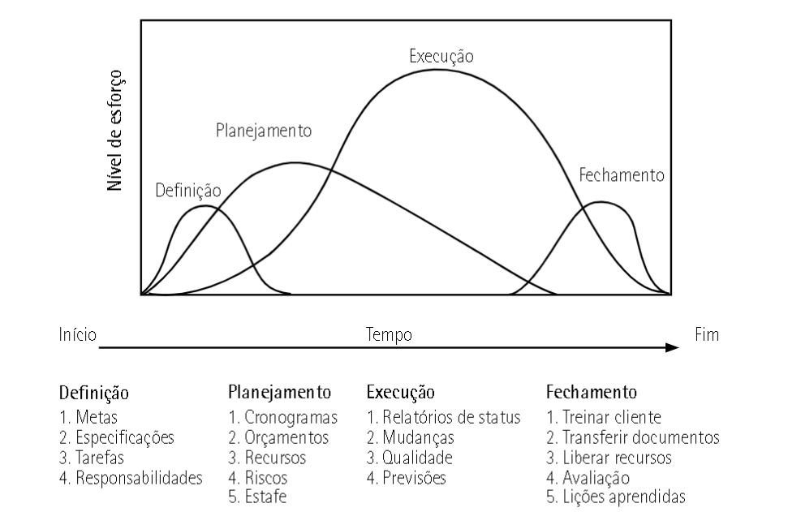
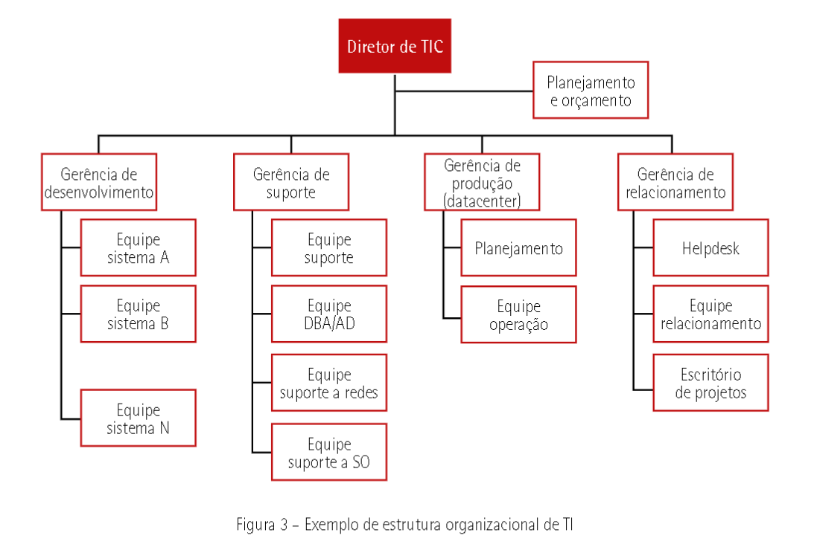

--- 
title: "Gerenciamento de Projetos de Software"
author: "Pedro José Laurenti de Matos"
date: "`r Sys.Date()`"
output: rmdformats::material

---

# PROJETOS

### Conceitos básicos envolvendo projetos

"Projetar" é um esforço para se alcançar um objetivo específico por meio de um conjunto único de atividades inter-relacionadas e da utilização eficaz de recursos

Uma das características mais interessantes do projeto é que ele é temporário, ou seja, é concebido, nasce, cresce e depois “morre”. Essa forma de enxergar os projetos é conhecida como `ciclo de vida`.

### Stakeholders

- **Definição:** Stakeholders são pessoas, grupos ou organizações afetadas por um projeto, programa ou portfólio.

- **Tipos de Stakeholders:**
    1. **Shareholders:** Proprietários e investidores, interessados no retorno sobre investimento.
    2. **Stakeholders Internos:** Funcionários e colaboradores do projeto.
    3. **Stakeholders Externos:** Fornecedores, clientes e usuários finais.
    4. **Stakeholders do Entorno:** ONGs, entidades governamentais, sociedade e comunidades locais.

- Stakeholders externos têm relação direta com negócios, enquanto os do entorno não.

### Conceito de Programa e Portfólio

**Programa:**
- Definido como um grupo de subprogramas, projetos e operações relacionados e coordenados.
- Objetivo: Alcançar benefícios que não seriam obtidos se gerenciados individualmente.
- Exemplo: Programa de melhoria de infraestrutura de TI com projetos interligados.

**Portfólio:**
- Conjunto de projetos, programas e outros esforços agrupados para atingir objetivos estratégicos.
- Componentes são mensuráveis, ordenáveis e priorizáveis.
- Inclui esforços temporários e não temporários (operações).
- Os componentes não necessariamente estão interligados.
- Pode abranger áreas diferentes e refletir objetivos estratégicos.

**Características do Portfólio:**
- Abrangência de ações atuais e futuras.
- Características temporárias diferentes dos projetos e programas.
- Uma organização pode ter vários portfólios agrupados por áreas.
- Reflete objetivos estratégicos.
- Composto de trabalhos que devem ser feitos.

## Estruturas de gerenciamento de projetos

Nas organizações, existem várias estruturas de gerenciamento de projetos influenciadas pelo estilo organizacional, maturidade em gestão de projetos e cultura organizacional. As modalidades incluem funcional, projetizada e matricial. A cultura organizacional desempenha um papel fundamental na escolha da estrutura.

**Cultura Organizacional:**
- Cultura organizacional é um sistema sociocultural que define a identidade da organização.
- Envolve padrões de comportamento, valores, normas, significados e interpretações.
- Schein divide a cultura em três níveis: artefatos, valores e pressupostos.
- Barreto et al. mencionam quatro tipos de culturas organizacionais: clã, inovativa, mercado e hierárquica.

**Tipos de Estruturas Organizacionais:**
- Funcional: Hierarquia tradicional; gerentes funcionais têm autoridade.
- Projetizada: Organização orientada por projetos; gerentes de projeto têm autoridade.
- Matricial: Combinando funcional e projetizada; dualidade de autoridade.

### Estruturas de Gerenciamento de Projetos

Estrutura Organizacional Funcional:
- Mais comum e tradicional.
- Organização centrada em funções especializadas.
- Controle limitado e independência entre departamentos.
- Vantagens: clareza de especializações, carreiras definidas.
- Desvantagens: pouca autoridade do gerente de projeto, foco nas áreas funcionais.

Estrutura Organizacional Projetizada:
- Foco nos projetos, com gerente de projeto com alta autoridade.
- Recursos alocados diretamente para os projetos.
- Funções de suporte são vistas como apoio aos projetos.
- Vantagens: poder do gerente de projeto, eficiência nos projetos.
- Desvantagens: ociosidade, duplicação de recursos e estruturas.

Estrutura Organizacional Matricial:
- Estrutura híbrida, combina elementos funcional e projetizado.
- Coexistência de gerentes funcionais e de projeto.
- Três categorias: matricial fraca, matricial forte e matricial balanceada.
- Vantagens: controle compartilhado, melhor utilização de recursos.
- Desvantagens: conflitos de autoridade, alocação de recursos desafiadora.

## Escritório de Projetos

Um Escritório de Projetos (também conhecido como PMO, do inglês Project Management Office) é responsável pelo gerenciamento dos projetos sob sua competência. É mais comumente encontrado em estruturas organizacionais projetizadas e matriciais.

Principais Papéis do Escritório de Projetos (Monteiro, 2008):
- Determinar padrões, políticas e procedimentos para o gerenciamento de projetos.
- Desenvolver e fornecer documentos relacionados à gestão de projetos.
- Oferecer ferramentas, suporte e treinamento a gerentes e equipes de projeto.
- Realizar auditorias em projetos da organização.
- Salvaguardar documentos e registros dos projetos.

Funções de um Escritório de Gerenciamento de Projetos (Dinsmore e Barbosa, 2009):
- Suporte e administração: manutenção de cronogramas, relatórios, salas de reunião, histórico do projeto e ferramentas computacionais.
- Métodos e padrões: planejamento do projeto, elaboração de cronogramas, gerenciamento de contratos e padrões de projeto.
- Consultoria e aconselhamento: suporte a propostas, avaliação de riscos e consultoria com a alta administração.
- Treinamento: treinamento das equipes de projeto.
- Acompanhamento de profissionais: apoio na contratação, avaliação de capacidades e identificação de níveis salariais.

# GERENCIAMENTO DE PROJETOS DENTRO DO AMBIENTE DE TI

Hoje em dia, podemos encontrar a TI com uma estrutura organizacional formada pelas seguintes subáreas: desenvolvimento, suporte, produção e relacionamento. A figura a seguir apresenta um exemplo de estrutura organizacional de TI comumente encontrada em algumas empresas.

- **CIO (Chief Information Officer):** Responsável pelos resultados da TI e pelo alinhamento estratégico com o negócio.

- **Área de Desenvolvimento:** Mantém e desenvolve sistemas de informação com base nos requisitos de negócio.

- **Área de Suporte:** Gerencia a infraestrutura que suporta as operações das aplicações de negócio.

- **Área de Produção (Operação ou Datacenter):** Lida com o processamento de dados.

- **Área de Relacionamento:** Facilita a comunicação entre TI e negócio.

A estrutura de TI pode variar com base na terceirização de serviços. A evolução na administração da TI abrangeu uma mudança para a gestão de serviços e, atualmente, foca na governança de TI, promovendo parceria com o negócio.

## Modelos que auxiliam a gestão da TI

| Modelo                                             | Escopo do Modelo                                      |
|----------------------------------------------------|-------------------------------------------------------|
| Business Analysis Body of Knowledge (BABOK)        | Análise de negócios                                   |
| Business Process Management Body of Knowledge (BPM CBOK) | Gestão de processos de negócios                 |
| The Open Group Architecture Framework (TOGAF)      | Arquitetura relacionada à TI                          |
| Projects in controlled environments (PRINCE2)      | Gestão de projetos de forma geral                     |
| Project Management Body Of Knowledge (PMBOK)       | Gestão de projetos de forma geral                     |
| Capability Maturity Model Integration (CMMI)       | Desenvolvimento de produtos e projetos de sistemas    |
| Melhoria de Processos do Software Brasileiro (MPS.br) | Melhoria do processo de software                   |
| ISO 31000:2018                                     | Gerenciamento de riscos para organizações             |
| ISO 20000:2018                                     | Gerenciamento de serviços de TI                       |
| ISO 27001:2013 e ISO 27002:2013                    | Gestão da segurança da informação                     |
| eSourcing Capability Model (eSCM)                  | Outsourcing em serviços intensivos em TI              |
| Organizational Project Management Maturity Model (OPM3) | Gerenciamento de projetos                        |
| Scrum                                              | Gerenciamento ágil de projetos                        |
| Balanced Scorecard (BSC)                           | Planejamento e gestão da estratégia                   |
| Six Sigma                                          | Melhoria da qualidade de processos                    |
| Statement on Auditing Standards (SAS) n. 70        | Regras de auditoria para empresas de serviços         |

## Família de normas ISO/IEC 20000

| Norma                                   | ISO Equivalente ABNT                     | Escopo                                                                                    |
|-----------------------------------------|------------------------------------------|-------------------------------------------------------------------------------------------|
| ISO/IEC 20000-1:2018                    | ABNT NBR ISO/IEC 20000-1:2020            | Tecnologia da informação – Gestão de serviço – Requisitos do sistema de gestão de serviço |
| ISO/IEC 20000-2:2019                    | ABNT NBR ISO/IEC 20000-2:2021            | Orientação para aplicação de sistemas de gestão de serviço                                |
| ISO/IEC 20000-3:2019                    | Não há equivalente                       | Definição de escopo e aplicabilidade da norma ABNT NBR ISO/IEC 20000-1                    |
| ISO/IEC TR 20000-4:2010                 | Não há equivalente                       | Modelo de referência de processo                                                          |
| ISO/IEC TR 20000-5:2010                 | ABNT ISO/IEC TR 20000-5:2011             | Exemplo de um plano de implementação da ABNT NBR ISO/IEC 20000-1                          |

# Padrão de Gerenciamento de Projetos

O Padrão de Gerenciamento de Projetos é uma publicação elaborada pelo PMI (Project Management Institute) que visa fornecer os princípios fundamentais que compõem a gestão de projetos. É uma referência amplamente reconhecida e utilizada por profissionais de gerenciamento de projetos em todo o mundo.

## Aplicação Universal

Uma das principais vantagens desse padrão é sua aplicação universal. Ele pode ser implementado com sucesso em qualquer organização, independentemente do tamanho, setor ou ramo de atividade. Isso o torna uma ferramenta valiosa para empresas que desejam melhorar a eficiência de suas operações e alcançar resultados bem-sucedidos por meio da gestão de projetos.

## Componentes do Padrão

O Padrão de Gerenciamento de Projetos é composto por três elementos essenciais:

1. **Aspectos Introdutórios:** Esta seção fornece definições claras de termos e conceitos básicos relacionados a projetos, incluindo projeto, programa, portfólio, produto, gerenciamento de projetos, gerente de projetos, equipe de projeto, sistema de entrega de valor e valor. Essa base conceitual é crucial para uma compreensão sólida da gestão de projetos.

2. **Sistema para Entrega de Valor:** Aqui, o padrão aborda a estruturação do sistema de entrega de valor. Isso envolve a definição de projetos, programas, portfólios e operações, cada um desempenhando um papel fundamental na entrega de valor aos stakeholders. O foco principal é atender às necessidades e expectativas das partes interessadas.

3. **Princípios de Gerenciamento de Projetos:** Este componente apresenta um conjunto de princípios que orientam a condução e a gestão de projetos. Cada princípio está relacionado a uma temática específica e oferece direcionamento sobre como abordar questões relevantes durante o ciclo de vida do projeto.

Em resumo, o Padrão de Gerenciamento de Projetos é uma ferramenta valiosa para profissionais de gerenciamento de projetos e organizações que desejam melhorar sua capacidade de planejar, executar e controlar projetos com eficácia, visando ao alcance de resultados bem-sucedidos.

# PRINCE2 (PRojects IN Controlled Environments)

- O PRINCE2 é um método de gestão de projetos que foi desenvolvido no Reino Unido em 1989 pela Central Computer and Telecommunications Agency (CCTA), agora conhecida como Office of Government Commerce (OGC). Desde então, ele se tornou amplamente reconhecido e adotado em todo o mundo para o gerenciamento de projetos em diversas áreas, incluindo TI.

- Uma das principais características do PRINCE2 é sua abordagem orientada para o negócio. Ele coloca grande ênfase na justificativa de negócio, o que significa que cada projeto deve ter uma razão clara e sólida para existir. Isso ajuda a garantir que os recursos da organização sejam alocados de maneira eficaz apenas para projetos que agreguem valor.

- O PRINCE2 equilibra seis aspectos de desempenho em um projeto: escopo, riscos, custos, tempo, qualidade e benefícios. Isso significa que o modelo não apenas se concentra em entregar um projeto dentro do prazo e orçamento, mas também em garantir que o projeto alcance seus objetivos e benefícios esperados.

- O PRINCE2 é composto por quatro elementos principais: princípios, temas, processos e adaptação ao ambiente de projeto.

- Os princípios do PRINCE2 são diretrizes fundamentais que orientam a abordagem do projeto. Eles incluem:
    - Justificativa para o negócio: Certificar-se de que há uma razão clara e contínua para o projeto.
    - Definição de papéis e responsabilidades: Designar responsabilidades claras para todos os envolvidos no projeto.
    - Aprendizado com a experiência: Usar lições aprendidas em projetos anteriores para melhorar o desempenho.
    - Gerenciamento por estágios: Dividir o projeto em estágios gerenciáveis, com revisões no final de cada estágio.
    - Foco no produto: Concentrar-se nos resultados e produtos que o projeto entregará.
    - Adequação ao ambiente de projeto: Adaptar o PRINCE2 ao ambiente específico do projeto.
    - Continuidade do negócio: Garantir que o projeto não coloque em risco a continuidade dos negócios da organização.

- Os temas do PRINCE2 são áreas de foco contínuo durante todo o ciclo de vida do projeto. Eles incluem:
    - Business Case: Avaliar continuamente a viabilidade do projeto.
    - Organização: Definir papéis e responsabilidades da equipe do projeto.
    - Qualidade: Garantir que os produtos do projeto atendam aos padrões de qualidade.
    - Riscos: Identificar, avaliar e gerenciar riscos ao longo do projeto.
    - Planos: Criar e manter planos detalhados para orientar a execução do projeto.
    - Mudanças: Gerenciar mudanças no escopo e nos requisitos do projeto.
    - Progresso: Acompanhar e relatar o progresso do projeto em relação ao plano.

Esses são alguns dos princípios, temas e elementos essenciais do PRINCE2, que contribuem para torná-lo um modelo abrangente e estruturado para o gerenciamento de projetos, incluindo aqueles na área de Tecnologia da Informação.

C:\Users\pedro\Desktop\Faculdade\ADS-UNIP\📝 Aulas\3 Período\GERENCIAMENTO DE PROJETOS DE SOFTWARE\img